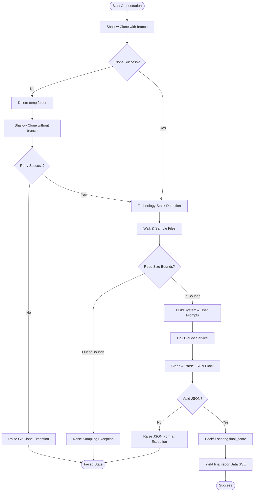

# 04 - Orchestrator Analysis

This document audits the orchestrator classes defined in the `app/orchestrators` directory, detailing the execution steps, dependency maps, timeout logic, and retry behaviors.

---

## Orchestrator Directory Audit

1.  **`GitHubAnalysisOrchestrator` (Active)**: Coordinates the entire repository verification process.
2.  **`CvAnalysisOrchestrator` (Skeleton)**: Intended to orchestrate resume profile extractions. Currently returns `{}`.
3.  **`JobMatchingOrchestrator` (Skeleton)**: Intended to match candidate profiles to jobs. Currently returns `[]`.

---

## GitHubAnalysisOrchestrator Execution Flow

The `GitHubAnalysisOrchestrator` executes the repository intelligence pipeline using a series of generator steps, yielding status reports back to the C# Core client.

---

## Detailed Component Analysis (GitHubAnalysisOrchestrator)

### 1. Responsibilities
*   Create a local clone workspace directory inside `CVerify.AI/temp_clones/`.
*   Execute shell commands for `git clone` using depth-1 settings.
*   Scan file paths and manifests to identify tech stacks and framework usage.
*   Enforce repository safety size constraints (<= 150MB total size, <= 10,000 files).
*   Extract up to 10 largest source files + package configuration manifests.
*   Synthesize prompts, invoke Anthropic's Claude, and extract the JSON response.
*   Backfill scoring parameters (final score/band mappings) to satisfy C# backend models.

### 2. Failure Points and Retry Behavior
*   **Git Clone Failure (with Fallback)**:
    *   *Mechanism*: If cloning using the specified branch (`--branch default_branch`) returns a non-zero code, it deletes the directory `clone_dir` using `shutil.rmtree(clone_dir, ignore_errors=True)`.
    *   *Retry*: It immediately attempts a second clone command *without* the branch parameter, letting the remote repository fall back to its own default branch (e.g. `main` or `master`). If this fallback also fails, it decodes `stderr` and raises a generic Exception.
*   **API Timeout**:
    *   The Python microservice does not define explicit connection timeouts when calling the Anthropic API.
    *   *Timeout handling*: The C# background processor `BackgroundRepositoryAnalysisProcessor` encapsulates the task with `linkedCts.CancelAfter(TimeSpan.FromMinutes(10))`. If the analysis execution exceeds 10 minutes, CVerify.Core raises an `OperationCanceledException` and marks the job status in the database as `TimedOut`.
*   **JSON Parse Failure**:
    *   If Claude outputs an unparseable or truncated block, the orchestrator first attempts to locate the outermost braces `{ ... }`. If parsing still fails, it raises an exception, yielding a `Failed` event SSE frame.

---

## AI Agent Consumption Optimization

| Field | Reference Value / Path |
|---|---|
| **Entry Points** | `orchestrate_async` in [app/orchestrators/github_analysis_orchestrator.py](../orchestrators/github_analysis_orchestrator.py) |
| **Dependencies** | Python: `shutil`, `tempfile`, `subprocess`, `asyncio`, `json` |
| **Execution Flow** | Triggered by router → Create Temp Dir → Subprocess Git Clone (branch retry) → Scan technologies → Sample files (size checks) → Fetch prompts → Send to Claude → Parse JSON → Yield steps |
| **Common Failure Modes** | **Git Subprocess Hangs** (no credential helper configuration, waiting for stdin), **Out of Disk Space** (accumulated temp clones), **JSON Parse Crash** (Claude returned invalid JSON formats) |
| **Related Files** | [app/routes/analysis_router.py](../routes/analysis_router.py), [app/orchestrators/cv_analysis_orchestrator.py](../orchestrators/cv_analysis_orchestrator.py), [app/orchestrators/job_matching_orchestrator.py](../orchestrators/job_matching_orchestrator.py) |
| **Related Services** | [ClaudeService](../services/claude_service.py), [TechnologyDetector](../github/technology_detector.py), [CodeSampler](../github/code_sampler.py) |
| **Related DTOs** | `AnalysisRequest` (FastAPI router input payload) |
| **Related Database Tables** | `AnalysisJobs`, `AnalysisJobEvents`, `AnalysisReports` |
| **Related Frontend Components** | `DetailedAnalysisModal.tsx` |
