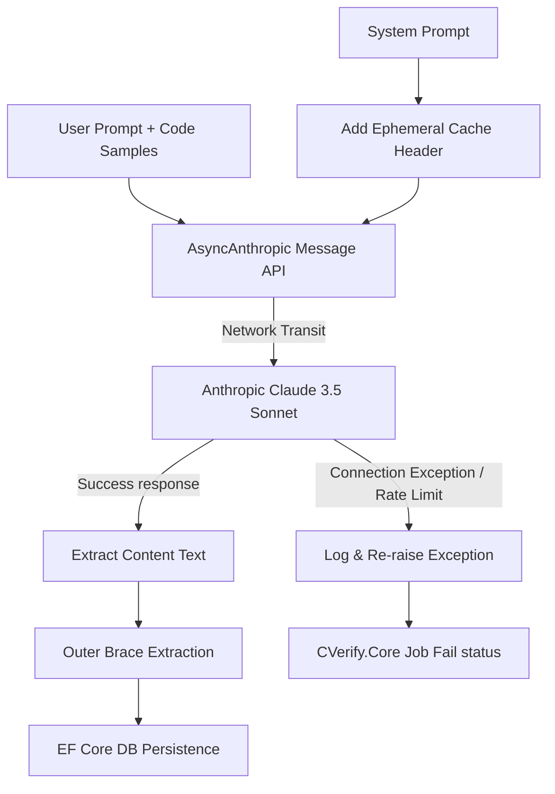

# 06 - Claude Integration

This document analyzes the integration with Anthropic's Claude API via the `ClaudeService`, reviewing the service configurations, prompt caching mechanism, error behaviors, and streaming handlers.

---

## Claude Service Architecture

The `ClaudeService` (defined in `app/services/claude_service.py`) encapsulates all interactions with Anthropic's Async SDK. It provides two execution modes:

1.  **Repository Analysis (`analyze_repo`)**: A single-shot request with low temperature (`0.2`) and strict JSON output formatting guidelines.
2.  **Conversational Chat Streaming (`stream_chat`)**: A token-by-token server-sent event generator with moderate temperature (`0.7`) and markdown formatting guidelines.



---

## Model and API Configurations

*   **SDK Client**: Instantiated using the asynchronous Anthropic SDK `AsyncAnthropic(api_key=settings.anthropic_api_key)`.
*   **Model Parameter**: Loaded dynamically from `settings.claude_model`. Defaults to `claude-3-5-sonnet-20241022` (Claude 3.5 Sonnet).
*   **Token Output Limit**: Set to `max_tokens=8192` (maximum supported output tokens for Sonnet).
*   **Temperature Setting**:
    *   *Repository Analysis*: `0.2` to reduce creative liberties and force adherence to the JSON schema.
    *   *Chat Streaming*: `0.7` for conversational fluency.

---

## Cost Optimization: Ephemeral Prompt Caching

Repository analysis user prompts contain dense directory listings and file content dumps, which represent high token volumes. To minimize token overhead, the `ClaudeService` enables Anthropic's **Prompt Caching** (specifically Ephemeral Prompt Caching) on system prompts:

*   **Configuration**:
    ```python
    system_config = [
        {
            "type": "text",
            "text": system_prompt,
            "cache_control": {"type": "ephemeral"}
        }
    ]
    ```
*   **Functionality**: Systems running multiple concurrent or sequential analyses of similarly structured codebases query cached prompt contexts on Anthropic's routers. This reduces input processing pricing by up to 90% and decreases execution latency.

---

## Gaps, Error Handling, and Retry Limitations

> [!WARNING]
> **Critical Observability & Reliability Gap**: The `ClaudeService` implements **no automatic retry logic**.
>
> If a network timeout, transient API outage, or rate limit exception (`429 Too Many Requests`) occurs, the exception is logged locally via `logger.error` and immediately re-raised, causing the background execution job to crash instantly.
>
> *Recommendation*: Implement an exponential backoff retry mechanism (e.g., using `tenacity` library) in `analyze_repo` and `stream_chat` to catch Anthropic API errors and retry up to 3-5 times.

---

## AI Agent Consumption Optimization

| Field | Reference Value / Path |
|---|---|
| **Entry Points** | `analyze_repo` and `stream_chat` in [app/services/claude_service.py](../services/claude_service.py) |
| **Dependencies** | Python: `anthropic` library, [app/config.py](../config.py) settings |
| **Execution Flow** | Orchestrator invokes `claude_service.analyze_repo` → system config caching set → sdk message call dispatched → text returned |
| **Common Failure Modes** | **Auth Error** (invalid api key), **Network Timeout** (slow upload/download), **Rate Limit Block** (no exponential backoff, crashes loop) |
| **Related Files** | [app/orchestrators/github_analysis_orchestrator.py](../orchestrators/github_analysis_orchestrator.py) |
| **Related Services** | None |
| **Related DTOs** | None |
| **Related Database Tables** | `AnalysisReports` |
| **Related Frontend Components** | `DetailedAnalysisModal.tsx` |
