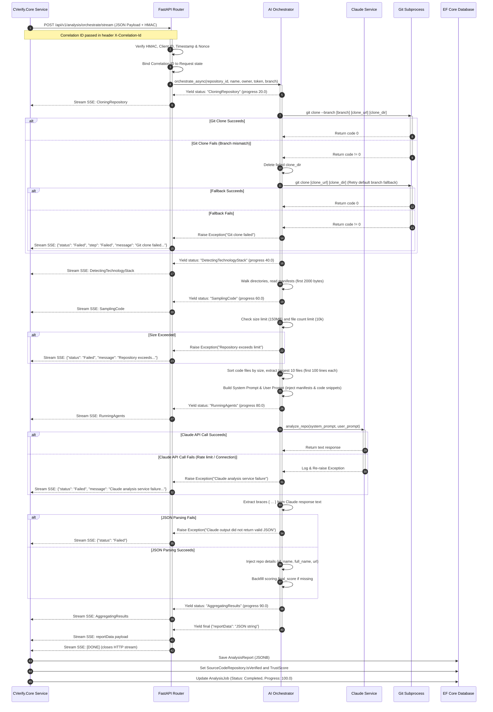

# 16 - AI Analysis Workflow

This document traces the workflow of the repository intelligence pipeline, from the C# backend invocation through the Python FastAPI microservice to Claude and back.

---

## Detailed Sequence Diagram

The following diagram maps the exact step-by-step execution flow, including error fallbacks, correlation ID propagation, and cancellations.

---

## Error and Cancellation Pathways

### 1. User/Timeout Cancellation
*   **Trigger**: The user clicks "Cancel" in the UI, or the CVerify.Core background processor surpasses the 10-minute timeout limit.
*   **Workflow**:
    1.  C# `RepositoryAnalysisService` cancels the asynchronous http client query task (triggers `CancellationToken` cancellation).
    2.  `RepositoryAnalysisService` catches `OperationCanceledException`.
    3.  If the status of the job in the SQL database is not already `Cancelled` (user-triggered), the worker updates it to `TimedOut` and sets the error message.
    4.  The service logs `Repository analysis job {JobId} timed out or was cancelled.`
    5.  The worker publishes a progress event payload to Redis Pub/Sub with status `Cancelled` or `TimedOut` to close any open client browser SSE streams.

### 2. Git Clone Fallback Retry Path
*   **Trigger**: Subprocess clone of the designated branch fails (due to branch renaming or removal).
*   **Workflow**:
    1.  Python microservice catches `subprocess.run` failure.
    2.  Executes `shutil.rmtree(clone_dir, ignore_errors=True)` to clean the workspace.
    3.  Fires a second `subprocess.run` cloning only the repository root *without* branch tags.
    4.  If this succeeds, execution proceeds normally to technology stack scans.

---

## AI Agent Consumption Optimization

| Field | Reference Value / Path |
|---|---|
| **Entry Points** | `/api/v1/analysis/orchestrate/stream` in [app/routes/analysis_router.py](../routes/analysis_router.py) |
| **Dependencies** | Python: `fastapi`, `anthropic`, `redis`, `subprocess`. C#: `HttpClient`, `EF Core`, `StackExchange.Redis`. |
| **Execution Flow** | Orchestrated sequence detailed in sequence diagram. |
| **Common Failure Modes** | Invalid HMAC headers (clock skew), Claude parser crash (invalid text formatting), DB write timeout. |
| **Related Files** | [app/orchestrators/github_analysis_orchestrator.py](../orchestrators/github_analysis_orchestrator.py), `RepositoryAnalysisService.cs` |
| **Related Services** | [ClaudeService](../services/claude_service.py) |
| **Related DTOs** | `AnalysisRequest` |
| **Related Database Tables** | `AnalysisJobs`, `AnalysisJobEvents`, `AnalysisReports` |
| **Related Frontend Components** | `DetailedAnalysisModal.tsx` |
