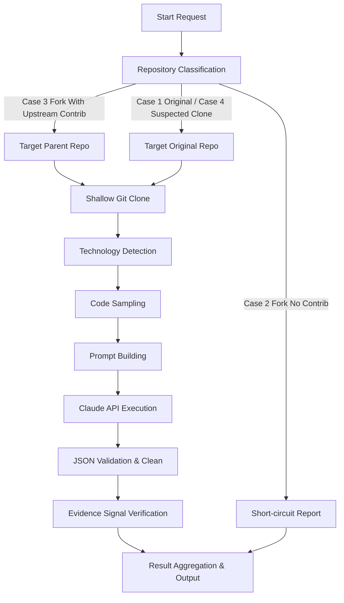

# Pipeline Catalog

This catalog documents the step-by-step pipeline execution for the CVerify Repository Intelligence Engine.

## Repository Analysis Pipeline Steps

## Step Details

### 1. Repository Classification
Determines repository characteristics and assigns `repo_type`, `confidence_ceiling`, and `analysis_target` using GitHub API metadata prior to resource-intensive clones.
* **Module**: [repo_classifier.py](../../app/github/repo_classifier.py)

### 2. Shallow Git Clone
Clones the targeted repository locally to a temporary folder under a depth-1 constraint.
* **Module**: [github_analysis_orchestrator.py](../../app/orchestrators/github_analysis_orchestrator.py)

### 3. Technology Detection
Scans filenames and extracts package manifests (e.g. `package.json`, `requirements.txt`) to identify programming languages, libraries, and frameworks.
* **Module**: [technology_detector.py](../../app/github/technology_detector.py)

### 4. Code Sampling
Filters and extracts representative code snippets (up to 10 files, maximum 100 lines per file) to prevent token bloat.
* **Module**: [code_sampler.py](../../app/github/code_sampler.py)

### 5. Claude API Execution
Dispatches system and user prompts to Anthropic's Claude 3.5 Sonnet model with Ephemeral Prompt Caching enabled.
* **Module**: [claude_service.py](../../app/services/claude_service.py)

### 6. Validation and Output
Parses and validates the JSON output, checks cited evidence signals against sampled files, backfills scoring models, and aggregates the final report payload.
* **Module**: [github_analysis_orchestrator.py](../../app/orchestrators/github_analysis_orchestrator.py)

## Traceability Links

* [Repository Analysis Pipeline](./07-repository-analysis-pipeline.md)
* [Analysis Pipeline Playbook](./15-analysis-pipeline-playbook.md)
