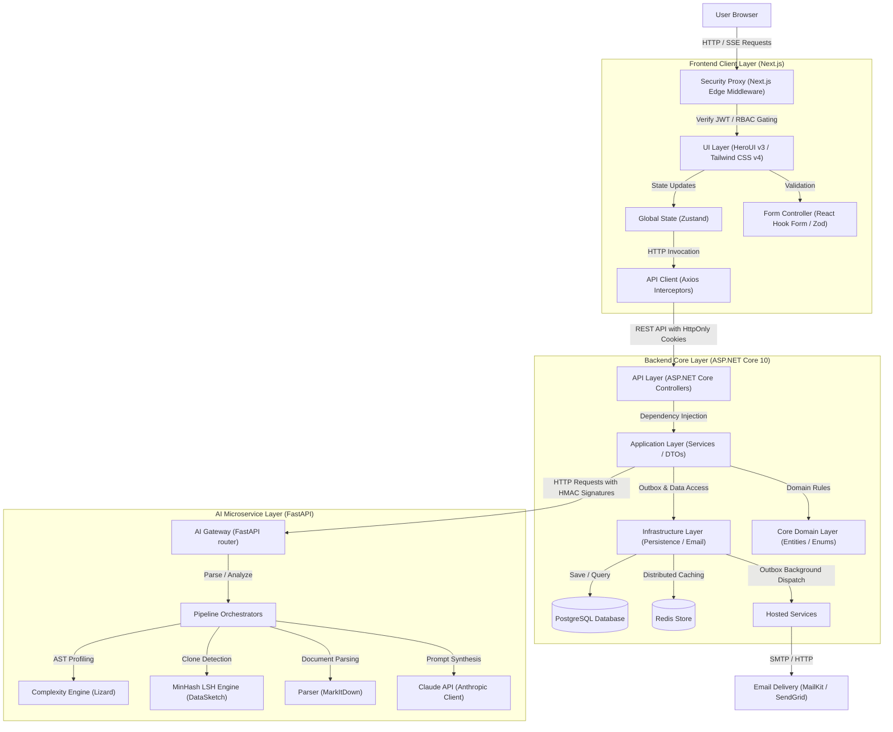

# CVerify - Developer Source Code Verification and Trust Intelligence Platform

Welcome to CVerify, an enterprise-grade developer source code verification and trust intelligence platform. CVerify leverages large language models and static analysis to analyze candidate code repositories, evaluate developer contributions, detect plagiarism or AI-generated segments, and synthesize verified CV profiles. It features a responsive React/Next.js frontend client, a resilient ASP.NET Core backend gateway, and a dedicated FastAPI AI microservice.

This repository is structured as a monorepo containing:
* Frontend Client Layer: `/client` - Built on Next.js 16 (App Router), React 19, HeroUI v3, Tailwind CSS v4, and Zustand. Employs a strict feature-driven folder structure with a modular design.
* Backend Server Layer: `/CVerify.Core` - Built on ASP.NET Core v10, PostgreSQL, Entity Framework Core, Redis, and a custom email failover infrastructure. Follows Clean Architecture design principles.
* AI Microservice Layer: `/CVerify.AI` - Built on Python, FastAPI, Lizard AST complexity analyzer, DataSketch MinHash LSH clone-detector, MarkItDown, and the Anthropic Claude API.

---

## Architecture Blueprint

CVerify uses a decoupled architecture with strict separation of concerns, ensuring scalability, security, and developer efficiency.



---

## Monorepo Setup Guide

Follow this guide to get all three services running locally on your development machine.

### Prerequisites

Ensure you have the following software installed:

| Technology | Minimum Version | Purpose |
| :--- | :--- | :--- |
| Node.js | >= 18.x | Frontend runtime environment |
| .NET SDK | 10.0.x | Backend core API gateway runtime |
| Python | 3.11.x | AI microservice runtime environment |
| Docker Desktop | Latest | Runs Postgres database and Redis caching engines |
| Tesseract OCR | Latest | OCR fallback engine for certificate image parsing |

### Step-by-Step Installation

#### Step 1: Start Infrastructure Containers
Ensure Docker is running, then start PostgreSQL and Redis containers from the repository root:

```bash
docker compose up -d postgres redis
```

This starts:
* PostgreSQL on port `5432`
* Redis on port `6379`

Create an empty database named `cverify_db` inside PostgreSQL using your database management tool or the psql CLI:

```sql
CREATE DATABASE cverify_db;
```

#### Step 2: Configure and Run the Backend (.NET Core)
1. Navigate to the backend directory:
   ```bash
   cd CVerify.Core
   ```
2. Copy the environment configuration template:
   ```bash
   cp .env.example .env
   ```
3. Open `.env` and set the required variables, particularly `DB_PASSWORD` (database password) and `JWT_KEY` (secret key, must be 32+ characters):
   ```env
   DB_PASSWORD=your_postgres_password
   JWT_KEY=your_secure_32_character_jwt_secret_key
   TOKEN_ENCRYPTION_KEY=your_secure_32_byte_token_encryption_key
   AI_SERVICE_SHARED_SECRET=your_secure_32_character_hmac_secret_key
   ```
4. Restore NuGet packages and run the server:
   ```bash
   dotnet restore
   dotnet run
   ```
   Note: The EF Core database migrations apply automatically on application startup.

#### Step 3: Configure and Run the AI Microservice (Python)
1. Open a new terminal and navigate to the AI service directory:
   ```bash
   cd CVerify.AI
   ```
2. Create a virtual environment:
   ```bash
   python -m venv .venv
   ```
3. Activate the virtual environment:
   * Windows (PowerShell): `.venv\Scripts\Activate.ps1`
   * Unix / macOS: `source .venv/bin/activate`
4. Install python packages:
   ```bash
   pip install -r requirements.txt
   ```
5. Copy the environment configuration template:
   ```bash
   cp .env.example .env
   ```
6. Open `.env` and set the variables, ensuring the `SHARED_SECRET` matches `AI_SERVICE_SHARED_SECRET` in the backend:
   ```env
   ANTHROPIC_API_KEY=your_anthropic_api_key
   SHARED_SECRET=your_secure_32_character_hmac_secret_key
   ```
7. Start the Uvicorn dev server:
   ```bash
   uvicorn app.main:app --reload
   ```

#### Step 4: Configure and Run the Frontend Client (Next.js)
1. Open a new terminal and navigate to the client directory:
   ```bash
   cd client
   ```
2. Copy the environment configuration template:
   ```bash
   cp .env.example .env.local
   ```
3. Open `.env.local` and set the variables, ensuring `JWT_SECRET` matches `JWT_KEY` in the backend `.env`:
   ```env
   NEXT_PUBLIC_API_URL=http://localhost:5247/api
   JWT_SECRET=your_secure_32_character_jwt_secret_key
   ```
4. Install npm packages:
   ```bash
   npm install
   ```
5. Start the development server with Turbopack support:
   ```bash
   npm run dev
   ```

---

## System Ports and URLs

When running locally, system components bind to the following default configurations:

| Component | Default Address | Description |
| :--- | :--- | :--- |
| Next.js Client Portal | http://localhost:3000 | Frontend User Web Interface |
| ASP.NET Core API Gateway | http://localhost:5247 | Core REST API Endpoint |
| OpenAPI Swagger Sandbox | http://localhost:5247/swagger | API Documentation Sandbox |
| FastAPI AI Microservice | http://localhost:8000 | AI Processing Endpoint |
| PostgreSQL Database | localhost:5432 | Primary Transactional Store |
| Redis Cache Server | localhost:6379 | State and Cache Store |

---

## Integration Verification Checklist

To confirm the full monorepo stack is running and integrated, perform the following validation checks:

1. API Health Endpoint: Navigate to `http://localhost:5247/health`. You should receive a status code 200 indicating DB and Redis caches are reachable.
2. System Status Endpoint: Navigate to `http://localhost:5247/api/system/status`. This returns current server telemetry.
3. Swagger Documentation: Visit `http://localhost:5247/swagger` to inspect endpoints.
4. AI Service Documentation: Visit `http://localhost:8000/docs` to verify the FastAPI routing layer is running.
5. User Registration: Navigate to `http://localhost:3000/register`. Register a new account. The registration should write data to PostgreSQL, trigger an outbox email log, and redirect to the email verification page.
6. Multi-Tab Session Sync: Log in to `http://localhost:3000/login` in one tab and open `http://localhost:3000/dashboard` in another tab. Log out in one tab. The second tab should instantly log out and redirect to `/login` via broadcast channel notifications.

---

## Sub-Project Developer Guides

For detailed configurations, technologies, and structures of specific layers:
* Frontend Client Guide: [client/README.md](client/README.md) - Details on Next.js Edge routing, Zustand stores, state hydration, and HeroUI integration.
* Backend Core Server Guide: [CVerify.Core/README.md](CVerify.Core/README.md) - Details on Clean Architecture layers, outbox background processors, rate limiting, and EF Core mappings.
* AI Microservice Guide: [CVerify.AI/README.md](CVerify.AI/README.md) - Details on FastAPI routes, Lizard AST complexity analyzer, and datasketch clone detection.
