# Modular Database Mermaid Diagrams

This document contains all Mermaid ER and architecture diagrams for the CVerify database system, formatted in strict Mermaid 11 syntax.

## Table of Contents
1. [High-Level Module Architecture Diagram](#high-level-module-architecture-diagram)
2. [1. Identity & Access Management (IAM)](#iam)
2. [2. Organizations & Workspaces](#organizations_workspaces)
2. [3. Candidate Profile & Portfolio](#candidate_profile)
2. [4. Talent Intelligence Graph](#talent_intelligence)
2. [5. Recruitment & Job Vacancy Matching](#recruitment_job_matching)
2. [6. Candidate Assessment & Skill Attribution](#candidate_assessment)
2. [7. Source Code Intelligence & Repository Analysis](#source_code_intelligence)
2. [8. Community Forum](#community_forum)
2. [9. Audit, Security Telemetry & Messaging](#audit_security_messaging)
2. [10. System Administration & Staff](#administration)
2. [11. Platform Orchestration & AI Engine](#platform_orchestration_ai)

---

## High-Level Module Architecture Diagram

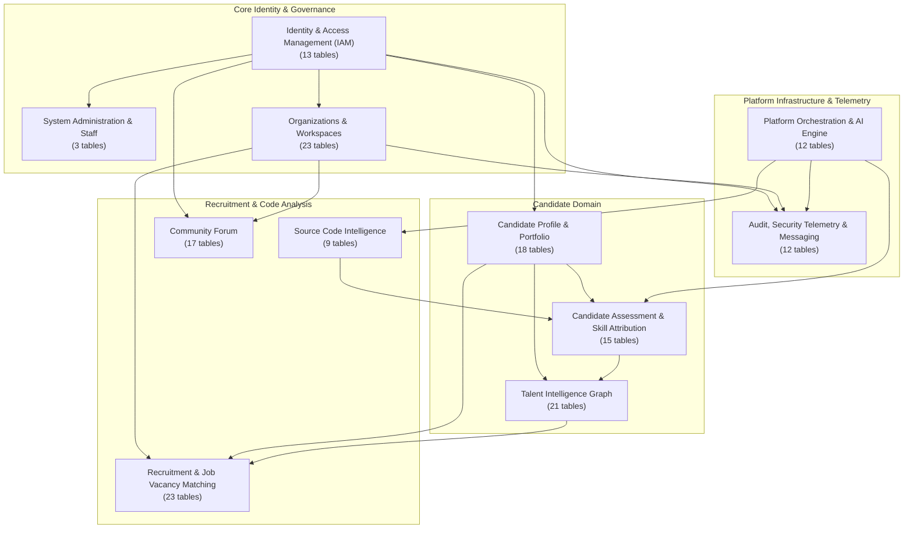

---

## 1. Identity & Access Management (IAM)

*User identities, authentication states, RBAC roles/permissions, OAuth providers, OTP challenges, and JWT session tokens.* (`13 tables`)

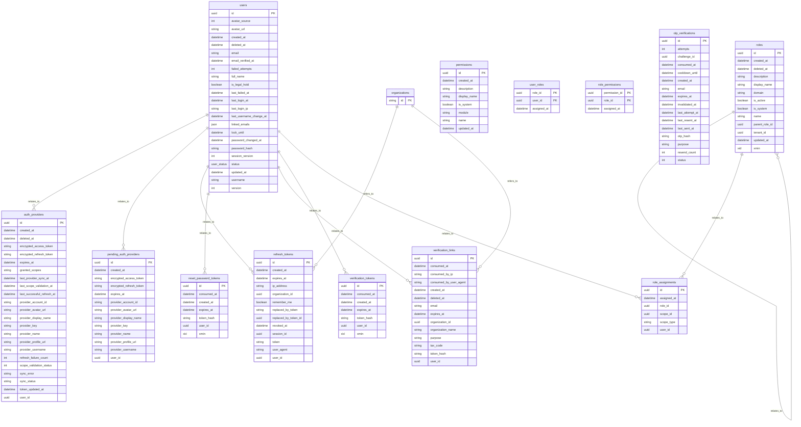

---

## 2. Organizations & Workspaces

*Multi-tenant enterprise organizations, collaborative workspaces, workspace memberships, and legal authority recovery.* (`23 tables`)

```mermaid
erDiagram

    organizations {
        uuid id PK
        string banner_url
        int branch_count
        string city
        string contact_email
        string contact_name
        string contact_phone
        string core_values
        datetime created_at
        datetime deleted_at
        string description
        string detail_address
        string email
        string facebook_url
        int follower_count
        string founded
        string google_maps_embed_url
        datetime initial_admin_assigned_at
        boolean is_verified
        string linkedin_url
        string logo_url
        string mission
        string name
        string organization_size
        string organization_type
        string recovery_authority
        string registration_number
        string representative_email
        string representative_identity
        string representative_name
        string representative_phone
        string status
        string tax_code
        string twitter_url
        datetime updated_at
        string username
        int verification_level
        string vision
        string website
    }

    organization_authorities {
        uuid id PK
        datetime joined_at
        uuid organization_id
        string role
        uuid user_id
    }

    organization_memberships {
        uuid id PK
        datetime joined_at
        uuid organization_id
        string role
        string status
        uuid user_id
    }

    organization_followers {
        uuid user_id PK
        uuid organization_id PK
        datetime followed_at
    }

    organization_verifications {
        uuid id PK
        boolean is_verified
        string metadata
        uuid organization_id
        string verification_type
        datetime verified_at
        string verified_by
        string verified_value
    }

    organization_credentials {
        uuid organization_id PK
        datetime created_at
        datetime deleted_at
        int failed_login_attempts
        datetime lockout_end
        string password_hash
        datetime updated_at
        string username
    }

    pending_organization_ownerships {
        uuid id PK
        datetime consumed_at
        uuid consumed_by_user_id
        datetime created_at
        datetime discovery_notified_at
        datetime expires_at
        uuid organization_id
        string owner_email
    }

    organization_invitations {
        uuid id PK
        datetime accepted_at
        uuid consumed_by_user_id
        datetime created_at
        datetime declined_at
        string declined_reason
        datetime discovery_notified_at
        datetime expires_at
        uuid invited_by_user_id
        string invitee_email
        uuid organization_id
        string status
        string token_hash
    }

    organization_invitation_roles {
        uuid id PK
        uuid invitation_id
        uuid role_id
        uuid scope_id
        string scope_type
    }

    organization_recovery_claims {
        uuid id PK
        datetime created_at
        string document_ocr_metadata
        string document_suspicious_metadata
        json documents
        string historical_claim_flags
        string ip_device_flags
        uuid organization_id
        string phone_number
        string recovery_email
        string rejection_reason
        string representative_full_name
        string representative_position
        datetime reviewed_at
        string reviewed_by
        string risk_level
        int risk_score
        string second_reviewer_by
        string status
        string suggested_recovery_strategy
        datetime updated_at
        string workspace_activity_flags
    }

    approved_recovery_sessions {
        uuid id PK
        string approved_by
        string approved_representative
        datetime created_at
        datetime expires_at
        boolean is_consumed
        uuid organization_id
        string recovery_token_hash
        datetime revoked_at
        string suggested_strategy
        datetime used_at
        string used_by_device
        string used_by_ip
        string verified_recovery_email
    }

    recovery_execution_locks {
        uuid id PK
        datetime acquired_at
        datetime completed_at
        uuid recovery_session_id
        string status
    }

    recovery_tokens {
        uuid id PK
        datetime consumed_at
        datetime created_at
        datetime expires_at
        string metadata_json
        uuid organization_id
        string purpose
        datetime revoked_at
        string token_hash
        int token_type
        uuid user_id
        xid xmin
    }

    representative_rotation_requests {
        uuid id PK
        string admin_approval_status
        datetime created_at
        string current_representative
        datetime expires_at
        string final_decision
        string optional_supporting_message
        uuid organization_id
        string reason
        string requested_email
        string requested_phone
        string requested_representative
        string support_approval_status
        string verification_call_notes
        string verification_call_status
    }

    representative_approval_votes {
        uuid id PK
        string approver_role
        uuid approver_user_id
        string decision
        uuid request_id
        datetime timestamp
    }

    representative_authority_histories {
        uuid id PK
        datetime effective_at
        string new_representative
        uuid organization_id
        string previous_representative
        string rotated_by
        string support_reviewer
    }

    enterprise_workflow_requests {
        uuid id PK
        datetime assigned_at
        uuid assigned_reviewer_id
        datetime claimed_at
        datetime created_at
        datetime due_at
        uuid escalated_to_user_id
        string metadata_json
        uuid organization_id
        string priority
        string request_type
        datetime resolved_at
        string review_state
        bytea row_version
        string status
        datetime updated_at
    }

    workflow_attachments {
        uuid id PK
        string content_type
        datetime created_at
        string file_name
        string storage_path
        uuid workflow_request_id
    }

    workflow_comments {
        uuid id PK
        uuid author_user_id
        string content
        datetime created_at
        boolean is_internal_only
        uuid workflow_request_id
    }

    workspaces {
        uuid id PK
        string branding
        datetime created_at
        datetime deleted_at
        string description
        string display_name
        uuid organization_id
        uuid owner_id
        string slug
        string status
        datetime updated_at
    }

    workspace_members {
        uuid id PK
        datetime joined_at
        string role
        uuid user_id
        uuid workspace_id
    }

    workspace_archive_snapshots {
        uuid id PK
        string archived_by
        datetime created_at
        uuid organization_id
        string snapshot_data_json
        uuid workspace_id
    }

    workspace_posts {
        uuid id PK
        string category
        string content
        datetime created_at
        uuid created_by_user_id
        int likes
        uuid organization_id
        int shares_count
        datetime updated_at
    }

    organizations ||--o{ organization_credentials : relates_to
    organizations ||--o{ approved_recovery_sessions : relates_to
    organizations ||--o{ organization_recovery_claims : relates_to
    organizations ||--o{ recovery_tokens : relates_to
    users {
        string id PK
    }

    users ||--o{ recovery_tokens : refers_to
    users ||--o{ representative_approval_votes : refers_to
    representative_rotation_requests ||--o{ representative_approval_votes : relates_to
    organizations ||--o{ representative_authority_histories : relates_to
    organizations ||--o{ representative_rotation_requests : relates_to
    users ||--o{ enterprise_workflow_requests : refers_to
    organizations ||--o{ enterprise_workflow_requests : relates_to
    organizations ||--o{ organization_authorities : relates_to
    users ||--o{ organization_authorities : refers_to
    organizations ||--o{ organization_followers : relates_to
    users ||--o{ organization_invitations : refers_to
    organizations ||--o{ organization_invitations : relates_to
    organization_invitations ||--o{ organization_invitation_roles : relates_to
    roles {
        string id PK
    }

    roles ||--o{ organization_invitation_roles : refers_to
    organizations ||--o{ organization_memberships : relates_to
    users ||--o{ organization_memberships : refers_to
    organizations ||--o{ organization_verifications : relates_to
    users ||--o{ pending_organization_ownerships : refers_to
    organizations ||--o{ pending_organization_ownerships : relates_to
    enterprise_workflow_requests ||--o{ workflow_attachments : relates_to
    users ||--o{ workflow_comments : refers_to
    enterprise_workflow_requests ||--o{ workflow_comments : relates_to
    organizations ||--o{ workspaces : relates_to
    users ||--o{ workspaces : refers_to
    users ||--o{ workspace_members : refers_to
    workspaces ||--o{ workspace_members : relates_to
    users ||--o{ workspace_posts : refers_to
    organizations ||--o{ workspace_posts : relates_to
```

---

## 3. Candidate Profile & Portfolio

*Candidate resume profiles, work experiences, educational background, academic achievements, and portfolio project links.* (`18 tables`)

```mermaid
erDiagram

    user_profiles {
        uuid user_id PK
        string ai_suggestions_json
        string ai_talent_discovery
        string bio
        datetime birth_date
        string company
        datetime created_at
        string custom_pronouns
        datetime deleted_at
        string headline
        datetime last_profile_update_at
        string location
        string phone_number
        string profile_visibility
        string pronouns
        string public_email
        boolean recruiter_visibility
        datetime updated_at
        string username
        int version
    }

    career_preferences {
        uuid user_id PK
        boolean available_for_hire
        datetime created_at
        datetime deleted_at
        string expected_salary_currency
        float expected_salary_max
        float expected_salary_min
        boolean expected_salary_negotiable
        string expected_salary_type
        boolean is_expected_salary_visible
        string job_title_preferences
        string leadership_track
        boolean open_to_relocation
        string open_to_work_status
        string preferred_language
        string remote_preference
        float salary_expectations
        datetime updated_at
        int version
        string work_preference_notes
    }

    ai_inferred_preferences {
        uuid user_id PK
        float confidence_score
        datetime created_at
        datetime deleted_at
        string inferred_primary_role
        string inferred_salary_currency
        float inferred_salary_max
        float inferred_salary_min
        string inferred_seniority
        datetime last_analyzed_at
        string synthesis_rationale
        datetime updated_at
        int version
    }

    user_skills {
        uuid id PK
        datetime created_at
        string normalized_name
        string skill
        string skill_id
        uuid user_id
    }

    education_entries {
        uuid id PK
        datetime created_at
        string degree
        datetime deleted_at
        string description
        int display_order
        datetime end_date
        float gpa
        float gpa_scale
        boolean is_currently_studying
        string label
        string major
        string school_name
        datetime start_date
        datetime updated_at
        uuid user_id
    }

    academic_achievements {
        uuid id PK
        datetime created_at
        string credential_url
        datetime deleted_at
        string description
        int display_order
        datetime issue_date
        string issuer
        string title
        datetime updated_at
        uuid user_id
    }

    profile_attachments {
        uuid id PK
        datetime created_at
        datetime deleted_at
        uuid entity_id
        string entity_type
        string file_name
        string file_path
        int file_size
        string file_type
        datetime updated_at
        uuid user_id
    }

    work_experience_entries {
        uuid id PK
        string company
        datetime created_at
        datetime deleted_at
        string description
        int display_order
        int employment_type
        datetime end_date
        int experience_category
        boolean is_currently_working
        boolean is_leadership
        string job_title
        string location
        datetime start_date
        datetime updated_at
        uuid user_id
    }

    work_experience_achievements {
        uuid id PK
        datetime created_at
        string description
        string title
        datetime updated_at
        uuid work_experience_id
    }

    work_experience_technologies {
        uuid id PK
        datetime created_at
        string name
        uuid work_experience_id
    }

    work_experience_links {
        uuid id PK
        datetime created_at
        int link_type
        string url
        uuid work_experience_id
    }

    project_entries {
        uuid id PK
        datetime created_at
        datetime deleted_at
        string description
        int display_order
        datetime end_date
        boolean is_currently_working
        string name
        string role
        datetime start_date
        datetime updated_at
        uuid user_id
        int verification_level
        json verification_metadata_json
        int verification_status
        datetime verified_at
    }

    project_repository_links {
        uuid id PK
        datetime linked_at
        uuid project_entry_id
        uuid source_code_repository_id
    }

    project_technologies {
        uuid id PK
        datetime created_at
        string name
        uuid project_entry_id
    }

    project_contributions {
        uuid id PK
        string content
        datetime created_at
        uuid project_entry_id
    }

    user_cv_settings {
        uuid user_id PK
        datetime created_at
        string cv_layout_config_json
        string cv_template_id
        string cv_theme_color
        boolean is_cv_published
        datetime updated_at
    }

    cv_repository_mappings {
        uuid id PK
        datetime indexed_at_utc
        uuid reference_entity_id
        string reference_source
        uuid source_code_repository_id
        uuid user_id
    }

    user_followers {
        uuid follower_id PK
        uuid followee_id PK
        datetime followed_at
    }

    users {
        string id PK
    }

    users ||--o{ academic_achievements : refers_to
    users ||--|| ai_inferred_preferences : refers_to
    users ||--|| career_preferences : refers_to
    source_code_repositories {
        string id PK
    }

    source_code_repositories ||--o{ cv_repository_mappings : refers_to
    users ||--o{ education_entries : refers_to
    users ||--o{ profile_attachments : refers_to
    project_entries ||--o{ project_contributions : relates_to
    users ||--o{ project_entries : refers_to
    project_entries ||--o{ project_repository_links : relates_to
    source_code_repositories ||--o{ project_repository_links : refers_to
    project_entries ||--o{ project_technologies : relates_to
    users ||--o{ user_cv_settings : refers_to
    users ||--|| user_profiles : refers_to
    users ||--o{ user_skills : refers_to
    work_experience_entries ||--o{ work_experience_achievements : relates_to
    users ||--o{ work_experience_entries : refers_to
    work_experience_entries ||--o{ work_experience_links : relates_to
    work_experience_entries ||--o{ work_experience_technologies : relates_to
    users ||--o{ user_followers : refers_to
```

---

## 4. Talent Intelligence Graph

*Graph representation of candidate capabilities, evidence claims, trust profiles, and capability search projections.* (`21 tables`)

```mermaid
erDiagram

    capability_nodes {
        uuid id PK
        string category
        datetime created_at
        string description
        string name
        string slug
    }

    capability_edges {
        uuid source_node_id PK
        uuid target_node_id PK
        string relationship_type PK
        float weight
    }

    candidate_capabilities {
        uuid id PK
        uuid candidate_id
        uuid capability_node_id
        datetime created_at
        datetime updated_at
    }

    candidate_capability_evidences {
        uuid candidate_capability_id PK
        uuid evidence_artifact_id PK
        datetime added_at
    }

    candidate_capability_scores {
        uuid candidate_capability_id PK
        datetime calculated_at
        string expertise_level
        float proficiency_score
        float recency_index
    }

    candidate_capability_histories {
        uuid id PK
        uuid candidate_capability_id
        float proficiency_score
        datetime recorded_at
    }

    evidence_sources {
        uuid id PK
        json connection_config
        datetime created_at
        boolean is_active
        string name
        string provider_type
    }

    evidence_artifacts {
        uuid id PK
        string artifact_type
        datetime created_at
        string cryptographic_signature
        string external_identifier
        json payload
        uuid source_id
    }

    evidence_claims {
        uuid id PK
        string assertion_type
        uuid candidate_id
        float confidence_score
        datetime created_at
        uuid evidence_artifact_id
    }

    evidence_verifications {
        uuid id PK
        datetime created_at
        uuid evidence_claim_id
        datetime expires_at
        string status
        json verification_log
        string verification_type
        datetime verified_at
    }

    trust_profiles {
        uuid id PK
        datetime recalculated_at
        uuid target_entity_id
        string target_type
    }

    trust_components {
        uuid id PK
        string component_name
        int component_score
        json explanation_metadata
        uuid trust_profile_id
        datetime updated_at
        float weight
    }

    trust_calculations {
        uuid id PK
        int aggregate_score
        datetime calculated_at
        json calculation_details
        uuid trust_profile_id
    }

    candidate_trust_projections {
        uuid candidate_id PK
        int aggregate_score
        datetime last_updated_at
        uuid trust_profile_id
        string trust_tier
    }

    candidate_search_profiles {
        uuid candidate_id PK
        json capabilities_json
        string full_name
        string headline
        datetime last_projected_at
        string location
        int trust_score
        string trust_tier
    }

    candidate_ranking_projections {
        uuid candidate_id PK
        float ai_score
        boolean available_for_hire
        string avatar_url
        string bio
        string career_level_label
        float composite_score
        float evidence_trust_score
        int followers_count
        int following_count
        string full_name
        int global_rank_position
        string headline
        datetime last_updated_at
        string location
        string open_to_work_status
        int previous_global_rank_position
        string primary_domain
        float profile_completeness
        json top_capabilities_json
        int total_forks_count
        int total_stars_count
        float trust_score
        string username
        int verified_contribution_count
        int verified_repo_count
    }

    candidate_capability_projections {
        uuid candidate_id PK
        json capabilities_json
        datetime projected_at
    }

    capability_catalog_items {
        string capability_id PK
        string category
        datetime created_at
        string description
        string display_name
        boolean is_custom
        string status
        datetime updated_at
        uuid workspace_id
    }

    capability_registries {
        string capability_id PK
        string capability_version
        string category
        datetime created_at
        string deprecated_by_id
        string description
        string display_name
        datetime effective_date
        json migration_mappings
        string status
        string taxonomy_version
        datetime updated_at
    }

    capability_hierarchies {
        string parent_id PK
        string child_id PK
    }

    capability_aliases {
        string alias_name PK
        string canonical_id
    }

    users {
        string id PK
    }

    users ||--o{ candidate_capabilities : refers_to
    capability_nodes ||--o{ candidate_capabilities : relates_to
    candidate_capabilities ||--o{ candidate_capability_evidences : relates_to
    evidence_artifacts ||--o{ candidate_capability_evidences : relates_to
    candidate_capabilities ||--o{ candidate_capability_histories : relates_to
    users ||--|| candidate_capability_projections : refers_to
    candidate_capabilities ||--|| candidate_capability_scores : relates_to
    users ||--|| candidate_ranking_projections : refers_to
    users ||--|| candidate_search_profiles : refers_to
    users ||--|| candidate_trust_projections : refers_to
    trust_profiles ||--o{ candidate_trust_projections : relates_to
    capability_registries ||--o{ capability_aliases : relates_to
    workspaces {
        string id PK
    }

    workspaces ||--o{ capability_catalog_items : refers_to
    capability_nodes ||--o{ capability_edges : relates_to
    capability_nodes ||--o{ capability_edges : relates_to
    capability_registries ||--o{ capability_hierarchies : relates_to
    capability_registries ||--o{ capability_hierarchies : relates_to
    capability_registries ||--o{ capability_registries : relates_to
    evidence_sources ||--o{ evidence_artifacts : relates_to
    users ||--o{ evidence_claims : refers_to
    evidence_artifacts ||--o{ evidence_claims : relates_to
    evidence_claims ||--o{ evidence_verifications : relates_to
    trust_profiles ||--o{ trust_calculations : relates_to
    trust_profiles ||--o{ trust_components : relates_to
```

---

## 5. Recruitment & Job Vacancy Matching

*Hiring requirements, job vacancies, candidate applications, AI matching evaluations, and recommendation runs.* (`23 tables`)

```mermaid
erDiagram

    job_vacancies {
        uuid id PK
        string acquisition_strategy
        string category
        string city
        string cover_url
        datetime created_at
        string degree
        string department
        json discovery_profile_json
        string experience
        string gender
        int headcount
        uuid hiring_requirement_id
        boolean is_active
        string metadata
        uuid organization_id
        uuid requirement_snapshot_id
        string salary
        string salary_min_max
        string status
        string title
        string type
        datetime updated_at
        string workplace_type
    }

    hiring_requirements {
        uuid id PK
        int auto_close_rule
        string business_problem
        int candidates_needed_count
        string city
        datetime created_at
        string currency
        string degree_requirement
        string department
        string employment_type
        datetime end_date
        int headcount
        string hiring_reason
        boolean is_manually_closed
        boolean is_salary_negotiable
        uuid organization_id
        float salary_max
        float salary_min
        int salary_period
        string seniority
        datetime start_date
        string status
        string timezone_range
        string title
        datetime updated_at
        int version
        string workplace_type
        uuid workspace_id
    }

    business_outcomes {
        uuid id PK
        datetime created_at
        uuid hiring_requirement_id
        string text
    }

    responsibilities {
        uuid id PK
        datetime created_at
        uuid hiring_requirement_id
        boolean is_leadership
        string ownership_level
        string priority
        string text
    }

    requirement_capabilities {
        uuid id PK
        string capability_id
        string category
        datetime created_at
        int expected_proficiency
        uuid hiring_requirement_id
        string name
        string ownership_level
        string priority
    }

    technology_requirements {
        uuid id PK
        datetime created_at
        uuid hiring_requirement_id
        string name
        string priority
        int sfia_level
    }

    evidence_signals {
        uuid id PK
        string expected_metric
        json metadata
        string rationale
        uuid requirement_capability_id
        string signal_type
    }

    evaluation_rubrics {
        uuid id PK
        json capability_weights
        datetime created_at
        json evidence_requirements
        uuid hiring_requirement_id
        json scoring_rules
    }

    interview_blueprints {
        uuid id PK
        json capability_questions
        datetime created_at
        json dimensions
        uuid hiring_requirement_id
    }

    requirement_artifacts {
        uuid id PK
        string artifact_type
        datetime created_at
        json generation_metadata_json
        datetime generation_timestamp
        uuid hiring_requirement_id
        string markdown_content
        string model_info
        string prompt_hash
        string prompt_template_id
        string prompt_version
        json regeneration_history_json
        string status
        json structured_content_json
        datetime updated_at
    }

    requirement_snapshots {
        uuid id PK
        int auto_close_rule
        json business_outcomes_json
        string business_problem
        int candidates_needed_count
        json capabilities_json
        string city
        string currency
        string degree_requirement
        string department
        string employment_type
        datetime end_date
        int headcount
        string hiring_reason
        uuid hiring_requirement_id
        boolean is_manually_closed
        boolean is_salary_negotiable
        json responsibilities_json
        float salary_max
        float salary_min
        int salary_period
        string seniority
        datetime snapshotted_at
        datetime start_date
        json technology_requirements_json
        string timezone_range
        string title
        int version
        string workplace_type
    }

    evaluation_rubric_snapshots {
        uuid requirement_snapshot_id PK
        json capability_weights
        json evidence_requirements
        json scoring_rules
        datetime snapshotted_at
    }

    interview_blueprint_snapshots {
        uuid requirement_snapshot_id PK
        json capability_questions
        json dimensions
        datetime snapshotted_at
    }

    requirement_artifact_snapshots {
        uuid id PK
        string artifact_type
        string markdown_content
        uuid requirement_snapshot_id
        datetime snapshotted_at
        json structured_content_json
    }

    requirement_vector_snapshots {
        uuid requirement_snapshot_id PK
        int dimension
        datetime snapshotted_at
    }

    candidate_discovery_runs {
        uuid id PK
        int candidates_found_count
        datetime completed_at
        string error_message
        uuid hiring_requirement_id
        string match_quality_summary
        string raw_results_json
        datetime started_at
        int status
        uuid triggered_by_id
    }

    candidate_match_projections {
        uuid candidate_id PK
        datetime last_projected_at
        string profile_summary
    }

    candidate_evaluation_snapshots {
        uuid candidate_id PK
        datetime evaluated_at
        float evidence_trust_score
        float identity_trust_score
        float profile_completeness
        string verification_state
    }

    matching_evaluations {
        uuid id PK
        int aggregate_score
        uuid candidate_id
        string confidence_level
        datetime created_at
        uuid job_vacancy_id
        datetime updated_at
    }

    matching_factors {
        uuid id PK
        string factor_name
        int factor_score
        uuid matching_evaluation_id
        float weight
    }

    matching_explanations {
        uuid id PK
        string assertion_text
        uuid capability_node_id
        string explanation_type
        uuid matching_evaluation_id
        uuid supporting_artifact_id
    }

    job_applications {
        uuid id PK
        uuid candidate_id
        datetime created_at
        json eligibility_snapshot_json
        json gaps_snapshot_json
        uuid job_vacancy_id
        string status
        datetime updated_at
    }

    job_interactions {
        uuid id PK
        datetime interaction_at
        string interaction_type
        uuid job_vacancy_id
        uuid user_id
    }

    hiring_requirements ||--o{ business_outcomes : relates_to
    hiring_requirements ||--o{ candidate_discovery_runs : relates_to
    users {
        string id PK
    }

    users ||--o{ candidate_discovery_runs : refers_to
    users ||--|| candidate_evaluation_snapshots : refers_to
    users ||--|| candidate_match_projections : refers_to
    hiring_requirements ||--o{ evaluation_rubrics : relates_to
    requirement_snapshots ||--|| evaluation_rubric_snapshots : relates_to
    requirement_capabilities ||--o{ evidence_signals : relates_to
    organizations {
        string id PK
    }

    organizations ||--o{ hiring_requirements : refers_to
    workspaces {
        string id PK
    }

    workspaces ||--o{ hiring_requirements : refers_to
    hiring_requirements ||--o{ interview_blueprints : relates_to
    requirement_snapshots ||--|| interview_blueprint_snapshots : relates_to
    users ||--o{ job_applications : refers_to
    job_vacancies ||--o{ job_applications : relates_to
    job_vacancies ||--o{ job_interactions : relates_to
    users ||--o{ job_interactions : refers_to
    hiring_requirements ||--o{ job_vacancies : relates_to
    organizations ||--o{ job_vacancies : refers_to
    requirement_snapshots ||--o{ job_vacancies : relates_to
    users ||--o{ matching_evaluations : refers_to
    job_vacancies ||--o{ matching_evaluations : relates_to
    capability_nodes {
        string id PK
    }

    capability_nodes ||--o{ matching_explanations : refers_to
    matching_evaluations ||--o{ matching_explanations : relates_to
    evidence_artifacts {
        string id PK
    }

    evidence_artifacts ||--o{ matching_explanations : refers_to
    matching_evaluations ||--o{ matching_factors : relates_to
    hiring_requirements ||--o{ requirement_artifacts : relates_to
    requirement_snapshots ||--o{ requirement_artifact_snapshots : relates_to
    hiring_requirements ||--o{ requirement_capabilities : relates_to
    hiring_requirements ||--o{ requirement_snapshots : relates_to
    requirement_snapshots ||--|| requirement_vector_snapshots : relates_to
    hiring_requirements ||--o{ responsibilities : relates_to
    hiring_requirements ||--o{ technology_requirements : relates_to
```

---

## 6. Candidate Assessment & Skill Attribution

*Deep automated candidate skill assessments, canonical skill taxonomies, repository attributions, and skill tree breakdowns.* (`15 tables`)

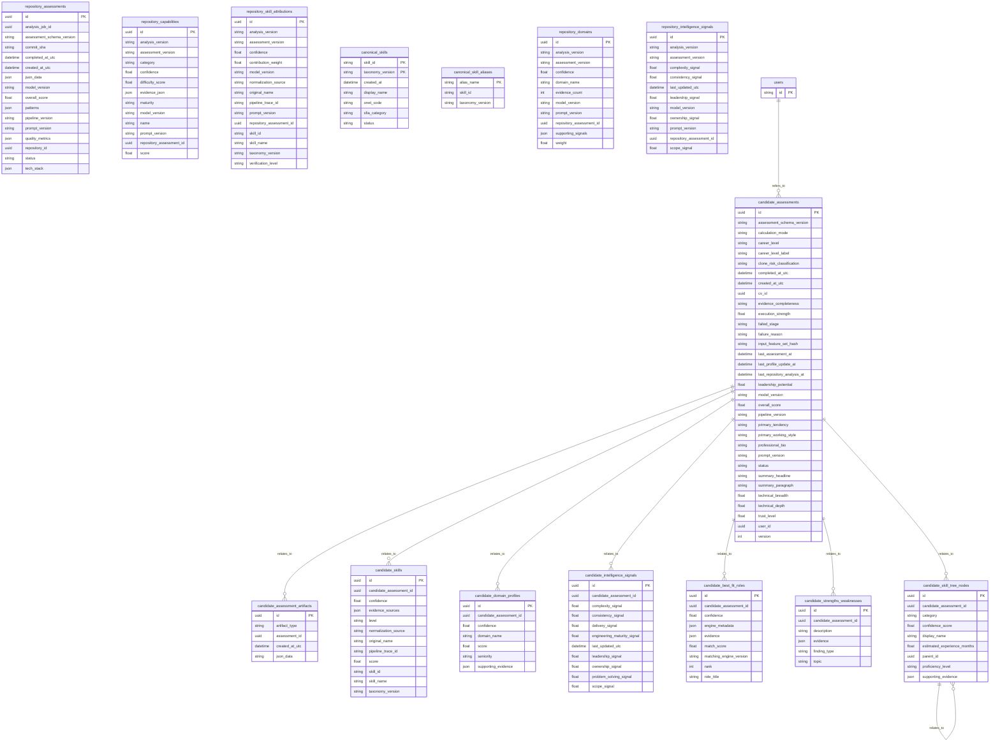

---

## 7. Source Code Intelligence & Repository Analysis

*Linked Git source code repositories, AST code analysis jobs, task executions, and static analysis reports.* (`9 tables`)

```mermaid
erDiagram

    external_organizations {
        uuid id PK
        uuid auth_provider_id
        string avatar_url
        string description
        string external_id
        string html_url
        boolean is_active
        datetime last_synced_at
        string login
        string name
        string type
    }

    source_code_repositories {
        uuid id PK
        boolean archived_externally
        uuid auth_provider_id
        string authenticity_type
        string classification
        datetime created_at_utc
        string custom_settings_json
        string default_branch
        string description
        uuid external_organization_id
        string external_repository_id
        int forks_count
        string html_url
        boolean is_accessible
        boolean is_enabled
        boolean is_private
        boolean is_verified
        datetime last_commit_at
        datetime last_seen_at
        datetime last_synced_at
        datetime last_updated_utc
        datetime latest_analysis_completed_at_utc
        string latest_analysis_status
        json latest_risk_factors_json
        string latest_risk_level
        float latest_risk_score
        string name
        int open_issues_count
        string owner
        string owner_login
        string owner_type
        string primary_language
        int stars_count
        float trust_score
        int watchers_count
    }

    analysis_jobs {
        uuid id PK
        string commit_sha
        datetime completed_at
        datetime created_at_utc
        string current_step
        string error_message
        datetime last_updated_utc
        float progress
        uuid repository_id
        datetime started_at
        string status
        uuid user_id
    }

    analysis_job_events {
        uuid id PK
        datetime created_at_utc
        uuid job_id
        string message
        float progress
        string step
    }

    analysis_reports {
        uuid id PK
        datetime created_at_utc
        uuid job_id
        json report_data
        uuid repository_id
    }

    analysis_tasks {
        uuid id PK
        int cache_read_tokens
        int cache_write_tokens
        datetime completed_at
        int completion_tokens
        datetime created_at_utc
        int duration_ms
        string error_message
        float estimated_cost_usd
        uuid job_id
        datetime last_updated_utc
        json metadata
        string model_name
        float progress
        int prompt_tokens
        int retry_count
        datetime started_at
        string status
        string task_type
    }

    analysis_task_results {
        uuid task_id PK
        datetime created_at_utc
        json result_data
        string schema_version
    }

    analysis_task_events {
        uuid id PK
        string event_type
        string level
        string message
        json metadata
        uuid task_id
        datetime timestamp
    }

    analysis_executions {
        uuid id PK
        int cached_tokens
        int completion_tokens
        datetime created_at_utc
        int duration_ms
        float estimated_cost_usd
        string execution_type
        uuid job_id
        string model
        int prompt_tokens
        string provider
        uuid task_id
        int total_tokens
        uuid user_id
    }

    analysis_jobs ||--o{ analysis_executions : relates_to
    analysis_tasks ||--o{ analysis_executions : relates_to
    users {
        string id PK
    }

    users ||--o{ analysis_executions : refers_to
    source_code_repositories ||--o{ analysis_jobs : relates_to
    users ||--o{ analysis_jobs : refers_to
    analysis_jobs ||--o{ analysis_job_events : relates_to
    analysis_jobs ||--|| analysis_reports : relates_to
    source_code_repositories ||--o{ analysis_reports : relates_to
    analysis_jobs ||--o{ analysis_tasks : relates_to
    analysis_tasks ||--o{ analysis_task_events : relates_to
    analysis_tasks ||--|| analysis_task_results : relates_to
    auth_providers {
        string id PK
    }

    auth_providers ||--o{ external_organizations : refers_to
    auth_providers ||--o{ source_code_repositories : refers_to
    external_organizations ||--o{ source_code_repositories : relates_to
```

---

## 8. Community Forum

*Discussion categories, topics, replies, moderation queues, gamification badges, and user reputation scores.* (`17 tables`)

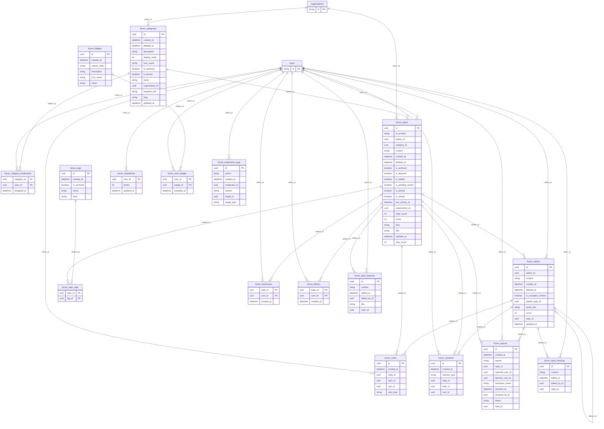

---

## 9. Audit, Security Telemetry & Messaging

*Immutable audit logs, security event telemetry, SOC incidents, in-app notifications, and outbox messaging.* (`12 tables`)

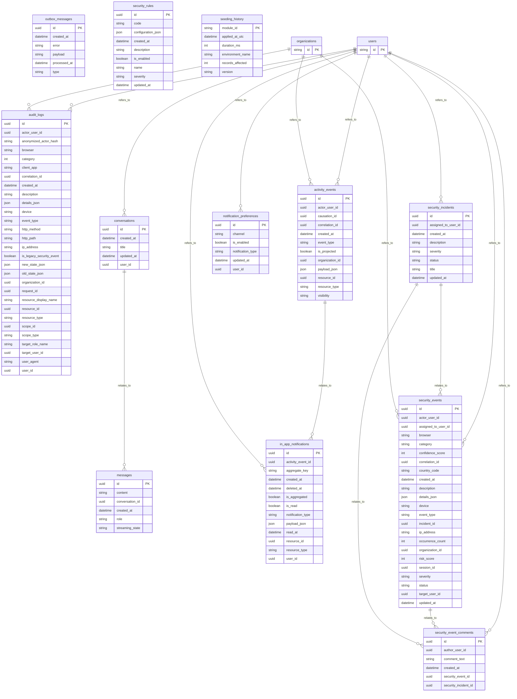

---

## 10. System Administration & Staff

*Super-administrative staff accounts, admin invitations, and pre-assigned administrative role mappings.* (`3 tables`)

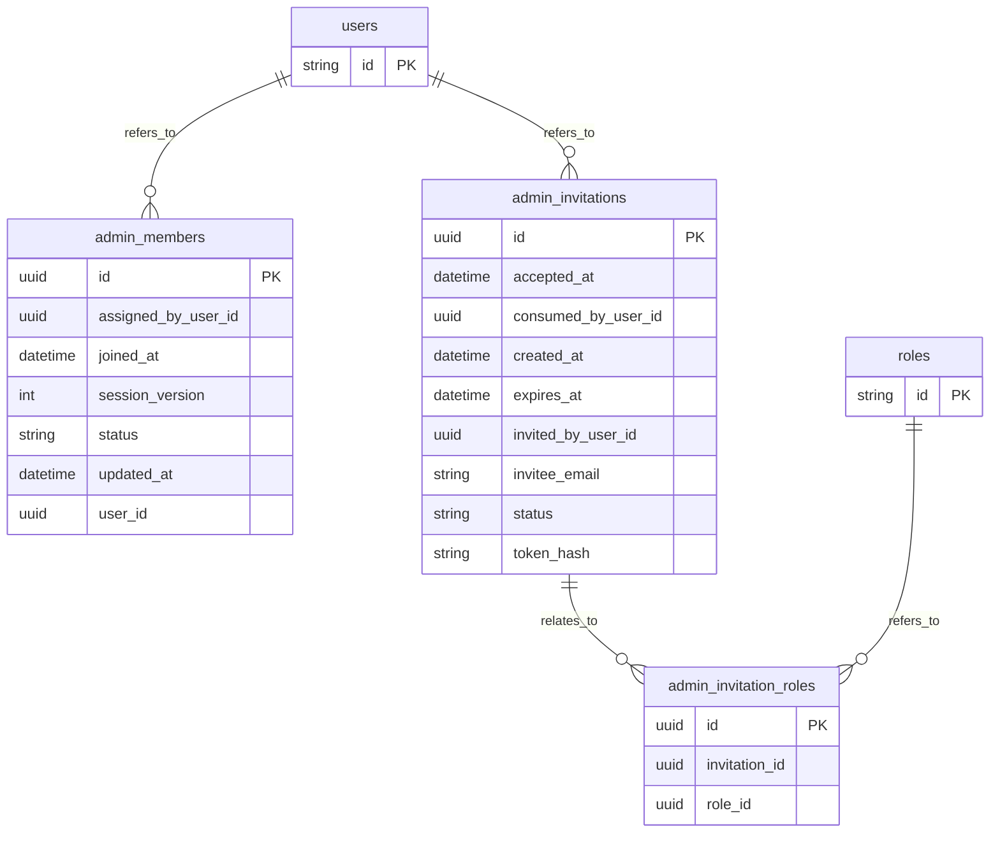

---

## 11. Platform Orchestration & AI Engine

*Background pipeline job scheduling, durable workflow tasks, AI prompt deployments, artifact registry, and token streaming.* (`12 tables`)

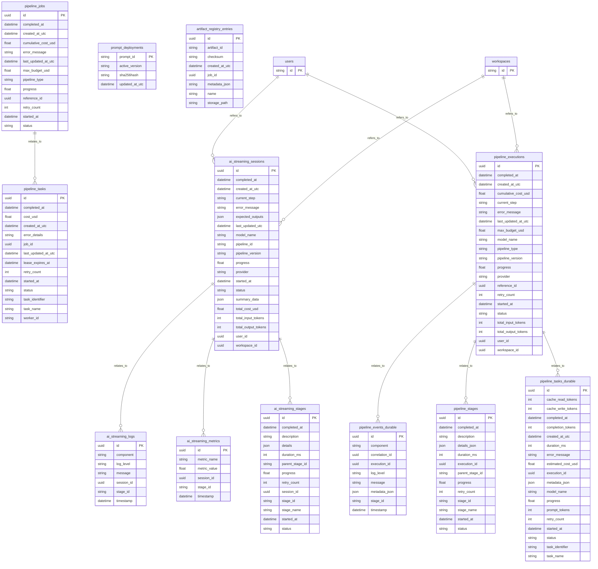

---
