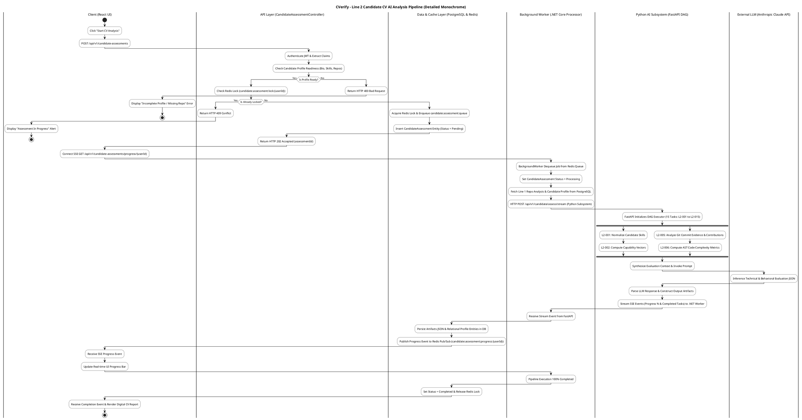
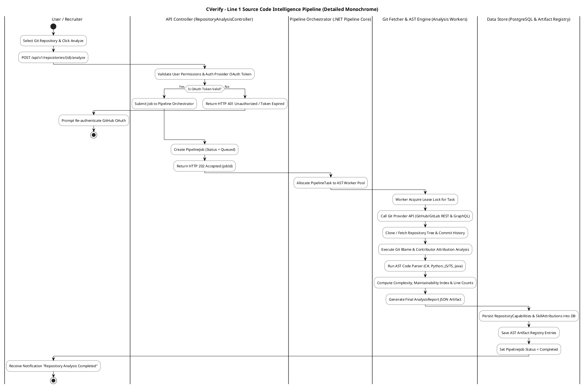
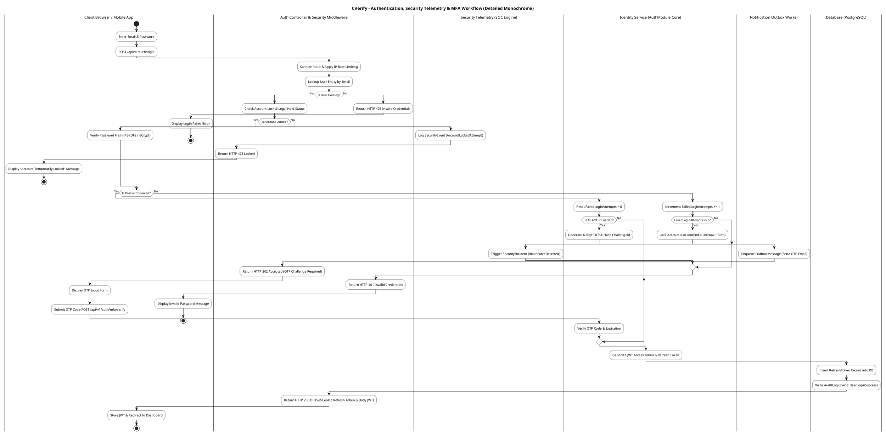
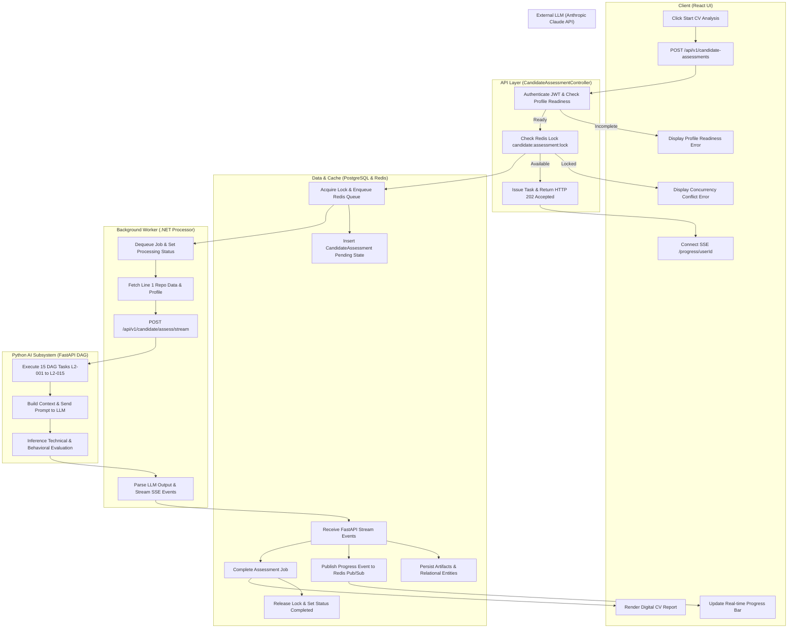

# Mã Import Sơ đồ Swimlane Chi Tiết Trắng Đen dành cho Draw.io (app.diagrams.net)

Tài liệu này chứa các mã import sơ đồ Swimlane **Chi Tiết Đầy Đủ (Fully Detailed)** ở phong cách **Trắng Đen (Monochrome / Black & White)** dành cho **Draw.io (app.diagrams.net)**.

---

## 🚀 Hướng dẫn Import vào Draw.io (3 Cách thực hiện)

### Cách 1: Import bằng PlantUML (Khuyên dùng cho sơ đồ Activity phân làn chi tiết)
1. Mở [app.diagrams.net](https://app.diagrams.net/).
2. Chọn: **Arrange** (Sắp xếp) $\rightarrow$ **Insert** (Chèn) $\rightarrow$ **Advanced** (Nâng cao) $\rightarrow$ **PlantUML...**
3. Copy toàn bộ khối ````plantuml` bên dưới và dán vào ô nhập $\rightarrow$ Nhấn **Insert**.

### Cách 2: Import bằng Mermaid (Nhanh chóng & Trực quan)
1. Chọn: **Arrange** $\rightarrow$ **Insert** $\rightarrow$ **Advanced** $\rightarrow$ **Mermaid...**
2. Copy khối ````mermaid` bên dưới và dán vào ô nhập $\rightarrow$ Nhấn **Insert**.

### Cách 3: Import bằng CSV (Tạo khối Shapes Native Trắng Đen kéo thả)
1. Chọn: **Arrange** $\rightarrow$ **Insert** $\rightarrow$ **Advanced** $\rightarrow$ **CSV...**
2. Copy khối mã CSV bên dưới và dán vào ô nhập $\rightarrow$ Nhấn **Insert**.

---

## 1. Code PlantUML Chi Tiết Trắng Đen (Import qua Arrange -> Insert -> Advanced -> PlantUML)

### Quy trình 1: Line 2 - Candidate CV AI Analysis Pipeline (Phân tích CV & Đánh giá Năng lực Ứng viên)



### Quy trình 2: Line 1 - Source Code Intelligence Pipeline (Phân tích Mã nguồn & Git Repository)



### Quy trình 3: Authentication, Security Telemetry & MFA Workflow (Đăng nhập, MFA & An ninh)



---

## 2. Code Mermaid Chi Tiết Trắng Đen (Import qua Arrange -> Insert -> Advanced -> Mermaid)



---

## 3. Code Draw.io CSV Format Chi Tiết Trắng Đen (Import qua Arrange -> Insert -> Advanced -> CSV)

```csv
# label: %step%
# style: shape=%shape%;fillColor=#FFFFFF;strokeColor=#000000;fontColor=#000000;fontStyle=1;whiteSpace=wrap;html=1;rounded=1;strokeWidth=1.5;
# namespace: csvimport
# connect: {"from": "from", "to": "id", "label": "label", "style": "edgeStyle=orthogonalEdgeStyle;rounded=1;strokeColor=#000000;strokeWidth=1.5;"}
# width: 240
# height: 60
# padding: 20
# layout: auto
# swimlane: lane
id,lane,step,shape,from,label
L1,Client (React UI),1. Click "Start CV Analysis",rectangle,,
L2,API Layer (.NET Controller),2. Authenticate JWT & Readiness Check,rhombus,L1,POST /api/v1/candidate-assessments
L3,Data & Cache Layer,3. Acquire Redis Lock & Enqueue Queue,rectangle,L2,Ready
L4,Background Worker (.NET),4. Dequeue Job & Fetch Line 1 Data,rectangle,L3,Queued
L5,Python AI Subsystem,5. Run 15 DAG Tasks (L2-001 to L2-015),rectangle,L4,POST /assess/stream
L6,External LLM (Claude API),6. Inference Technical & Behavioral JSON,rectangle,L5,Send Context
L7,Python AI Subsystem,7. Parse Output & Stream SSE Events,rectangle,L6,Response
L8,Data & Cache Layer,8. Save DB Artifacts & Pub/Sub Progress,rectangle,L7,Stream Event
L9,Client (React UI),9. Update SSE Progress Bar & Render CV,rectangle,L8,Progress Event
L10,Background Worker (.NET),10. Complete Execution & Set Status,rectangle,L8,Done
L11,Data & Cache Layer,11. Set Status = Completed & Release Lock,rectangle,L10,Complete
```

---
*Mã Import Draw.io phiên bản Chi Tiết Đầy Đủ (Trắng Đen Monochrome) cho CVerify.*
