# Logical ERD Code Documentation (Mô hình ERD Ký hiệu Chen)

Tài liệu này chứa toàn bộ mã Mermaid ERD khái niệm theo chuẩn **Ký hiệu Chen (Peter Chen ERD Notation)** cho hệ thống CVerify, chia nhỏ độc lập theo **11 module nghiệp vụ**:
* **Thực thể (Entities)**: Hộp chữ nhật (`[ENTITY_NAME]`)
* **Mối quan hệ (Relationships)**: Hình thoi (`{"RELATIONSHIP"}`)
* **Thuộc tính (Attributes)**: Hình elip (`([attribute])`), thuộc tính Khóa chính được gạch chân (`([<u>pk_id</u>])`)
* **Bản thể (Cardinalities)**: Nhãn `1`, `N`, `M` trên các đường nối kết nối Thực thể và Hình thoi Mối quan hệ

## Mục lục Sơ đồ
1. [Mô hình Tổng quan Liên kết giữa các Module](#tong-quan-modules)
2. [1. Identity & Access Management (IAM)](#iam)
2. [2. Organizations & Workspaces](#organizations_workspaces)
2. [3. Candidate Profile & Portfolio](#candidate_profile)
2. [4. Talent Intelligence Graph](#talent_intelligence)
2. [5. Recruitment & Job Vacancy Matching](#recruitment_job_matching)
2. [6. Candidate Assessment & Skill Attribution](#candidate_assessment)
2. [7. Source Code Intelligence & Repository Analysis](#source_code_intelligence)
2. [8. Community Forum](#community_forum)
2. [9. Audit, Security Telemetry & Messaging](#audit_security_messaging)
2. [10. System Administration & Staff](#administration)
2. [11. Platform Orchestration & AI Engine](#platform_orchestration_ai)

---

## Mô hình Tổng quan Liên kết giữa các Module

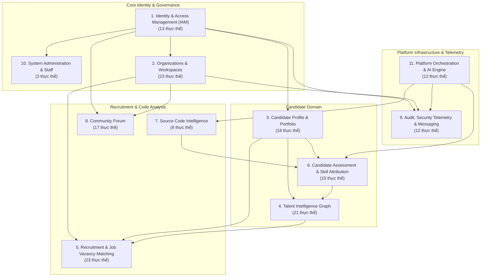

---

## 1. Identity & Access Management (IAM)

*Logical domain capturing user identities, authentication states, RBAC roles, permission assignments, OAuth providers, and session tokens.* (`13 thực thể`)

```mermaid
flowchart TD

    %% Thực thể (Hộp chữ nhật / Rectangles)
    E_users["USERS"]
    E_roles["ROLES"]
    E_permissions["PERMISSIONS"]
    E_user_roles["USER_ROLES"]
    E_role_permissions["ROLE_PERMISSIONS"]
    E_role_assignments["ROLE_ASSIGNMENTS"]
    E_refresh_tokens["REFRESH_TOKENS"]
    E_verification_tokens["VERIFICATION_TOKENS"]
    E_reset_password_tokens["RESET_PASSWORD_TOKENS"]
    E_auth_providers["AUTH_PROVIDERS"]
    E_pending_auth_providers["PENDING_AUTH_PROVIDERS"]
    E_otp_verifications["OTP_VERIFICATIONS"]
    E_verification_links["VERIFICATION_LINKS"]

    %% Thuộc tính (Hình elip / Ovals)
    A_users_id(["<u>id</u>"]) --- E_users
    A_users_avatar_source(["avatar_source"]) --- E_users
    A_users_avatar_url(["avatar_url"]) --- E_users
    A_roles_id(["<u>id</u>"]) --- E_roles
    A_roles_created_at(["created_at"]) --- E_roles
    A_roles_deleted_at(["deleted_at"]) --- E_roles
    A_permissions_id(["<u>id</u>"]) --- E_permissions
    A_permissions_created_at(["created_at"]) --- E_permissions
    A_permissions_description(["description"]) --- E_permissions
    A_user_roles_role_id(["<u>role_id</u>"]) --- E_user_roles
    A_user_roles_user_id(["<u>user_id</u>"]) --- E_user_roles
    A_user_roles_assigned_at(["assigned_at"]) --- E_user_roles
    A_role_permissions_permission_id(["<u>permission_id</u>"]) --- E_role_permissions
    A_role_permissions_role_id(["<u>role_id</u>"]) --- E_role_permissions
    A_role_permissions_assigned_at(["assigned_at"]) --- E_role_permissions
    A_role_assignments_id(["<u>id</u>"]) --- E_role_assignments
    A_role_assignments_assigned_at(["assigned_at"]) --- E_role_assignments
    A_role_assignments_role_id(["role_id"]) --- E_role_assignments
    A_refresh_tokens_id(["<u>id</u>"]) --- E_refresh_tokens
    A_refresh_tokens_created_at(["created_at"]) --- E_refresh_tokens
    A_refresh_tokens_expires_at(["expires_at"]) --- E_refresh_tokens
    A_verification_tokens_id(["<u>id</u>"]) --- E_verification_tokens
    A_verification_tokens_consumed_at(["consumed_at"]) --- E_verification_tokens
    A_verification_tokens_created_at(["created_at"]) --- E_verification_tokens
    A_reset_password_tokens_id(["<u>id</u>"]) --- E_reset_password_tokens
    A_reset_password_tokens_consumed_at(["consumed_at"]) --- E_reset_password_tokens
    A_reset_password_tokens_created_at(["created_at"]) --- E_reset_password_tokens
    A_auth_providers_id(["<u>id</u>"]) --- E_auth_providers
    A_auth_providers_created_at(["created_at"]) --- E_auth_providers
    A_auth_providers_deleted_at(["deleted_at"]) --- E_auth_providers
    A_pending_auth_providers_id(["<u>id</u>"]) --- E_pending_auth_providers
    A_pending_auth_providers_created_at(["created_at"]) --- E_pending_auth_providers
    A_pending_auth_providers_encrypted_access_token(["encrypted_access_token"]) --- E_pending_auth_providers
    A_otp_verifications_id(["<u>id</u>"]) --- E_otp_verifications
    A_otp_verifications_attempts(["attempts"]) --- E_otp_verifications
    A_otp_verifications_challenge_id(["challenge_id"]) --- E_otp_verifications
    A_verification_links_id(["<u>id</u>"]) --- E_verification_links
    A_verification_links_consumed_at(["consumed_at"]) --- E_verification_links
    A_verification_links_consumed_by_ip(["consumed_by_ip"]) --- E_verification_links

    %% Mối quan hệ (Hình thoi / Diamonds & Bản thể)
    R_iam_1{"USERS_AUTH"}
    E_users ---|"1"| R_iam_1
    R_iam_1 ---|"N"| E_auth_providers
    R_iam_2{"USERS_PENDING"}
    E_users ---|"1"| R_iam_2
    R_iam_2 ---|"N"| E_pending_auth_providers
    R_iam_3{"USERS_REFRESH"}
    E_users ---|"1"| R_iam_3
    R_iam_3 ---|"N"| E_refresh_tokens
    R_iam_4{"USERS_RESET"}
    E_users ---|"1"| R_iam_4
    R_iam_4 ---|"N"| E_reset_password_tokens
    R_iam_5{"USERS_VERIFICATION"}
    E_users ---|"1"| R_iam_5
    R_iam_5 ---|"N"| E_verification_links
    R_iam_6{"USERS_VERIFICATION"}
    E_users ---|"1"| R_iam_6
    R_iam_6 ---|"N"| E_verification_tokens
    R_iam_7{"ROLES_ROLES"}
    E_roles ---|"1"| R_iam_7
    R_iam_7 ---|"N"| E_roles
    R_iam_8{"ROLES_ROLE"}
    E_roles ---|"1"| R_iam_8
    R_iam_8 ---|"N"| E_role_assignments
    R_iam_9{"USERS_ROLE"}
    E_users ---|"1"| R_iam_9
    R_iam_9 ---|"N"| E_role_assignments
```

---

## 2. Organizations & Workspaces

*Logical domain representing multi-tenant enterprise organizations, collaborative workspaces, workspace memberships, and legal authority workflows.* (`23 thực thể`)

```mermaid
flowchart TD

    %% Thực thể (Hộp chữ nhật / Rectangles)
    E_organizations["ORGANIZATIONS"]
    E_organization_authorities["ORGANIZATION_AUTHORITIES"]
    E_organization_memberships["ORGANIZATION_MEMBERSHIPS"]
    E_organization_followers["ORGANIZATION_FOLLOWERS"]
    E_organization_verifications["ORGANIZATION_VERIFICATIONS"]
    E_organization_credentials["ORGANIZATION_CREDENTIALS"]
    E_pending_organization_ownerships["PENDING_ORGANIZATION_OWNERSHIPS"]
    E_organization_invitations["ORGANIZATION_INVITATIONS"]
    E_organization_invitation_roles["ORGANIZATION_INVITATION_ROLES"]
    E_organization_recovery_claims["ORGANIZATION_RECOVERY_CLAIMS"]
    E_approved_recovery_sessions["APPROVED_RECOVERY_SESSIONS"]
    E_recovery_execution_locks["RECOVERY_EXECUTION_LOCKS"]
    E_recovery_tokens["RECOVERY_TOKENS"]
    E_representative_rotation_requests["REPRESENTATIVE_ROTATION_REQUESTS"]
    E_representative_approval_votes["REPRESENTATIVE_APPROVAL_VOTES"]
    E_representative_authority_histories["REPRESENTATIVE_AUTHORITY_HISTORIES"]
    E_enterprise_workflow_requests["ENTERPRISE_WORKFLOW_REQUESTS"]
    E_workflow_attachments["WORKFLOW_ATTACHMENTS"]
    E_workflow_comments["WORKFLOW_COMMENTS"]
    E_workspaces["WORKSPACES"]
    E_workspace_members["WORKSPACE_MEMBERS"]
    E_workspace_archive_snapshots["WORKSPACE_ARCHIVE_SNAPSHOTS"]
    E_workspace_posts["WORKSPACE_POSTS"]

    %% Thuộc tính (Hình elip / Ovals)
    A_organizations_id(["<u>id</u>"]) --- E_organizations
    A_organizations_banner_url(["banner_url"]) --- E_organizations
    A_organizations_branch_count(["branch_count"]) --- E_organizations
    A_organization_authorities_id(["<u>id</u>"]) --- E_organization_authorities
    A_organization_authorities_joined_at(["joined_at"]) --- E_organization_authorities
    A_organization_authorities_organization_id(["organization_id"]) --- E_organization_authorities
    A_organization_memberships_id(["<u>id</u>"]) --- E_organization_memberships
    A_organization_memberships_joined_at(["joined_at"]) --- E_organization_memberships
    A_organization_memberships_organization_id(["organization_id"]) --- E_organization_memberships
    A_organization_followers_user_id(["<u>user_id</u>"]) --- E_organization_followers
    A_organization_followers_organization_id(["<u>organization_id</u>"]) --- E_organization_followers
    A_organization_followers_followed_at(["followed_at"]) --- E_organization_followers
    A_organization_verifications_id(["<u>id</u>"]) --- E_organization_verifications
    A_organization_verifications_is_verified(["is_verified"]) --- E_organization_verifications
    A_organization_verifications_metadata(["metadata"]) --- E_organization_verifications
    A_organization_credentials_organization_id(["<u>organization_id</u>"]) --- E_organization_credentials
    A_organization_credentials_created_at(["created_at"]) --- E_organization_credentials
    A_organization_credentials_deleted_at(["deleted_at"]) --- E_organization_credentials
    A_pending_organization_ownerships_id(["<u>id</u>"]) --- E_pending_organization_ownerships
    A_pending_organization_ownerships_consumed_at(["consumed_at"]) --- E_pending_organization_ownerships
    A_pending_organization_ownerships_consumed_by_user_id(["consumed_by_user_id"]) --- E_pending_organization_ownerships
    A_organization_invitations_id(["<u>id</u>"]) --- E_organization_invitations
    A_organization_invitations_accepted_at(["accepted_at"]) --- E_organization_invitations
    A_organization_invitations_consumed_by_user_id(["consumed_by_user_id"]) --- E_organization_invitations
    A_organization_invitation_roles_id(["<u>id</u>"]) --- E_organization_invitation_roles
    A_organization_invitation_roles_invitation_id(["invitation_id"]) --- E_organization_invitation_roles
    A_organization_invitation_roles_role_id(["role_id"]) --- E_organization_invitation_roles
    A_organization_recovery_claims_id(["<u>id</u>"]) --- E_organization_recovery_claims
    A_organization_recovery_claims_created_at(["created_at"]) --- E_organization_recovery_claims
    A_organization_recovery_claims_document_ocr_metadata(["document_ocr_metadata"]) --- E_organization_recovery_claims
    A_approved_recovery_sessions_id(["<u>id</u>"]) --- E_approved_recovery_sessions
    A_approved_recovery_sessions_approved_by(["approved_by"]) --- E_approved_recovery_sessions
    A_approved_recovery_sessions_approved_representative(["approved_representative"]) --- E_approved_recovery_sessions
    A_recovery_execution_locks_id(["<u>id</u>"]) --- E_recovery_execution_locks
    A_recovery_execution_locks_acquired_at(["acquired_at"]) --- E_recovery_execution_locks
    A_recovery_execution_locks_completed_at(["completed_at"]) --- E_recovery_execution_locks
    A_recovery_tokens_id(["<u>id</u>"]) --- E_recovery_tokens
    A_recovery_tokens_consumed_at(["consumed_at"]) --- E_recovery_tokens
    A_recovery_tokens_created_at(["created_at"]) --- E_recovery_tokens
    A_representative_rotation_requests_id(["<u>id</u>"]) --- E_representative_rotation_requests
    A_representative_rotation_requests_admin_approval_status(["admin_approval_status"]) --- E_representative_rotation_requests
    A_representative_rotation_requests_created_at(["created_at"]) --- E_representative_rotation_requests
    A_representative_approval_votes_id(["<u>id</u>"]) --- E_representative_approval_votes
    A_representative_approval_votes_approver_role(["approver_role"]) --- E_representative_approval_votes
    A_representative_approval_votes_approver_user_id(["approver_user_id"]) --- E_representative_approval_votes
    A_representative_authority_histories_id(["<u>id</u>"]) --- E_representative_authority_histories
    A_representative_authority_histories_effective_at(["effective_at"]) --- E_representative_authority_histories
    A_representative_authority_histories_new_representative(["new_representative"]) --- E_representative_authority_histories
    A_enterprise_workflow_requests_id(["<u>id</u>"]) --- E_enterprise_workflow_requests
    A_enterprise_workflow_requests_assigned_at(["assigned_at"]) --- E_enterprise_workflow_requests
    A_enterprise_workflow_requests_assigned_reviewer_id(["assigned_reviewer_id"]) --- E_enterprise_workflow_requests
    A_workflow_attachments_id(["<u>id</u>"]) --- E_workflow_attachments
    A_workflow_attachments_content_type(["content_type"]) --- E_workflow_attachments
    A_workflow_attachments_created_at(["created_at"]) --- E_workflow_attachments
    A_workflow_comments_id(["<u>id</u>"]) --- E_workflow_comments
    A_workflow_comments_author_user_id(["author_user_id"]) --- E_workflow_comments
    A_workflow_comments_content(["content"]) --- E_workflow_comments
    A_workspaces_id(["<u>id</u>"]) --- E_workspaces
    A_workspaces_branding(["branding"]) --- E_workspaces
    A_workspaces_created_at(["created_at"]) --- E_workspaces
    A_workspace_members_id(["<u>id</u>"]) --- E_workspace_members
    A_workspace_members_joined_at(["joined_at"]) --- E_workspace_members
    A_workspace_members_role(["role"]) --- E_workspace_members
    A_workspace_archive_snapshots_id(["<u>id</u>"]) --- E_workspace_archive_snapshots
    A_workspace_archive_snapshots_archived_by(["archived_by"]) --- E_workspace_archive_snapshots
    A_workspace_archive_snapshots_created_at(["created_at"]) --- E_workspace_archive_snapshots
    A_workspace_posts_id(["<u>id</u>"]) --- E_workspace_posts
    A_workspace_posts_category(["category"]) --- E_workspace_posts
    A_workspace_posts_content(["content"]) --- E_workspace_posts

    %% Mối quan hệ (Hình thoi / Diamonds & Bản thể)
    R_organizations_workspaces_1{"ORGANIZATIONS_ORGANIZATION"}
    E_organizations ---|"1"| R_organizations_workspaces_1
    R_organizations_workspaces_1 ---|"N"| E_organization_credentials
    R_organizations_workspaces_2{"ORGANIZATIONS_APPROVED"}
    E_organizations ---|"1"| R_organizations_workspaces_2
    R_organizations_workspaces_2 ---|"N"| E_approved_recovery_sessions
    R_organizations_workspaces_3{"ORGANIZATIONS_ORGANIZATION"}
    E_organizations ---|"1"| R_organizations_workspaces_3
    R_organizations_workspaces_3 ---|"N"| E_organization_recovery_claims
    R_organizations_workspaces_4{"ORGANIZATIONS_RECOVERY"}
    E_organizations ---|"1"| R_organizations_workspaces_4
    R_organizations_workspaces_4 ---|"N"| E_recovery_tokens
    R_organizations_workspaces_5{"REPRESENTATIVE_REPRESENTATIVE"}
    E_representative_rotation_requests ---|"1"| R_organizations_workspaces_5
    R_organizations_workspaces_5 ---|"N"| E_representative_approval_votes
    R_organizations_workspaces_6{"ORGANIZATIONS_REPRESENTATIVE"}
    E_organizations ---|"1"| R_organizations_workspaces_6
    R_organizations_workspaces_6 ---|"N"| E_representative_authority_histories
    R_organizations_workspaces_7{"ORGANIZATIONS_REPRESENTATIVE"}
    E_organizations ---|"1"| R_organizations_workspaces_7
    R_organizations_workspaces_7 ---|"N"| E_representative_rotation_requests
    R_organizations_workspaces_8{"ORGANIZATIONS_ENTERPRISE"}
    E_organizations ---|"1"| R_organizations_workspaces_8
    R_organizations_workspaces_8 ---|"N"| E_enterprise_workflow_requests
    R_organizations_workspaces_9{"ORGANIZATIONS_ORGANIZATION"}
    E_organizations ---|"1"| R_organizations_workspaces_9
    R_organizations_workspaces_9 ---|"N"| E_organization_authorities
    R_organizations_workspaces_10{"ORGANIZATIONS_ORGANIZATION"}
    E_organizations ---|"1"| R_organizations_workspaces_10
    R_organizations_workspaces_10 ---|"N"| E_organization_followers
    R_organizations_workspaces_11{"ORGANIZATIONS_ORGANIZATION"}
    E_organizations ---|"1"| R_organizations_workspaces_11
    R_organizations_workspaces_11 ---|"N"| E_organization_invitations
    R_organizations_workspaces_12{"ORGANIZATION_ORGANIZATION"}
    E_organization_invitations ---|"1"| R_organizations_workspaces_12
    R_organizations_workspaces_12 ---|"N"| E_organization_invitation_roles
    R_organizations_workspaces_13{"ORGANIZATIONS_ORGANIZATION"}
    E_organizations ---|"1"| R_organizations_workspaces_13
    R_organizations_workspaces_13 ---|"N"| E_organization_memberships
    R_organizations_workspaces_14{"ORGANIZATIONS_ORGANIZATION"}
    E_organizations ---|"1"| R_organizations_workspaces_14
    R_organizations_workspaces_14 ---|"N"| E_organization_verifications
    R_organizations_workspaces_15{"ORGANIZATIONS_PENDING"}
    E_organizations ---|"1"| R_organizations_workspaces_15
    R_organizations_workspaces_15 ---|"N"| E_pending_organization_ownerships
    R_organizations_workspaces_16{"ENTERPRISE_WORKFLOW"}
    E_enterprise_workflow_requests ---|"1"| R_organizations_workspaces_16
    R_organizations_workspaces_16 ---|"N"| E_workflow_attachments
    R_organizations_workspaces_17{"ENTERPRISE_WORKFLOW"}
    E_enterprise_workflow_requests ---|"1"| R_organizations_workspaces_17
    R_organizations_workspaces_17 ---|"N"| E_workflow_comments
    R_organizations_workspaces_18{"ORGANIZATIONS_WORKSPACES"}
    E_organizations ---|"1"| R_organizations_workspaces_18
    R_organizations_workspaces_18 ---|"N"| E_workspaces
    R_organizations_workspaces_19{"WORKSPACES_WORKSPACE"}
    E_workspaces ---|"1"| R_organizations_workspaces_19
    R_organizations_workspaces_19 ---|"N"| E_workspace_members
    R_organizations_workspaces_20{"ORGANIZATIONS_WORKSPACE"}
    E_organizations ---|"1"| R_organizations_workspaces_20
    R_organizations_workspaces_20 ---|"N"| E_workspace_posts
```

---

## 3. Candidate Profile & Portfolio

*Logical domain encapsulating candidate CV information, employment background, educational history, achievements, and portfolio project links.* (`18 thực thể`)

```mermaid
flowchart TD

    %% Thực thể (Hộp chữ nhật / Rectangles)
    E_user_profiles["USER_PROFILES"]
    E_career_preferences["CAREER_PREFERENCES"]
    E_ai_inferred_preferences["AI_INFERRED_PREFERENCES"]
    E_user_skills["USER_SKILLS"]
    E_education_entries["EDUCATION_ENTRIES"]
    E_academic_achievements["ACADEMIC_ACHIEVEMENTS"]
    E_profile_attachments["PROFILE_ATTACHMENTS"]
    E_work_experience_entries["WORK_EXPERIENCE_ENTRIES"]
    E_work_experience_achievements["WORK_EXPERIENCE_ACHIEVEMENTS"]
    E_work_experience_technologies["WORK_EXPERIENCE_TECHNOLOGIES"]
    E_work_experience_links["WORK_EXPERIENCE_LINKS"]
    E_project_entries["PROJECT_ENTRIES"]
    E_project_repository_links["PROJECT_REPOSITORY_LINKS"]
    E_project_technologies["PROJECT_TECHNOLOGIES"]
    E_project_contributions["PROJECT_CONTRIBUTIONS"]
    E_user_cv_settings["USER_CV_SETTINGS"]
    E_cv_repository_mappings["CV_REPOSITORY_MAPPINGS"]
    E_user_followers["USER_FOLLOWERS"]

    %% Thuộc tính (Hình elip / Ovals)
    A_user_profiles_user_id(["<u>user_id</u>"]) --- E_user_profiles
    A_user_profiles_ai_suggestions_json(["ai_suggestions_json"]) --- E_user_profiles
    A_user_profiles_ai_talent_discovery(["ai_talent_discovery"]) --- E_user_profiles
    A_career_preferences_user_id(["<u>user_id</u>"]) --- E_career_preferences
    A_career_preferences_available_for_hire(["available_for_hire"]) --- E_career_preferences
    A_career_preferences_created_at(["created_at"]) --- E_career_preferences
    A_ai_inferred_preferences_user_id(["<u>user_id</u>"]) --- E_ai_inferred_preferences
    A_ai_inferred_preferences_confidence_score(["confidence_score"]) --- E_ai_inferred_preferences
    A_ai_inferred_preferences_created_at(["created_at"]) --- E_ai_inferred_preferences
    A_user_skills_id(["<u>id</u>"]) --- E_user_skills
    A_user_skills_created_at(["created_at"]) --- E_user_skills
    A_user_skills_normalized_name(["normalized_name"]) --- E_user_skills
    A_education_entries_id(["<u>id</u>"]) --- E_education_entries
    A_education_entries_created_at(["created_at"]) --- E_education_entries
    A_education_entries_degree(["degree"]) --- E_education_entries
    A_academic_achievements_id(["<u>id</u>"]) --- E_academic_achievements
    A_academic_achievements_created_at(["created_at"]) --- E_academic_achievements
    A_academic_achievements_credential_url(["credential_url"]) --- E_academic_achievements
    A_profile_attachments_id(["<u>id</u>"]) --- E_profile_attachments
    A_profile_attachments_created_at(["created_at"]) --- E_profile_attachments
    A_profile_attachments_deleted_at(["deleted_at"]) --- E_profile_attachments
    A_work_experience_entries_id(["<u>id</u>"]) --- E_work_experience_entries
    A_work_experience_entries_company(["company"]) --- E_work_experience_entries
    A_work_experience_entries_created_at(["created_at"]) --- E_work_experience_entries
    A_work_experience_achievements_id(["<u>id</u>"]) --- E_work_experience_achievements
    A_work_experience_achievements_created_at(["created_at"]) --- E_work_experience_achievements
    A_work_experience_achievements_description(["description"]) --- E_work_experience_achievements
    A_work_experience_technologies_id(["<u>id</u>"]) --- E_work_experience_technologies
    A_work_experience_technologies_created_at(["created_at"]) --- E_work_experience_technologies
    A_work_experience_technologies_name(["name"]) --- E_work_experience_technologies
    A_work_experience_links_id(["<u>id</u>"]) --- E_work_experience_links
    A_work_experience_links_created_at(["created_at"]) --- E_work_experience_links
    A_work_experience_links_link_type(["link_type"]) --- E_work_experience_links
    A_project_entries_id(["<u>id</u>"]) --- E_project_entries
    A_project_entries_created_at(["created_at"]) --- E_project_entries
    A_project_entries_deleted_at(["deleted_at"]) --- E_project_entries
    A_project_repository_links_id(["<u>id</u>"]) --- E_project_repository_links
    A_project_repository_links_linked_at(["linked_at"]) --- E_project_repository_links
    A_project_repository_links_project_entry_id(["project_entry_id"]) --- E_project_repository_links
    A_project_technologies_id(["<u>id</u>"]) --- E_project_technologies
    A_project_technologies_created_at(["created_at"]) --- E_project_technologies
    A_project_technologies_name(["name"]) --- E_project_technologies
    A_project_contributions_id(["<u>id</u>"]) --- E_project_contributions
    A_project_contributions_content(["content"]) --- E_project_contributions
    A_project_contributions_created_at(["created_at"]) --- E_project_contributions
    A_user_cv_settings_user_id(["<u>user_id</u>"]) --- E_user_cv_settings
    A_user_cv_settings_created_at(["created_at"]) --- E_user_cv_settings
    A_user_cv_settings_cv_layout_config_json(["cv_layout_config_json"]) --- E_user_cv_settings
    A_cv_repository_mappings_id(["<u>id</u>"]) --- E_cv_repository_mappings
    A_cv_repository_mappings_indexed_at_utc(["indexed_at_utc"]) --- E_cv_repository_mappings
    A_cv_repository_mappings_reference_entity_id(["reference_entity_id"]) --- E_cv_repository_mappings
    A_user_followers_follower_id(["<u>follower_id</u>"]) --- E_user_followers
    A_user_followers_followee_id(["<u>followee_id</u>"]) --- E_user_followers
    A_user_followers_followed_at(["followed_at"]) --- E_user_followers

    %% Mối quan hệ (Hình thoi / Diamonds & Bản thể)
    R_candidate_profile_1{"PROJECT_PROJECT"}
    E_project_entries ---|"1"| R_candidate_profile_1
    R_candidate_profile_1 ---|"N"| E_project_contributions
    R_candidate_profile_2{"PROJECT_PROJECT"}
    E_project_entries ---|"1"| R_candidate_profile_2
    R_candidate_profile_2 ---|"N"| E_project_repository_links
    R_candidate_profile_3{"PROJECT_PROJECT"}
    E_project_entries ---|"1"| R_candidate_profile_3
    R_candidate_profile_3 ---|"N"| E_project_technologies
    R_candidate_profile_4{"WORK_WORK"}
    E_work_experience_entries ---|"1"| R_candidate_profile_4
    R_candidate_profile_4 ---|"N"| E_work_experience_achievements
    R_candidate_profile_5{"WORK_WORK"}
    E_work_experience_entries ---|"1"| R_candidate_profile_5
    R_candidate_profile_5 ---|"N"| E_work_experience_links
    R_candidate_profile_6{"WORK_WORK"}
    E_work_experience_entries ---|"1"| R_candidate_profile_6
    R_candidate_profile_6 ---|"N"| E_work_experience_technologies
```

---

## 4. Talent Intelligence Graph

*Logical domain representing the candidate capability knowledge graph, evidence claims, trust metrics, and search profile projections.* (`21 thực thể`)

```mermaid
flowchart TD

    %% Thực thể (Hộp chữ nhật / Rectangles)
    E_capability_nodes["CAPABILITY_NODES"]
    E_capability_edges["CAPABILITY_EDGES"]
    E_candidate_capabilities["CANDIDATE_CAPABILITIES"]
    E_candidate_capability_evidences["CANDIDATE_CAPABILITY_EVIDENCES"]
    E_candidate_capability_scores["CANDIDATE_CAPABILITY_SCORES"]
    E_candidate_capability_histories["CANDIDATE_CAPABILITY_HISTORIES"]
    E_evidence_sources["EVIDENCE_SOURCES"]
    E_evidence_artifacts["EVIDENCE_ARTIFACTS"]
    E_evidence_claims["EVIDENCE_CLAIMS"]
    E_evidence_verifications["EVIDENCE_VERIFICATIONS"]
    E_trust_profiles["TRUST_PROFILES"]
    E_trust_components["TRUST_COMPONENTS"]
    E_trust_calculations["TRUST_CALCULATIONS"]
    E_candidate_trust_projections["CANDIDATE_TRUST_PROJECTIONS"]
    E_candidate_search_profiles["CANDIDATE_SEARCH_PROFILES"]
    E_candidate_ranking_projections["CANDIDATE_RANKING_PROJECTIONS"]
    E_candidate_capability_projections["CANDIDATE_CAPABILITY_PROJECTIONS"]
    E_capability_catalog_items["CAPABILITY_CATALOG_ITEMS"]
    E_capability_registries["CAPABILITY_REGISTRIES"]
    E_capability_hierarchies["CAPABILITY_HIERARCHIES"]
    E_capability_aliases["CAPABILITY_ALIASES"]

    %% Thuộc tính (Hình elip / Ovals)
    A_capability_nodes_id(["<u>id</u>"]) --- E_capability_nodes
    A_capability_nodes_category(["category"]) --- E_capability_nodes
    A_capability_nodes_created_at(["created_at"]) --- E_capability_nodes
    A_capability_edges_source_node_id(["<u>source_node_id</u>"]) --- E_capability_edges
    A_capability_edges_target_node_id(["<u>target_node_id</u>"]) --- E_capability_edges
    A_capability_edges_relationship_type(["<u>relationship_type</u>"]) --- E_capability_edges
    A_candidate_capabilities_id(["<u>id</u>"]) --- E_candidate_capabilities
    A_candidate_capabilities_candidate_id(["candidate_id"]) --- E_candidate_capabilities
    A_candidate_capabilities_capability_node_id(["capability_node_id"]) --- E_candidate_capabilities
    A_candidate_capability_evidences_candidate_capability_id(["<u>candidate_capability_id</u>"]) --- E_candidate_capability_evidences
    A_candidate_capability_evidences_evidence_artifact_id(["<u>evidence_artifact_id</u>"]) --- E_candidate_capability_evidences
    A_candidate_capability_evidences_added_at(["added_at"]) --- E_candidate_capability_evidences
    A_candidate_capability_scores_candidate_capability_id(["<u>candidate_capability_id</u>"]) --- E_candidate_capability_scores
    A_candidate_capability_scores_calculated_at(["calculated_at"]) --- E_candidate_capability_scores
    A_candidate_capability_scores_expertise_level(["expertise_level"]) --- E_candidate_capability_scores
    A_candidate_capability_histories_id(["<u>id</u>"]) --- E_candidate_capability_histories
    A_candidate_capability_histories_candidate_capability_id(["candidate_capability_id"]) --- E_candidate_capability_histories
    A_candidate_capability_histories_proficiency_score(["proficiency_score"]) --- E_candidate_capability_histories
    A_evidence_sources_id(["<u>id</u>"]) --- E_evidence_sources
    A_evidence_sources_connection_config(["connection_config"]) --- E_evidence_sources
    A_evidence_sources_created_at(["created_at"]) --- E_evidence_sources
    A_evidence_artifacts_id(["<u>id</u>"]) --- E_evidence_artifacts
    A_evidence_artifacts_artifact_type(["artifact_type"]) --- E_evidence_artifacts
    A_evidence_artifacts_created_at(["created_at"]) --- E_evidence_artifacts
    A_evidence_claims_id(["<u>id</u>"]) --- E_evidence_claims
    A_evidence_claims_assertion_type(["assertion_type"]) --- E_evidence_claims
    A_evidence_claims_candidate_id(["candidate_id"]) --- E_evidence_claims
    A_evidence_verifications_id(["<u>id</u>"]) --- E_evidence_verifications
    A_evidence_verifications_created_at(["created_at"]) --- E_evidence_verifications
    A_evidence_verifications_evidence_claim_id(["evidence_claim_id"]) --- E_evidence_verifications
    A_trust_profiles_id(["<u>id</u>"]) --- E_trust_profiles
    A_trust_profiles_recalculated_at(["recalculated_at"]) --- E_trust_profiles
    A_trust_profiles_target_entity_id(["target_entity_id"]) --- E_trust_profiles
    A_trust_components_id(["<u>id</u>"]) --- E_trust_components
    A_trust_components_component_name(["component_name"]) --- E_trust_components
    A_trust_components_component_score(["component_score"]) --- E_trust_components
    A_trust_calculations_id(["<u>id</u>"]) --- E_trust_calculations
    A_trust_calculations_aggregate_score(["aggregate_score"]) --- E_trust_calculations
    A_trust_calculations_calculated_at(["calculated_at"]) --- E_trust_calculations
    A_candidate_trust_projections_candidate_id(["<u>candidate_id</u>"]) --- E_candidate_trust_projections
    A_candidate_trust_projections_aggregate_score(["aggregate_score"]) --- E_candidate_trust_projections
    A_candidate_trust_projections_last_updated_at(["last_updated_at"]) --- E_candidate_trust_projections
    A_candidate_search_profiles_candidate_id(["<u>candidate_id</u>"]) --- E_candidate_search_profiles
    A_candidate_search_profiles_capabilities_json(["capabilities_json"]) --- E_candidate_search_profiles
    A_candidate_search_profiles_full_name(["full_name"]) --- E_candidate_search_profiles
    A_candidate_ranking_projections_candidate_id(["<u>candidate_id</u>"]) --- E_candidate_ranking_projections
    A_candidate_ranking_projections_ai_score(["ai_score"]) --- E_candidate_ranking_projections
    A_candidate_ranking_projections_available_for_hire(["available_for_hire"]) --- E_candidate_ranking_projections
    A_candidate_capability_projections_candidate_id(["<u>candidate_id</u>"]) --- E_candidate_capability_projections
    A_candidate_capability_projections_capabilities_json(["capabilities_json"]) --- E_candidate_capability_projections
    A_candidate_capability_projections_projected_at(["projected_at"]) --- E_candidate_capability_projections
    A_capability_catalog_items_capability_id(["<u>capability_id</u>"]) --- E_capability_catalog_items
    A_capability_catalog_items_category(["category"]) --- E_capability_catalog_items
    A_capability_catalog_items_created_at(["created_at"]) --- E_capability_catalog_items
    A_capability_registries_capability_id(["<u>capability_id</u>"]) --- E_capability_registries
    A_capability_registries_capability_version(["capability_version"]) --- E_capability_registries
    A_capability_registries_category(["category"]) --- E_capability_registries
    A_capability_hierarchies_parent_id(["<u>parent_id</u>"]) --- E_capability_hierarchies
    A_capability_hierarchies_child_id(["<u>child_id</u>"]) --- E_capability_hierarchies
    A_capability_aliases_alias_name(["<u>alias_name</u>"]) --- E_capability_aliases
    A_capability_aliases_canonical_id(["canonical_id"]) --- E_capability_aliases

    %% Mối quan hệ (Hình thoi / Diamonds & Bản thể)
    R_talent_intelligence_1{"CAPABILITY_CANDIDATE"}
    E_capability_nodes ---|"1"| R_talent_intelligence_1
    R_talent_intelligence_1 ---|"N"| E_candidate_capabilities
    R_talent_intelligence_2{"CANDIDATE_CANDIDATE"}
    E_candidate_capabilities ---|"1"| R_talent_intelligence_2
    R_talent_intelligence_2 ---|"N"| E_candidate_capability_evidences
    R_talent_intelligence_3{"EVIDENCE_CANDIDATE"}
    E_evidence_artifacts ---|"1"| R_talent_intelligence_3
    R_talent_intelligence_3 ---|"N"| E_candidate_capability_evidences
    R_talent_intelligence_4{"CANDIDATE_CANDIDATE"}
    E_candidate_capabilities ---|"1"| R_talent_intelligence_4
    R_talent_intelligence_4 ---|"N"| E_candidate_capability_histories
    R_talent_intelligence_5{"CANDIDATE_CANDIDATE"}
    E_candidate_capabilities ---|"1"| R_talent_intelligence_5
    R_talent_intelligence_5 ---|"1"| E_candidate_capability_scores
    R_talent_intelligence_6{"TRUST_CANDIDATE"}
    E_trust_profiles ---|"1"| R_talent_intelligence_6
    R_talent_intelligence_6 ---|"N"| E_candidate_trust_projections
    R_talent_intelligence_7{"CAPABILITY_CAPABILITY"}
    E_capability_registries ---|"1"| R_talent_intelligence_7
    R_talent_intelligence_7 ---|"N"| E_capability_aliases
    R_talent_intelligence_8{"CAPABILITY_CAPABILITY"}
    E_capability_nodes ---|"1"| R_talent_intelligence_8
    R_talent_intelligence_8 ---|"N"| E_capability_edges
    R_talent_intelligence_9{"CAPABILITY_CAPABILITY"}
    E_capability_nodes ---|"1"| R_talent_intelligence_9
    R_talent_intelligence_9 ---|"N"| E_capability_edges
    R_talent_intelligence_10{"CAPABILITY_CAPABILITY"}
    E_capability_registries ---|"1"| R_talent_intelligence_10
    R_talent_intelligence_10 ---|"N"| E_capability_hierarchies
    R_talent_intelligence_11{"CAPABILITY_CAPABILITY"}
    E_capability_registries ---|"1"| R_talent_intelligence_11
    R_talent_intelligence_11 ---|"N"| E_capability_hierarchies
    R_talent_intelligence_12{"CAPABILITY_CAPABILITY"}
    E_capability_registries ---|"1"| R_talent_intelligence_12
    R_talent_intelligence_12 ---|"N"| E_capability_registries
    R_talent_intelligence_13{"EVIDENCE_EVIDENCE"}
    E_evidence_sources ---|"1"| R_talent_intelligence_13
    R_talent_intelligence_13 ---|"N"| E_evidence_artifacts
    R_talent_intelligence_14{"EVIDENCE_EVIDENCE"}
    E_evidence_artifacts ---|"1"| R_talent_intelligence_14
    R_talent_intelligence_14 ---|"N"| E_evidence_claims
    R_talent_intelligence_15{"EVIDENCE_EVIDENCE"}
    E_evidence_claims ---|"1"| R_talent_intelligence_15
    R_talent_intelligence_15 ---|"N"| E_evidence_verifications
    R_talent_intelligence_16{"TRUST_TRUST"}
    E_trust_profiles ---|"1"| R_talent_intelligence_16
    R_talent_intelligence_16 ---|"N"| E_trust_calculations
    R_talent_intelligence_17{"TRUST_TRUST"}
    E_trust_profiles ---|"1"| R_talent_intelligence_17
    R_talent_intelligence_17 ---|"N"| E_trust_components
```

---

## 5. Recruitment & Job Vacancy Matching

*Logical domain managing job vacancies, structured hiring specifications, candidate matching evaluations, and application pipelines.* (`23 thực thể`)

```mermaid
flowchart TD

    %% Thực thể (Hộp chữ nhật / Rectangles)
    E_job_vacancies["JOB_VACANCIES"]
    E_hiring_requirements["HIRING_REQUIREMENTS"]
    E_business_outcomes["BUSINESS_OUTCOMES"]
    E_responsibilities["RESPONSIBILITIES"]
    E_requirement_capabilities["REQUIREMENT_CAPABILITIES"]
    E_technology_requirements["TECHNOLOGY_REQUIREMENTS"]
    E_evidence_signals["EVIDENCE_SIGNALS"]
    E_evaluation_rubrics["EVALUATION_RUBRICS"]
    E_interview_blueprints["INTERVIEW_BLUEPRINTS"]
    E_requirement_artifacts["REQUIREMENT_ARTIFACTS"]
    E_requirement_snapshots["REQUIREMENT_SNAPSHOTS"]
    E_evaluation_rubric_snapshots["EVALUATION_RUBRIC_SNAPSHOTS"]
    E_interview_blueprint_snapshots["INTERVIEW_BLUEPRINT_SNAPSHOTS"]
    E_requirement_artifact_snapshots["REQUIREMENT_ARTIFACT_SNAPSHOTS"]
    E_requirement_vector_snapshots["REQUIREMENT_VECTOR_SNAPSHOTS"]
    E_candidate_discovery_runs["CANDIDATE_DISCOVERY_RUNS"]
    E_candidate_match_projections["CANDIDATE_MATCH_PROJECTIONS"]
    E_candidate_evaluation_snapshots["CANDIDATE_EVALUATION_SNAPSHOTS"]
    E_matching_evaluations["MATCHING_EVALUATIONS"]
    E_matching_factors["MATCHING_FACTORS"]
    E_matching_explanations["MATCHING_EXPLANATIONS"]
    E_job_applications["JOB_APPLICATIONS"]
    E_job_interactions["JOB_INTERACTIONS"]

    %% Thuộc tính (Hình elip / Ovals)
    A_job_vacancies_id(["<u>id</u>"]) --- E_job_vacancies
    A_job_vacancies_acquisition_strategy(["acquisition_strategy"]) --- E_job_vacancies
    A_job_vacancies_category(["category"]) --- E_job_vacancies
    A_hiring_requirements_id(["<u>id</u>"]) --- E_hiring_requirements
    A_hiring_requirements_auto_close_rule(["auto_close_rule"]) --- E_hiring_requirements
    A_hiring_requirements_business_problem(["business_problem"]) --- E_hiring_requirements
    A_business_outcomes_id(["<u>id</u>"]) --- E_business_outcomes
    A_business_outcomes_created_at(["created_at"]) --- E_business_outcomes
    A_business_outcomes_hiring_requirement_id(["hiring_requirement_id"]) --- E_business_outcomes
    A_responsibilities_id(["<u>id</u>"]) --- E_responsibilities
    A_responsibilities_created_at(["created_at"]) --- E_responsibilities
    A_responsibilities_hiring_requirement_id(["hiring_requirement_id"]) --- E_responsibilities
    A_requirement_capabilities_id(["<u>id</u>"]) --- E_requirement_capabilities
    A_requirement_capabilities_capability_id(["capability_id"]) --- E_requirement_capabilities
    A_requirement_capabilities_category(["category"]) --- E_requirement_capabilities
    A_technology_requirements_id(["<u>id</u>"]) --- E_technology_requirements
    A_technology_requirements_created_at(["created_at"]) --- E_technology_requirements
    A_technology_requirements_hiring_requirement_id(["hiring_requirement_id"]) --- E_technology_requirements
    A_evidence_signals_id(["<u>id</u>"]) --- E_evidence_signals
    A_evidence_signals_expected_metric(["expected_metric"]) --- E_evidence_signals
    A_evidence_signals_metadata(["metadata"]) --- E_evidence_signals
    A_evaluation_rubrics_id(["<u>id</u>"]) --- E_evaluation_rubrics
    A_evaluation_rubrics_capability_weights(["capability_weights"]) --- E_evaluation_rubrics
    A_evaluation_rubrics_created_at(["created_at"]) --- E_evaluation_rubrics
    A_interview_blueprints_id(["<u>id</u>"]) --- E_interview_blueprints
    A_interview_blueprints_capability_questions(["capability_questions"]) --- E_interview_blueprints
    A_interview_blueprints_created_at(["created_at"]) --- E_interview_blueprints
    A_requirement_artifacts_id(["<u>id</u>"]) --- E_requirement_artifacts
    A_requirement_artifacts_artifact_type(["artifact_type"]) --- E_requirement_artifacts
    A_requirement_artifacts_created_at(["created_at"]) --- E_requirement_artifacts
    A_requirement_snapshots_id(["<u>id</u>"]) --- E_requirement_snapshots
    A_requirement_snapshots_auto_close_rule(["auto_close_rule"]) --- E_requirement_snapshots
    A_requirement_snapshots_business_outcomes_json(["business_outcomes_json"]) --- E_requirement_snapshots
    A_evaluation_rubric_snapshots_requirement_snapshot_id(["<u>requirement_snapshot_id</u>"]) --- E_evaluation_rubric_snapshots
    A_evaluation_rubric_snapshots_capability_weights(["capability_weights"]) --- E_evaluation_rubric_snapshots
    A_evaluation_rubric_snapshots_evidence_requirements(["evidence_requirements"]) --- E_evaluation_rubric_snapshots
    A_interview_blueprint_snapshots_requirement_snapshot_id(["<u>requirement_snapshot_id</u>"]) --- E_interview_blueprint_snapshots
    A_interview_blueprint_snapshots_capability_questions(["capability_questions"]) --- E_interview_blueprint_snapshots
    A_interview_blueprint_snapshots_dimensions(["dimensions"]) --- E_interview_blueprint_snapshots
    A_requirement_artifact_snapshots_id(["<u>id</u>"]) --- E_requirement_artifact_snapshots
    A_requirement_artifact_snapshots_artifact_type(["artifact_type"]) --- E_requirement_artifact_snapshots
    A_requirement_artifact_snapshots_markdown_content(["markdown_content"]) --- E_requirement_artifact_snapshots
    A_requirement_vector_snapshots_requirement_snapshot_id(["<u>requirement_snapshot_id</u>"]) --- E_requirement_vector_snapshots
    A_requirement_vector_snapshots_dimension(["dimension"]) --- E_requirement_vector_snapshots
    A_requirement_vector_snapshots_snapshotted_at(["snapshotted_at"]) --- E_requirement_vector_snapshots
    A_candidate_discovery_runs_id(["<u>id</u>"]) --- E_candidate_discovery_runs
    A_candidate_discovery_runs_candidates_found_count(["candidates_found_count"]) --- E_candidate_discovery_runs
    A_candidate_discovery_runs_completed_at(["completed_at"]) --- E_candidate_discovery_runs
    A_candidate_match_projections_candidate_id(["<u>candidate_id</u>"]) --- E_candidate_match_projections
    A_candidate_match_projections_last_projected_at(["last_projected_at"]) --- E_candidate_match_projections
    A_candidate_match_projections_profile_summary(["profile_summary"]) --- E_candidate_match_projections
    A_candidate_evaluation_snapshots_candidate_id(["<u>candidate_id</u>"]) --- E_candidate_evaluation_snapshots
    A_candidate_evaluation_snapshots_evaluated_at(["evaluated_at"]) --- E_candidate_evaluation_snapshots
    A_candidate_evaluation_snapshots_evidence_trust_score(["evidence_trust_score"]) --- E_candidate_evaluation_snapshots
    A_matching_evaluations_id(["<u>id</u>"]) --- E_matching_evaluations
    A_matching_evaluations_aggregate_score(["aggregate_score"]) --- E_matching_evaluations
    A_matching_evaluations_candidate_id(["candidate_id"]) --- E_matching_evaluations
    A_matching_factors_id(["<u>id</u>"]) --- E_matching_factors
    A_matching_factors_factor_name(["factor_name"]) --- E_matching_factors
    A_matching_factors_factor_score(["factor_score"]) --- E_matching_factors
    A_matching_explanations_id(["<u>id</u>"]) --- E_matching_explanations
    A_matching_explanations_assertion_text(["assertion_text"]) --- E_matching_explanations
    A_matching_explanations_capability_node_id(["capability_node_id"]) --- E_matching_explanations
    A_job_applications_id(["<u>id</u>"]) --- E_job_applications
    A_job_applications_candidate_id(["candidate_id"]) --- E_job_applications
    A_job_applications_created_at(["created_at"]) --- E_job_applications
    A_job_interactions_id(["<u>id</u>"]) --- E_job_interactions
    A_job_interactions_interaction_at(["interaction_at"]) --- E_job_interactions
    A_job_interactions_interaction_type(["interaction_type"]) --- E_job_interactions

    %% Mối quan hệ (Hình thoi / Diamonds & Bản thể)
    R_recruitment_job_matching_1{"HIRING_BUSINESS"}
    E_hiring_requirements ---|"1"| R_recruitment_job_matching_1
    R_recruitment_job_matching_1 ---|"N"| E_business_outcomes
    R_recruitment_job_matching_2{"HIRING_CANDIDATE"}
    E_hiring_requirements ---|"1"| R_recruitment_job_matching_2
    R_recruitment_job_matching_2 ---|"N"| E_candidate_discovery_runs
    R_recruitment_job_matching_3{"HIRING_EVALUATION"}
    E_hiring_requirements ---|"1"| R_recruitment_job_matching_3
    R_recruitment_job_matching_3 ---|"N"| E_evaluation_rubrics
    R_recruitment_job_matching_4{"REQUIREMENT_EVALUATION"}
    E_requirement_snapshots ---|"1"| R_recruitment_job_matching_4
    R_recruitment_job_matching_4 ---|"1"| E_evaluation_rubric_snapshots
    R_recruitment_job_matching_5{"REQUIREMENT_EVIDENCE"}
    E_requirement_capabilities ---|"1"| R_recruitment_job_matching_5
    R_recruitment_job_matching_5 ---|"N"| E_evidence_signals
    R_recruitment_job_matching_6{"HIRING_INTERVIEW"}
    E_hiring_requirements ---|"1"| R_recruitment_job_matching_6
    R_recruitment_job_matching_6 ---|"N"| E_interview_blueprints
    R_recruitment_job_matching_7{"REQUIREMENT_INTERVIEW"}
    E_requirement_snapshots ---|"1"| R_recruitment_job_matching_7
    R_recruitment_job_matching_7 ---|"1"| E_interview_blueprint_snapshots
    R_recruitment_job_matching_8{"JOB_JOB"}
    E_job_vacancies ---|"1"| R_recruitment_job_matching_8
    R_recruitment_job_matching_8 ---|"N"| E_job_applications
    R_recruitment_job_matching_9{"JOB_JOB"}
    E_job_vacancies ---|"1"| R_recruitment_job_matching_9
    R_recruitment_job_matching_9 ---|"N"| E_job_interactions
    R_recruitment_job_matching_10{"HIRING_JOB"}
    E_hiring_requirements ---|"1"| R_recruitment_job_matching_10
    R_recruitment_job_matching_10 ---|"N"| E_job_vacancies
    R_recruitment_job_matching_11{"REQUIREMENT_JOB"}
    E_requirement_snapshots ---|"1"| R_recruitment_job_matching_11
    R_recruitment_job_matching_11 ---|"N"| E_job_vacancies
    R_recruitment_job_matching_12{"JOB_MATCHING"}
    E_job_vacancies ---|"1"| R_recruitment_job_matching_12
    R_recruitment_job_matching_12 ---|"N"| E_matching_evaluations
    R_recruitment_job_matching_13{"MATCHING_MATCHING"}
    E_matching_evaluations ---|"1"| R_recruitment_job_matching_13
    R_recruitment_job_matching_13 ---|"N"| E_matching_explanations
    R_recruitment_job_matching_14{"MATCHING_MATCHING"}
    E_matching_evaluations ---|"1"| R_recruitment_job_matching_14
    R_recruitment_job_matching_14 ---|"N"| E_matching_factors
    R_recruitment_job_matching_15{"HIRING_REQUIREMENT"}
    E_hiring_requirements ---|"1"| R_recruitment_job_matching_15
    R_recruitment_job_matching_15 ---|"N"| E_requirement_artifacts
    R_recruitment_job_matching_16{"REQUIREMENT_REQUIREMENT"}
    E_requirement_snapshots ---|"1"| R_recruitment_job_matching_16
    R_recruitment_job_matching_16 ---|"N"| E_requirement_artifact_snapshots
    R_recruitment_job_matching_17{"HIRING_REQUIREMENT"}
    E_hiring_requirements ---|"1"| R_recruitment_job_matching_17
    R_recruitment_job_matching_17 ---|"N"| E_requirement_capabilities
    R_recruitment_job_matching_18{"HIRING_REQUIREMENT"}
    E_hiring_requirements ---|"1"| R_recruitment_job_matching_18
    R_recruitment_job_matching_18 ---|"N"| E_requirement_snapshots
    R_recruitment_job_matching_19{"REQUIREMENT_REQUIREMENT"}
    E_requirement_snapshots ---|"1"| R_recruitment_job_matching_19
    R_recruitment_job_matching_19 ---|"1"| E_requirement_vector_snapshots
    R_recruitment_job_matching_20{"HIRING_RESPONSIBILITIES"}
    E_hiring_requirements ---|"1"| R_recruitment_job_matching_20
    R_recruitment_job_matching_20 ---|"N"| E_responsibilities
    R_recruitment_job_matching_21{"HIRING_TECHNOLOGY"}
    E_hiring_requirements ---|"1"| R_recruitment_job_matching_21
    R_recruitment_job_matching_21 ---|"N"| E_technology_requirements
```

---

## 6. Candidate Assessment & Skill Attribution

*Logical domain governing candidate technical skill evaluations, canonical skill taxonomies, repository attributions, and skill tree hierarchies.* (`15 thực thể`)

```mermaid
flowchart TD

    %% Thực thể (Hộp chữ nhật / Rectangles)
    E_candidate_assessments["CANDIDATE_ASSESSMENTS"]
    E_candidate_assessment_artifacts["CANDIDATE_ASSESSMENT_ARTIFACTS"]
    E_repository_assessments["REPOSITORY_ASSESSMENTS"]
    E_repository_capabilities["REPOSITORY_CAPABILITIES"]
    E_repository_skill_attributions["REPOSITORY_SKILL_ATTRIBUTIONS"]
    E_canonical_skills["CANONICAL_SKILLS"]
    E_canonical_skill_aliases["CANONICAL_SKILL_ALIASES"]
    E_repository_domains["REPOSITORY_DOMAINS"]
    E_repository_intelligence_signals["REPOSITORY_INTELLIGENCE_SIGNALS"]
    E_candidate_skills["CANDIDATE_SKILLS"]
    E_candidate_domain_profiles["CANDIDATE_DOMAIN_PROFILES"]
    E_candidate_intelligence_signals["CANDIDATE_INTELLIGENCE_SIGNALS"]
    E_candidate_best_fit_roles["CANDIDATE_BEST_FIT_ROLES"]
    E_candidate_strengths_weaknesses["CANDIDATE_STRENGTHS_WEAKNESSES"]
    E_candidate_skill_tree_nodes["CANDIDATE_SKILL_TREE_NODES"]

    %% Thuộc tính (Hình elip / Ovals)
    A_candidate_assessments_id(["<u>id</u>"]) --- E_candidate_assessments
    A_candidate_assessments_assessment_schema_version(["assessment_schema_version"]) --- E_candidate_assessments
    A_candidate_assessments_calculation_mode(["calculation_mode"]) --- E_candidate_assessments
    A_candidate_assessment_artifacts_id(["<u>id</u>"]) --- E_candidate_assessment_artifacts
    A_candidate_assessment_artifacts_artifact_type(["artifact_type"]) --- E_candidate_assessment_artifacts
    A_candidate_assessment_artifacts_assessment_id(["assessment_id"]) --- E_candidate_assessment_artifacts
    A_repository_assessments_id(["<u>id</u>"]) --- E_repository_assessments
    A_repository_assessments_analysis_job_id(["analysis_job_id"]) --- E_repository_assessments
    A_repository_assessments_assessment_schema_version(["assessment_schema_version"]) --- E_repository_assessments
    A_repository_capabilities_id(["<u>id</u>"]) --- E_repository_capabilities
    A_repository_capabilities_analysis_version(["analysis_version"]) --- E_repository_capabilities
    A_repository_capabilities_assessment_version(["assessment_version"]) --- E_repository_capabilities
    A_repository_skill_attributions_id(["<u>id</u>"]) --- E_repository_skill_attributions
    A_repository_skill_attributions_analysis_version(["analysis_version"]) --- E_repository_skill_attributions
    A_repository_skill_attributions_assessment_version(["assessment_version"]) --- E_repository_skill_attributions
    A_canonical_skills_skill_id(["<u>skill_id</u>"]) --- E_canonical_skills
    A_canonical_skills_taxonomy_version(["<u>taxonomy_version</u>"]) --- E_canonical_skills
    A_canonical_skills_created_at(["created_at"]) --- E_canonical_skills
    A_canonical_skill_aliases_alias_name(["<u>alias_name</u>"]) --- E_canonical_skill_aliases
    A_canonical_skill_aliases_skill_id(["skill_id"]) --- E_canonical_skill_aliases
    A_canonical_skill_aliases_taxonomy_version(["taxonomy_version"]) --- E_canonical_skill_aliases
    A_repository_domains_id(["<u>id</u>"]) --- E_repository_domains
    A_repository_domains_analysis_version(["analysis_version"]) --- E_repository_domains
    A_repository_domains_assessment_version(["assessment_version"]) --- E_repository_domains
    A_repository_intelligence_signals_id(["<u>id</u>"]) --- E_repository_intelligence_signals
    A_repository_intelligence_signals_analysis_version(["analysis_version"]) --- E_repository_intelligence_signals
    A_repository_intelligence_signals_assessment_version(["assessment_version"]) --- E_repository_intelligence_signals
    A_candidate_skills_id(["<u>id</u>"]) --- E_candidate_skills
    A_candidate_skills_candidate_assessment_id(["candidate_assessment_id"]) --- E_candidate_skills
    A_candidate_skills_confidence(["confidence"]) --- E_candidate_skills
    A_candidate_domain_profiles_id(["<u>id</u>"]) --- E_candidate_domain_profiles
    A_candidate_domain_profiles_candidate_assessment_id(["candidate_assessment_id"]) --- E_candidate_domain_profiles
    A_candidate_domain_profiles_confidence(["confidence"]) --- E_candidate_domain_profiles
    A_candidate_intelligence_signals_id(["<u>id</u>"]) --- E_candidate_intelligence_signals
    A_candidate_intelligence_signals_candidate_assessment_id(["candidate_assessment_id"]) --- E_candidate_intelligence_signals
    A_candidate_intelligence_signals_complexity_signal(["complexity_signal"]) --- E_candidate_intelligence_signals
    A_candidate_best_fit_roles_id(["<u>id</u>"]) --- E_candidate_best_fit_roles
    A_candidate_best_fit_roles_candidate_assessment_id(["candidate_assessment_id"]) --- E_candidate_best_fit_roles
    A_candidate_best_fit_roles_confidence(["confidence"]) --- E_candidate_best_fit_roles
    A_candidate_strengths_weaknesses_id(["<u>id</u>"]) --- E_candidate_strengths_weaknesses
    A_candidate_strengths_weaknesses_candidate_assessment_id(["candidate_assessment_id"]) --- E_candidate_strengths_weaknesses
    A_candidate_strengths_weaknesses_description(["description"]) --- E_candidate_strengths_weaknesses
    A_candidate_skill_tree_nodes_id(["<u>id</u>"]) --- E_candidate_skill_tree_nodes
    A_candidate_skill_tree_nodes_candidate_assessment_id(["candidate_assessment_id"]) --- E_candidate_skill_tree_nodes
    A_candidate_skill_tree_nodes_category(["category"]) --- E_candidate_skill_tree_nodes

    %% Mối quan hệ (Hình thoi / Diamonds & Bản thể)
    R_candidate_assessment_1{"CANDIDATE_CANDIDATE"}
    E_candidate_assessments ---|"1"| R_candidate_assessment_1
    R_candidate_assessment_1 ---|"N"| E_candidate_assessment_artifacts
    R_candidate_assessment_2{"CANDIDATE_CANDIDATE"}
    E_candidate_assessments ---|"1"| R_candidate_assessment_2
    R_candidate_assessment_2 ---|"N"| E_candidate_best_fit_roles
    R_candidate_assessment_3{"CANDIDATE_CANDIDATE"}
    E_candidate_assessments ---|"1"| R_candidate_assessment_3
    R_candidate_assessment_3 ---|"N"| E_candidate_domain_profiles
    R_candidate_assessment_4{"CANDIDATE_CANDIDATE"}
    E_candidate_assessments ---|"1"| R_candidate_assessment_4
    R_candidate_assessment_4 ---|"N"| E_candidate_intelligence_signals
    R_candidate_assessment_5{"CANDIDATE_CANDIDATE"}
    E_candidate_assessments ---|"1"| R_candidate_assessment_5
    R_candidate_assessment_5 ---|"N"| E_candidate_skills
    R_candidate_assessment_6{"CANDIDATE_CANDIDATE"}
    E_candidate_assessments ---|"1"| R_candidate_assessment_6
    R_candidate_assessment_6 ---|"N"| E_candidate_skill_tree_nodes
    R_candidate_assessment_7{"CANDIDATE_CANDIDATE"}
    E_candidate_skill_tree_nodes ---|"1"| R_candidate_assessment_7
    R_candidate_assessment_7 ---|"N"| E_candidate_skill_tree_nodes
    R_candidate_assessment_8{"CANDIDATE_CANDIDATE"}
    E_candidate_assessments ---|"1"| R_candidate_assessment_8
    R_candidate_assessment_8 ---|"N"| E_candidate_strengths_weaknesses
```

---

## 7. Source Code Intelligence & Repository Analysis

*Logical domain managing external Git repositories, static code analysis jobs, task executions, and report outputs.* (`9 thực thể`)

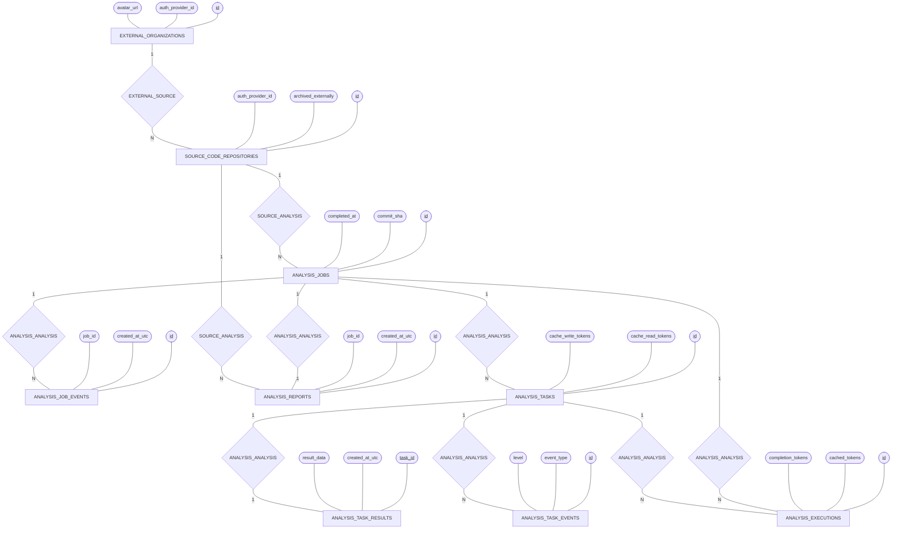

---

## 8. Community Forum

*Logical domain powering community discussions, categories, topics, replies, moderation queues, gamification badges, and reputation scores.* (`17 thực thể`)

```mermaid
flowchart TD

    %% Thực thể (Hộp chữ nhật / Rectangles)
    E_forum_categories["FORUM_CATEGORIES"]
    E_forum_category_moderators["FORUM_CATEGORY_MODERATORS"]
    E_forum_topics["FORUM_TOPICS"]
    E_forum_replies["FORUM_REPLIES"]
    E_forum_tags["FORUM_TAGS"]
    E_forum_topic_tags["FORUM_TOPIC_TAGS"]
    E_forum_votes["FORUM_VOTES"]
    E_forum_reactions["FORUM_REACTIONS"]
    E_forum_bookmarks["FORUM_BOOKMARKS"]
    E_forum_follows["FORUM_FOLLOWS"]
    E_forum_reports["FORUM_REPORTS"]
    E_forum_reputations["FORUM_REPUTATIONS"]
    E_forum_badges["FORUM_BADGES"]
    E_forum_user_badges["FORUM_USER_BADGES"]
    E_forum_moderation_logs["FORUM_MODERATION_LOGS"]
    E_forum_topic_histories["FORUM_TOPIC_HISTORIES"]
    E_forum_reply_histories["FORUM_REPLY_HISTORIES"]

    %% Thuộc tính (Hình elip / Ovals)
    A_forum_categories_id(["<u>id</u>"]) --- E_forum_categories
    A_forum_categories_created_at(["created_at"]) --- E_forum_categories
    A_forum_categories_deleted_at(["deleted_at"]) --- E_forum_categories
    A_forum_category_moderators_category_id(["<u>category_id</u>"]) --- E_forum_category_moderators
    A_forum_category_moderators_user_id(["<u>user_id</u>"]) --- E_forum_category_moderators
    A_forum_category_moderators_assigned_at(["assigned_at"]) --- E_forum_category_moderators
    A_forum_topics_id(["<u>id</u>"]) --- E_forum_topics
    A_forum_topics_ai_excerpt(["ai_excerpt"]) --- E_forum_topics
    A_forum_topics_author_id(["author_id"]) --- E_forum_topics
    A_forum_replies_id(["<u>id</u>"]) --- E_forum_replies
    A_forum_replies_author_id(["author_id"]) --- E_forum_replies
    A_forum_replies_content(["content"]) --- E_forum_replies
    A_forum_tags_id(["<u>id</u>"]) --- E_forum_tags
    A_forum_tags_created_at(["created_at"]) --- E_forum_tags
    A_forum_tags_is_archived(["is_archived"]) --- E_forum_tags
    A_forum_topic_tags_topic_id(["<u>topic_id</u>"]) --- E_forum_topic_tags
    A_forum_topic_tags_tag_id(["<u>tag_id</u>"]) --- E_forum_topic_tags
    A_forum_votes_id(["<u>id</u>"]) --- E_forum_votes
    A_forum_votes_created_at(["created_at"]) --- E_forum_votes
    A_forum_votes_reply_id(["reply_id"]) --- E_forum_votes
    A_forum_reactions_id(["<u>id</u>"]) --- E_forum_reactions
    A_forum_reactions_created_at(["created_at"]) --- E_forum_reactions
    A_forum_reactions_reaction_type(["reaction_type"]) --- E_forum_reactions
    A_forum_bookmarks_topic_id(["<u>topic_id</u>"]) --- E_forum_bookmarks
    A_forum_bookmarks_user_id(["<u>user_id</u>"]) --- E_forum_bookmarks
    A_forum_bookmarks_created_at(["created_at"]) --- E_forum_bookmarks
    A_forum_follows_topic_id(["<u>topic_id</u>"]) --- E_forum_follows
    A_forum_follows_user_id(["<u>user_id</u>"]) --- E_forum_follows
    A_forum_follows_created_at(["created_at"]) --- E_forum_follows
    A_forum_reports_id(["<u>id</u>"]) --- E_forum_reports
    A_forum_reports_created_at(["created_at"]) --- E_forum_reports
    A_forum_reports_reason(["reason"]) --- E_forum_reports
    A_forum_reputations_user_id(["<u>user_id</u>"]) --- E_forum_reputations
    A_forum_reputations_points(["points"]) --- E_forum_reputations
    A_forum_reputations_updated_at(["updated_at"]) --- E_forum_reputations
    A_forum_badges_id(["<u>id</u>"]) --- E_forum_badges
    A_forum_badges_created_at(["created_at"]) --- E_forum_badges
    A_forum_badges_criteria_code(["criteria_code"]) --- E_forum_badges
    A_forum_user_badges_user_id(["<u>user_id</u>"]) --- E_forum_user_badges
    A_forum_user_badges_badge_id(["<u>badge_id</u>"]) --- E_forum_user_badges
    A_forum_user_badges_awarded_at(["awarded_at"]) --- E_forum_user_badges
    A_forum_moderation_logs_id(["<u>id</u>"]) --- E_forum_moderation_logs
    A_forum_moderation_logs_action(["action"]) --- E_forum_moderation_logs
    A_forum_moderation_logs_created_at(["created_at"]) --- E_forum_moderation_logs
    A_forum_topic_histories_id(["<u>id</u>"]) --- E_forum_topic_histories
    A_forum_topic_histories_content(["content"]) --- E_forum_topic_histories
    A_forum_topic_histories_edited_at(["edited_at"]) --- E_forum_topic_histories
    A_forum_reply_histories_id(["<u>id</u>"]) --- E_forum_reply_histories
    A_forum_reply_histories_content(["content"]) --- E_forum_reply_histories
    A_forum_reply_histories_edited_at(["edited_at"]) --- E_forum_reply_histories

    %% Mối quan hệ (Hình thoi / Diamonds & Bản thể)
    R_community_forum_1{"FORUM_FORUM"}
    E_forum_topics ---|"1"| R_community_forum_1
    R_community_forum_1 ---|"N"| E_forum_bookmarks
    R_community_forum_2{"FORUM_FORUM"}
    E_forum_categories ---|"1"| R_community_forum_2
    R_community_forum_2 ---|"N"| E_forum_category_moderators
    R_community_forum_3{"FORUM_FORUM"}
    E_forum_topics ---|"1"| R_community_forum_3
    R_community_forum_3 ---|"N"| E_forum_follows
    R_community_forum_4{"FORUM_FORUM"}
    E_forum_replies ---|"1"| R_community_forum_4
    R_community_forum_4 ---|"N"| E_forum_reactions
    R_community_forum_5{"FORUM_FORUM"}
    E_forum_topics ---|"1"| R_community_forum_5
    R_community_forum_5 ---|"N"| E_forum_reactions
    R_community_forum_6{"FORUM_FORUM"}
    E_forum_replies ---|"1"| R_community_forum_6
    R_community_forum_6 ---|"N"| E_forum_replies
    R_community_forum_7{"FORUM_FORUM"}
    E_forum_topics ---|"1"| R_community_forum_7
    R_community_forum_7 ---|"N"| E_forum_replies
    R_community_forum_8{"FORUM_FORUM"}
    E_forum_replies ---|"1"| R_community_forum_8
    R_community_forum_8 ---|"N"| E_forum_reply_histories
    R_community_forum_9{"FORUM_FORUM"}
    E_forum_replies ---|"1"| R_community_forum_9
    R_community_forum_9 ---|"N"| E_forum_reports
    R_community_forum_10{"FORUM_FORUM"}
    E_forum_topics ---|"1"| R_community_forum_10
    R_community_forum_10 ---|"N"| E_forum_reports
    R_community_forum_11{"FORUM_FORUM"}
    E_forum_categories ---|"1"| R_community_forum_11
    R_community_forum_11 ---|"N"| E_forum_topics
    R_community_forum_12{"FORUM_FORUM"}
    E_forum_topics ---|"1"| R_community_forum_12
    R_community_forum_12 ---|"N"| E_forum_topic_histories
    R_community_forum_13{"FORUM_FORUM"}
    E_forum_tags ---|"1"| R_community_forum_13
    R_community_forum_13 ---|"N"| E_forum_topic_tags
    R_community_forum_14{"FORUM_FORUM"}
    E_forum_topics ---|"1"| R_community_forum_14
    R_community_forum_14 ---|"N"| E_forum_topic_tags
    R_community_forum_15{"FORUM_FORUM"}
    E_forum_badges ---|"1"| R_community_forum_15
    R_community_forum_15 ---|"N"| E_forum_user_badges
    R_community_forum_16{"FORUM_FORUM"}
    E_forum_replies ---|"1"| R_community_forum_16
    R_community_forum_16 ---|"N"| E_forum_votes
    R_community_forum_17{"FORUM_FORUM"}
    E_forum_topics ---|"1"| R_community_forum_17
    R_community_forum_17 ---|"N"| E_forum_votes
```

---

## 9. Audit, Security Telemetry & Messaging

*Logical domain handling system audit trails, real-time security event telemetry, SOC incident management, in-app notifications, and outbox messaging.* (`12 thực thể`)

```mermaid
flowchart TD

    %% Thực thể (Hộp chữ nhật / Rectangles)
    E_outbox_messages["OUTBOX_MESSAGES"]
    E_audit_logs["AUDIT_LOGS"]
    E_conversations["CONVERSATIONS"]
    E_messages["MESSAGES"]
    E_activity_events["ACTIVITY_EVENTS"]
    E_in_app_notifications["IN_APP_NOTIFICATIONS"]
    E_notification_preferences["NOTIFICATION_PREFERENCES"]
    E_security_events["SECURITY_EVENTS"]
    E_security_incidents["SECURITY_INCIDENTS"]
    E_security_event_comments["SECURITY_EVENT_COMMENTS"]
    E_security_rules["SECURITY_RULES"]
    E_seeding_history["SEEDING_HISTORY"]

    %% Thuộc tính (Hình elip / Ovals)
    A_outbox_messages_id(["<u>id</u>"]) --- E_outbox_messages
    A_outbox_messages_created_at(["created_at"]) --- E_outbox_messages
    A_outbox_messages_error(["error"]) --- E_outbox_messages
    A_audit_logs_id(["<u>id</u>"]) --- E_audit_logs
    A_audit_logs_actor_user_id(["actor_user_id"]) --- E_audit_logs
    A_audit_logs_anonymized_actor_hash(["anonymized_actor_hash"]) --- E_audit_logs
    A_conversations_id(["<u>id</u>"]) --- E_conversations
    A_conversations_created_at(["created_at"]) --- E_conversations
    A_conversations_title(["title"]) --- E_conversations
    A_messages_id(["<u>id</u>"]) --- E_messages
    A_messages_content(["content"]) --- E_messages
    A_messages_conversation_id(["conversation_id"]) --- E_messages
    A_activity_events_id(["<u>id</u>"]) --- E_activity_events
    A_activity_events_actor_user_id(["actor_user_id"]) --- E_activity_events
    A_activity_events_causation_id(["causation_id"]) --- E_activity_events
    A_in_app_notifications_id(["<u>id</u>"]) --- E_in_app_notifications
    A_in_app_notifications_activity_event_id(["activity_event_id"]) --- E_in_app_notifications
    A_in_app_notifications_aggregate_key(["aggregate_key"]) --- E_in_app_notifications
    A_notification_preferences_id(["<u>id</u>"]) --- E_notification_preferences
    A_notification_preferences_channel(["channel"]) --- E_notification_preferences
    A_notification_preferences_is_enabled(["is_enabled"]) --- E_notification_preferences
    A_security_events_id(["<u>id</u>"]) --- E_security_events
    A_security_events_actor_user_id(["actor_user_id"]) --- E_security_events
    A_security_events_assigned_to_user_id(["assigned_to_user_id"]) --- E_security_events
    A_security_incidents_id(["<u>id</u>"]) --- E_security_incidents
    A_security_incidents_assigned_to_user_id(["assigned_to_user_id"]) --- E_security_incidents
    A_security_incidents_created_at(["created_at"]) --- E_security_incidents
    A_security_event_comments_id(["<u>id</u>"]) --- E_security_event_comments
    A_security_event_comments_author_user_id(["author_user_id"]) --- E_security_event_comments
    A_security_event_comments_comment_text(["comment_text"]) --- E_security_event_comments
    A_security_rules_id(["<u>id</u>"]) --- E_security_rules
    A_security_rules_code(["code"]) --- E_security_rules
    A_security_rules_configuration_json(["configuration_json"]) --- E_security_rules
    A_seeding_history_module_id(["<u>module_id</u>"]) --- E_seeding_history
    A_seeding_history_applied_at_utc(["applied_at_utc"]) --- E_seeding_history
    A_seeding_history_duration_ms(["duration_ms"]) --- E_seeding_history

    %% Mối quan hệ (Hình thoi / Diamonds & Bản thể)
    R_audit_security_messaging_1{"CONVERSATIONS_MESSAGES"}
    E_conversations ---|"1"| R_audit_security_messaging_1
    R_audit_security_messaging_1 ---|"N"| E_messages
    R_audit_security_messaging_2{"ACTIVITY_IN"}
    E_activity_events ---|"1"| R_audit_security_messaging_2
    R_audit_security_messaging_2 ---|"N"| E_in_app_notifications
    R_audit_security_messaging_3{"SECURITY_SECURITY"}
    E_security_incidents ---|"1"| R_audit_security_messaging_3
    R_audit_security_messaging_3 ---|"N"| E_security_events
    R_audit_security_messaging_4{"SECURITY_SECURITY"}
    E_security_events ---|"1"| R_audit_security_messaging_4
    R_audit_security_messaging_4 ---|"N"| E_security_event_comments
    R_audit_security_messaging_5{"SECURITY_SECURITY"}
    E_security_incidents ---|"1"| R_audit_security_messaging_5
    R_audit_security_messaging_5 ---|"N"| E_security_event_comments
```

---

## 10. System Administration & Staff

*Logical domain managing platform super-admin staff members, administrative invitations, and administrative role mappings.* (`3 thực thể`)

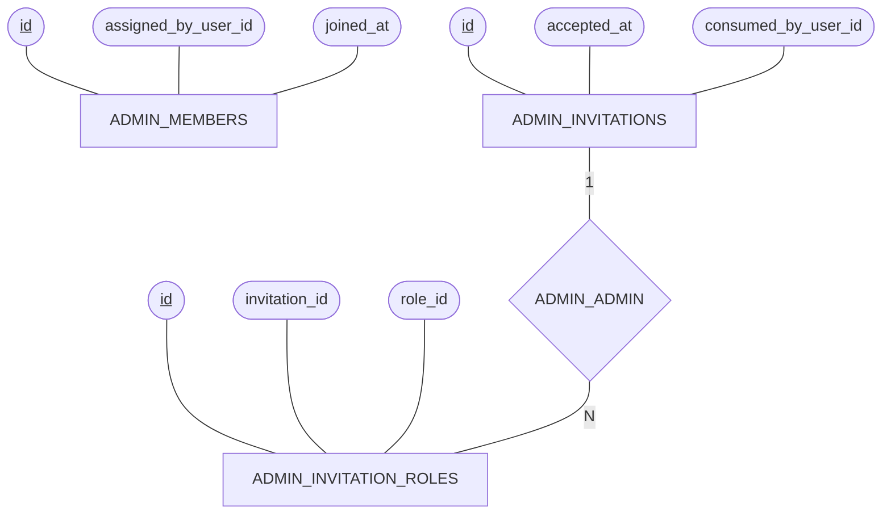

---

## 11. Platform Orchestration & AI Engine

*Logical domain orchestrating background pipeline jobs, durable workflow tasks, AI prompt deployments, artifact registry storage, and AI token streaming.* (`12 thực thể`)

```mermaid
flowchart TD

    %% Thực thể (Hộp chữ nhật / Rectangles)
    E_pipeline_jobs["PIPELINE_JOBS"]
    E_pipeline_tasks["PIPELINE_TASKS"]
    E_pipeline_executions["PIPELINE_EXECUTIONS"]
    E_pipeline_stages["PIPELINE_STAGES"]
    E_pipeline_tasks_durable["PIPELINE_TASKS_DURABLE"]
    E_pipeline_events_durable["PIPELINE_EVENTS_DURABLE"]
    E_prompt_deployments["PROMPT_DEPLOYMENTS"]
    E_artifact_registry_entries["ARTIFACT_REGISTRY_ENTRIES"]
    E_ai_streaming_sessions["AI_STREAMING_SESSIONS"]
    E_ai_streaming_stages["AI_STREAMING_STAGES"]
    E_ai_streaming_logs["AI_STREAMING_LOGS"]
    E_ai_streaming_metrics["AI_STREAMING_METRICS"]

    %% Thuộc tính (Hình elip / Ovals)
    A_pipeline_jobs_id(["<u>id</u>"]) --- E_pipeline_jobs
    A_pipeline_jobs_completed_at(["completed_at"]) --- E_pipeline_jobs
    A_pipeline_jobs_created_at_utc(["created_at_utc"]) --- E_pipeline_jobs
    A_pipeline_tasks_id(["<u>id</u>"]) --- E_pipeline_tasks
    A_pipeline_tasks_completed_at(["completed_at"]) --- E_pipeline_tasks
    A_pipeline_tasks_cost_usd(["cost_usd"]) --- E_pipeline_tasks
    A_pipeline_executions_id(["<u>id</u>"]) --- E_pipeline_executions
    A_pipeline_executions_completed_at(["completed_at"]) --- E_pipeline_executions
    A_pipeline_executions_created_at_utc(["created_at_utc"]) --- E_pipeline_executions
    A_pipeline_stages_id(["<u>id</u>"]) --- E_pipeline_stages
    A_pipeline_stages_completed_at(["completed_at"]) --- E_pipeline_stages
    A_pipeline_stages_description(["description"]) --- E_pipeline_stages
    A_pipeline_tasks_durable_id(["<u>id</u>"]) --- E_pipeline_tasks_durable
    A_pipeline_tasks_durable_cache_read_tokens(["cache_read_tokens"]) --- E_pipeline_tasks_durable
    A_pipeline_tasks_durable_cache_write_tokens(["cache_write_tokens"]) --- E_pipeline_tasks_durable
    A_pipeline_events_durable_id(["<u>id</u>"]) --- E_pipeline_events_durable
    A_pipeline_events_durable_component(["component"]) --- E_pipeline_events_durable
    A_pipeline_events_durable_correlation_id(["correlation_id"]) --- E_pipeline_events_durable
    A_prompt_deployments_prompt_id(["<u>prompt_id</u>"]) --- E_prompt_deployments
    A_prompt_deployments_active_version(["active_version"]) --- E_prompt_deployments
    A_prompt_deployments_sha256hash(["sha256hash"]) --- E_prompt_deployments
    A_artifact_registry_entries_id(["<u>id</u>"]) --- E_artifact_registry_entries
    A_artifact_registry_entries_artifact_id(["artifact_id"]) --- E_artifact_registry_entries
    A_artifact_registry_entries_checksum(["checksum"]) --- E_artifact_registry_entries
    A_ai_streaming_sessions_id(["<u>id</u>"]) --- E_ai_streaming_sessions
    A_ai_streaming_sessions_completed_at(["completed_at"]) --- E_ai_streaming_sessions
    A_ai_streaming_sessions_created_at_utc(["created_at_utc"]) --- E_ai_streaming_sessions
    A_ai_streaming_stages_id(["<u>id</u>"]) --- E_ai_streaming_stages
    A_ai_streaming_stages_completed_at(["completed_at"]) --- E_ai_streaming_stages
    A_ai_streaming_stages_description(["description"]) --- E_ai_streaming_stages
    A_ai_streaming_logs_id(["<u>id</u>"]) --- E_ai_streaming_logs
    A_ai_streaming_logs_component(["component"]) --- E_ai_streaming_logs
    A_ai_streaming_logs_log_level(["log_level"]) --- E_ai_streaming_logs
    A_ai_streaming_metrics_id(["<u>id</u>"]) --- E_ai_streaming_metrics
    A_ai_streaming_metrics_metric_name(["metric_name"]) --- E_ai_streaming_metrics
    A_ai_streaming_metrics_metric_value(["metric_value"]) --- E_ai_streaming_metrics

    %% Mối quan hệ (Hình thoi / Diamonds & Bản thể)
    R_platform_orchestration_ai_1{"AI_AI"}
    E_ai_streaming_sessions ---|"1"| R_platform_orchestration_ai_1
    R_platform_orchestration_ai_1 ---|"N"| E_ai_streaming_logs
    R_platform_orchestration_ai_2{"AI_AI"}
    E_ai_streaming_sessions ---|"1"| R_platform_orchestration_ai_2
    R_platform_orchestration_ai_2 ---|"N"| E_ai_streaming_metrics
    R_platform_orchestration_ai_3{"AI_AI"}
    E_ai_streaming_sessions ---|"1"| R_platform_orchestration_ai_3
    R_platform_orchestration_ai_3 ---|"N"| E_ai_streaming_stages
    R_platform_orchestration_ai_4{"PIPELINE_PIPELINE"}
    E_pipeline_executions ---|"1"| R_platform_orchestration_ai_4
    R_platform_orchestration_ai_4 ---|"N"| E_pipeline_events_durable
    R_platform_orchestration_ai_5{"PIPELINE_PIPELINE"}
    E_pipeline_executions ---|"1"| R_platform_orchestration_ai_5
    R_platform_orchestration_ai_5 ---|"N"| E_pipeline_stages
    R_platform_orchestration_ai_6{"PIPELINE_PIPELINE"}
    E_pipeline_executions ---|"1"| R_platform_orchestration_ai_6
    R_platform_orchestration_ai_6 ---|"N"| E_pipeline_tasks_durable
    R_platform_orchestration_ai_7{"PIPELINE_PIPELINE"}
    E_pipeline_jobs ---|"1"| R_platform_orchestration_ai_7
    R_platform_orchestration_ai_7 ---|"N"| E_pipeline_tasks
```

---
