# Entity Relationship Diagram (Mô hình Ký hiệu Chen)

## 1. System Overview

* **Total Number of Entities**: `166`
* **Total Number of Relationships**: `215`
* **Total Number of Modules**: `11`
* **Data Modeling Approach**: Logical Entity Relationship Model (Chen's ERD Notation: Rectangles = Entities, Diamonds = Relationships, Ovals = Attributes, Cardinalities = 1, N, M)

### Summary of the Logical Data Model

The CVerify platform data model is organized into **11 domain-aligned modules**:

1. **1. Identity & Access Management (IAM)**: Logical domain capturing user identities, authentication states, RBAC roles, permission assignments, OAuth providers, and session tokens.
2. **2. Organizations & Workspaces**: Logical domain representing multi-tenant enterprise organizations, collaborative workspaces, workspace memberships, and legal authority workflows.
3. **3. Candidate Profile & Portfolio**: Logical domain encapsulating candidate CV information, employment background, educational history, achievements, and portfolio project links.
4. **4. Talent Intelligence Graph**: Logical domain representing the candidate capability knowledge graph, evidence claims, trust metrics, and search profile projections.
5. **5. Recruitment & Job Vacancy Matching**: Logical domain managing job vacancies, structured hiring specifications, candidate matching evaluations, and application pipelines.
6. **6. Candidate Assessment & Skill Attribution**: Logical domain governing candidate technical skill evaluations, canonical skill taxonomies, repository attributions, and skill tree hierarchies.
7. **7. Source Code Intelligence & Repository Analysis**: Logical domain managing external Git repositories, static code analysis jobs, task executions, and report outputs.
8. **8. Community Forum**: Logical domain powering community discussions, categories, topics, replies, moderation queues, gamification badges, and reputation scores.
9. **9. Audit, Security Telemetry & Messaging**: Logical domain handling system audit trails, real-time security event telemetry, SOC incident management, in-app notifications, and outbox messaging.
10. **10. System Administration & Staff**: Logical domain managing platform super-admin staff members, administrative invitations, and administrative role mappings.
11. **11. Platform Orchestration & AI Engine**: Logical domain orchestrating background pipeline jobs, durable workflow tasks, AI prompt deployments, artifact registry storage, and AI token streaming.

---

## 2. Business Modules

| Module Name | Entity Count | Main Entities | Responsibilities |
| :--- | :--- | :--- | :--- |
| **1. Identity & Access Management (IAM)** | `13` | `users`, `roles`, `permissions`, `user_roles`... | User identity and credential lifecycle; Role-Based Access Control (RBAC) & permission mappings |
| **2. Organizations & Workspaces** | `23` | `organizations`, `organization_authorities`, `organization_memberships`, `organization_followers`... | Organization tax identity & business registration; Workspace environments, branding, and team memberships |
| **3. Candidate Profile & Portfolio** | `18` | `user_profiles`, `career_preferences`, `ai_inferred_preferences`, `user_skills`... | Candidate personal bio, location, and social profiles; Career preferences, salary targets, and AI-inferred preferences |
| **4. Talent Intelligence Graph** | `21` | `capability_nodes`, `capability_edges`, `candidate_capabilities`, `candidate_capability_evidences`... | Capability knowledge graph nodes and graph edges; Candidate capability scores and evidence artifact links |
| **5. Recruitment & Job Vacancy Matching** | `23` | `job_vacancies`, `hiring_requirements`, `business_outcomes`, `responsibilities`... | Job vacancy lifecycle and hiring specification criteria; Evaluation rubrics, interview blueprints, and requirement snapshots |
| **6. Candidate Assessment & Skill Attribution** | `15` | `candidate_assessments`, `candidate_assessment_artifacts`, `repository_assessments`, `repository_capabilities`... | Candidate assessment runs and evaluation output artifacts; Repository skill attribution and canonical skill taxonomy mapping |
| **7. Source Code Intelligence & Repository Analysis** | `9` | `external_organizations`, `source_code_repositories`, `analysis_jobs`, `analysis_job_events`... | External organization and Git repository links; Analysis job lifecycle, task queuing, and event tracking |
| **8. Community Forum** | `17` | `forum_categories`, `forum_category_moderators`, `forum_topics`, `forum_replies`... | Forum categories, topics, replies, and version edit histories; Category moderator assignment, content reports, and moderation logs |
| **9. Audit, Security Telemetry & Messaging** | `12` | `outbox_messages`, `audit_logs`, `conversations`, `messages`... | Immutable audit logs and transactional outbox email delivery; Real-time security telemetry, rule matching, and incident tracking |
| **10. System Administration & Staff** | `3` | `admin_members`, `admin_invitations`, `admin_invitation_roles` | Super-admin staff member management; Admin invitations and token hashes |
| **11. Platform Orchestration & AI Engine** | `12` | `pipeline_jobs`, `pipeline_tasks`, `pipeline_executions`, `pipeline_stages`... | Pipeline job scheduling, task execution, lease locking, and cost accounting; Durable pipeline task states and durable event streaming |

---

## 3. Entity Definitions

### Module: 1. Identity & Access Management (IAM)

*Logical domain capturing user identities, authentication states, RBAC roles, permission assignments, OAuth providers, and session tokens.*

#### Entity: `users`

**Description**: Core user entity representing system account credentials, login status, and security lock states.

**Primary Key**: `Id`

**Important Attributes**:
`id` (PK), `avatar_source`, `avatar_url`, `created_at`, `deleted_at`, `email`, `email_verified_at`, `failed_attempts`, `full_name`, `is_legal_hold`, `last_failed_at`, `last_login_at`, `last_login_ip`, `last_username_change_at`, `linked_emails`, `lock_until`, `password_changed_at`, `password_hash`, `session_version`, `status`, `updated_at`, `username`, `version`

**Relationships**:
* Parent in One-to-Many relationship with child entity `conversations`
* Parent in One-to-Many relationship with child entity `auth_providers`
* Parent in One-to-Many relationship with child entity `pending_auth_providers`
* Parent in One-to-Many relationship with child entity `refresh_tokens`
* Parent in One-to-Many relationship with child entity `reset_password_tokens`
* Parent in One-to-Many relationship with child entity `verification_links`
* Parent in One-to-Many relationship with child entity `verification_tokens`
* Parent in One-to-Many relationship with child entity `forum_bookmarks`
* Parent in One-to-Many relationship with child entity `forum_category_moderators`
* Parent in One-to-Many relationship with child entity `forum_follows`
* Parent in One-to-Many relationship with child entity `forum_moderation_logs`
* Parent in One-to-Many relationship with child entity `forum_reactions`
* Parent in One-to-Many relationship with child entity `forum_replies`
* Parent in One-to-Many relationship with child entity `forum_reply_histories`
* Parent in One-to-Many relationship with child entity `forum_reports`
* Parent in One-to-Many relationship with child entity `forum_reports`
* Parent in One-to-Many relationship with child entity `forum_reports`
* Parent in One-to-Many relationship with child entity `forum_reputations`
* Parent in One-to-Many relationship with child entity `forum_topics`
* Parent in One-to-Many relationship with child entity `forum_topic_histories`
* Parent in One-to-Many relationship with child entity `forum_user_badges`
* Parent in One-to-Many relationship with child entity `forum_votes`
* Parent in One-to-Many relationship with child entity `academic_achievements`
* Parent in One-to-One relationship with child entity `ai_inferred_preferences`
* Parent in One-to-Many relationship with child entity `candidate_assessments`
* Parent in One-to-One relationship with child entity `career_preferences`
* Parent in One-to-Many relationship with child entity `education_entries`
* Parent in One-to-Many relationship with child entity `profile_attachments`
* Parent in One-to-Many relationship with child entity `project_entries`
* Parent in One-to-Many relationship with child entity `user_cv_settings`
* Parent in One-to-One relationship with child entity `user_profiles`
* Parent in One-to-Many relationship with child entity `user_skills`
* Parent in One-to-Many relationship with child entity `work_experience_entries`
* Parent in One-to-Many relationship with child entity `recovery_tokens`
* Parent in One-to-Many relationship with child entity `representative_approval_votes`
* Parent in One-to-Many relationship with child entity `activity_events`
* Parent in One-to-Many relationship with child entity `admin_invitations`
* Parent in One-to-Many relationship with child entity `admin_invitations`
* Parent in One-to-Many relationship with child entity `admin_members`
* Parent in One-to-Many relationship with child entity `admin_members`
* Parent in One-to-Many relationship with child entity `ai_streaming_sessions`
* Parent in One-to-Many relationship with child entity `audit_logs`
* Parent in One-to-Many relationship with child entity `audit_logs`
* Parent in One-to-Many relationship with child entity `audit_logs`
* Parent in One-to-Many relationship with child entity `candidate_capabilities`
* Parent in One-to-One relationship with child entity `candidate_capability_projections`
* Parent in One-to-Many relationship with child entity `candidate_discovery_runs`
* Parent in One-to-One relationship with child entity `candidate_evaluation_snapshots`
* Parent in One-to-One relationship with child entity `candidate_match_projections`
* Parent in One-to-One relationship with child entity `candidate_ranking_projections`
* Parent in One-to-One relationship with child entity `candidate_search_profiles`
* Parent in One-to-One relationship with child entity `candidate_trust_projections`
* Parent in One-to-Many relationship with child entity `enterprise_workflow_requests`
* Parent in One-to-Many relationship with child entity `enterprise_workflow_requests`
* Parent in One-to-Many relationship with child entity `evidence_claims`
* Parent in One-to-Many relationship with child entity `in_app_notifications`
* Parent in One-to-Many relationship with child entity `job_applications`
* Parent in One-to-Many relationship with child entity `job_interactions`
* Parent in One-to-Many relationship with child entity `matching_evaluations`
* Parent in One-to-Many relationship with child entity `notification_preferences`
* Parent in One-to-Many relationship with child entity `organization_authorities`
* Parent in One-to-Many relationship with child entity `organization_invitations`
* Parent in One-to-Many relationship with child entity `organization_invitations`
* Parent in One-to-Many relationship with child entity `organization_memberships`
* Parent in One-to-Many relationship with child entity `pending_organization_ownerships`
* Parent in One-to-Many relationship with child entity `pipeline_executions`
* Parent in One-to-Many relationship with child entity `role_assignments`
* Parent in One-to-Many relationship with child entity `security_events`
* Parent in One-to-Many relationship with child entity `security_events`
* Parent in One-to-Many relationship with child entity `security_events`
* Parent in One-to-Many relationship with child entity `security_event_comments`
* Parent in One-to-Many relationship with child entity `security_incidents`
* Parent in One-to-Many relationship with child entity `user_followers`
* Parent in One-to-Many relationship with child entity `user_followers`
* Parent in One-to-Many relationship with child entity `workflow_comments`
* Parent in One-to-Many relationship with child entity `workspaces`
* Parent in One-to-Many relationship with child entity `workspace_members`
* Parent in One-to-Many relationship with child entity `workspace_posts`
* Parent in One-to-Many relationship with child entity `analysis_executions`
* Parent in One-to-Many relationship with child entity `analysis_jobs`

#### Entity: `roles`

**Description**: Role-Based Access Control (RBAC) role definition entity.

**Primary Key**: `Id`

**Important Attributes**:
`id` (PK), `created_at`, `deleted_at`, `description`, `display_name`, `domain`, `is_active`, `is_system`, `name`, `parent_role_id`, `tenant_id`, `updated_at`, `xmin`

**Relationships**:
* Parent in One-to-Many relationship with child entity `admin_invitation_roles`
* Parent in One-to-Many relationship with child entity `organization_invitation_roles`
* Many-to-One (One-to-Many) link with parent entity `roles`
* Parent in One-to-Many relationship with child entity `role_assignments`

#### Entity: `permissions`

**Description**: Granular system permission entity.

**Primary Key**: `Id`

**Important Attributes**:
`id` (PK), `created_at`, `description`, `display_name`, `is_system`, `module`, `name`, `updated_at`

**Relationships**:
* Standalone business entity.

#### Entity: `user_roles`

**Description**: Associative entity mapping users to assigned roles.

**Primary Key**: `role_id`, `user_id`

**Important Attributes**:
`role_id` (PK), `user_id` (PK), `assigned_at`

**Relationships**:
* Standalone business entity.

#### Entity: `role_permissions`

**Description**: Associative entity mapping permissions to roles.

**Primary Key**: `permission_id`, `role_id`

**Important Attributes**:
`permission_id` (PK), `role_id` (PK), `assigned_at`

**Relationships**:
* Standalone business entity.

#### Entity: `role_assignments`

**Description**: Scoped role assignment entity binding users to roles within specific organizational scopes.

**Primary Key**: `Id`

**Important Attributes**:
`id` (PK), `assigned_at`, `role_id`, `scope_id`, `scope_type`, `user_id`

**Relationships**:
* Many-to-One (One-to-Many) link with parent entity `roles`
* Many-to-One (One-to-Many) link with parent entity `users`

#### Entity: `refresh_tokens`

**Description**: OAuth2 / JWT long-lived refresh token and user session entity.

**Primary Key**: `Id`

**Important Attributes**:
`id` (PK), `created_at`, `expires_at`, `ip_address`, `organization_id`, `remember_me`, `replaced_by_token`, `replaced_by_token_id`, `revoked_at`, `session_id`, `token`, `user_agent`, `user_id`

**Relationships**:
* Many-to-One (One-to-Many) link with parent entity `organizations`
* Many-to-One (One-to-Many) link with parent entity `users`

#### Entity: `verification_tokens`

**Description**: One-time account email verification token entity.

**Primary Key**: `Id`

**Important Attributes**:
`id` (PK), `consumed_at`, `created_at`, `expires_at`, `token_hash`, `user_id`, `xmin`

**Relationships**:
* Many-to-One (One-to-Many) link with parent entity `users`

#### Entity: `reset_password_tokens`

**Description**: One-time password reset request token entity.

**Primary Key**: `Id`

**Important Attributes**:
`id` (PK), `consumed_at`, `created_at`, `expires_at`, `token_hash`, `user_id`, `xmin`

**Relationships**:
* Many-to-One (One-to-Many) link with parent entity `users`

#### Entity: `auth_providers`

**Description**: Linked OAuth2 authentication provider entity (Google, GitHub, etc.).

**Primary Key**: `Id`

**Important Attributes**:
`id` (PK), `created_at`, `deleted_at`, `encrypted_access_token`, `encrypted_refresh_token`, `expires_at`, `granted_scopes`, `last_provider_sync_at`, `last_scope_validation_at`, `last_successful_refresh_at`, `provider_account_id`, `provider_avatar_url`, `provider_display_name`, `provider_key`, `provider_name`, `provider_profile_url`, `provider_username`, `refresh_failure_count`, `scope_validation_status`, `sync_error`, `sync_status`, `token_updated_at`, `user_id`

**Relationships**:
* Many-to-One (One-to-Many) link with parent entity `users`
* Parent in One-to-Many relationship with child entity `external_organizations`
* Parent in One-to-Many relationship with child entity `source_code_repositories`

#### Entity: `pending_auth_providers`

**Description**: Pending OAuth provider linking request entity.

**Primary Key**: `Id`

**Important Attributes**:
`id` (PK), `created_at`, `encrypted_access_token`, `encrypted_refresh_token`, `expires_at`, `provider_account_id`, `provider_avatar_url`, `provider_display_name`, `provider_key`, `provider_name`, `provider_profile_url`, `provider_username`, `user_id`

**Relationships**:
* Many-to-One (One-to-Many) link with parent entity `users`

#### Entity: `otp_verifications`

**Description**: Multi-Factor / OTP authentication challenge entity.

**Primary Key**: `Id`

**Important Attributes**:
`id` (PK), `attempts`, `challenge_id`, `consumed_at`, `cooldown_until`, `created_at`, `email`, `expires_at`, `invalidated_at`, `last_attempt_at`, `last_resent_at`, `last_sent_at`, `otp_hash`, `purpose`, `resend_count`, `status`

**Relationships**:
* Standalone business entity.

#### Entity: `verification_links`

**Description**: Publicly shareable domain or organization verification link entity.

**Primary Key**: `Id`

**Important Attributes**:
`id` (PK), `consumed_at`, `consumed_by_ip`, `consumed_by_user_agent`, `created_at`, `deleted_at`, `email`, `expires_at`, `organization_id`, `organization_name`, `purpose`, `tax_code`, `token_hash`, `user_id`

**Relationships**:
* Many-to-One (One-to-Many) link with parent entity `organizations`
* Many-to-One (One-to-Many) link with parent entity `users`

### Module: 2. Organizations & Workspaces

*Logical domain representing multi-tenant enterprise organizations, collaborative workspaces, workspace memberships, and legal authority workflows.*

#### Entity: `organizations`

**Description**: Verified enterprise and business organization entity.

**Primary Key**: `Id`

**Important Attributes**:
`id` (PK), `banner_url`, `branch_count`, `city`, `contact_email`, `contact_name`, `contact_phone`, `core_values`, `created_at`, `deleted_at`, `description`, `detail_address`, `email`, `facebook_url`, `follower_count`, `founded`, `google_maps_embed_url`, `initial_admin_assigned_at`, `is_verified`, `linkedin_url`, `logo_url`, `mission`, `name`, `organization_size`, `organization_type`, `recovery_authority`, `registration_number`, `representative_email`, `representative_identity`, `representative_name`, `representative_phone`, `status`, `tax_code`, `twitter_url`, `updated_at`, `username`, `verification_level`, `vision`, `website`

**Relationships**:
* Parent in One-to-Many relationship with child entity `organization_credentials`
* Parent in One-to-Many relationship with child entity `refresh_tokens`
* Parent in One-to-Many relationship with child entity `verification_links`
* Parent in One-to-Many relationship with child entity `forum_categories`
* Parent in One-to-Many relationship with child entity `forum_topics`
* Parent in One-to-Many relationship with child entity `approved_recovery_sessions`
* Parent in One-to-Many relationship with child entity `organization_recovery_claims`
* Parent in One-to-Many relationship with child entity `recovery_tokens`
* Parent in One-to-Many relationship with child entity `representative_authority_histories`
* Parent in One-to-Many relationship with child entity `representative_rotation_requests`
* Parent in One-to-Many relationship with child entity `activity_events`
* Parent in One-to-Many relationship with child entity `audit_logs`
* Parent in One-to-Many relationship with child entity `enterprise_workflow_requests`
* Parent in One-to-Many relationship with child entity `hiring_requirements`
* Parent in One-to-Many relationship with child entity `job_vacancies`
* Parent in One-to-Many relationship with child entity `organization_authorities`
* Parent in One-to-Many relationship with child entity `organization_followers`
* Parent in One-to-Many relationship with child entity `organization_invitations`
* Parent in One-to-Many relationship with child entity `organization_memberships`
* Parent in One-to-Many relationship with child entity `organization_verifications`
* Parent in One-to-Many relationship with child entity `pending_organization_ownerships`
* Parent in One-to-Many relationship with child entity `security_events`
* Parent in One-to-Many relationship with child entity `workspaces`
* Parent in One-to-Many relationship with child entity `workspace_posts`

#### Entity: `organization_authorities`

**Description**: Authority assignment entity for organization ownership and administrative roles.

**Primary Key**: `Id`

**Important Attributes**:
`id` (PK), `joined_at`, `organization_id`, `role`, `user_id`

**Relationships**:
* Many-to-One (One-to-Many) link with parent entity `organizations`
* Many-to-One (One-to-Many) link with parent entity `users`

#### Entity: `organization_memberships`

**Description**: User membership entity within business organizations.

**Primary Key**: `Id`

**Important Attributes**:
`id` (PK), `joined_at`, `organization_id`, `role`, `status`, `user_id`

**Relationships**:
* Many-to-One (One-to-Many) link with parent entity `organizations`
* Many-to-One (One-to-Many) link with parent entity `users`

#### Entity: `organization_followers`

**Description**: User follower relationship entity for company pages.

**Primary Key**: `UserId`, `OrganizationId`

**Important Attributes**:
`user_id` (PK), `organization_id` (PK), `followed_at`

**Relationships**:
* Many-to-One (One-to-Many) link with parent entity `organizations`

#### Entity: `organization_verifications`

**Description**: Audit history entity of organization verification requests.

**Primary Key**: `Id`

**Important Attributes**:
`id` (PK), `is_verified`, `metadata`, `organization_id`, `verification_type`, `verified_at`, `verified_by`, `verified_value`

**Relationships**:
* Many-to-One (One-to-Many) link with parent entity `organizations`

#### Entity: `organization_credentials`

**Description**: System login credential entity assigned to organizations.

**Primary Key**: `OrganizationId`

**Important Attributes**:
`organization_id` (PK), `created_at`, `deleted_at`, `failed_login_attempts`, `lockout_end`, `password_hash`, `updated_at`, `username`

**Relationships**:
* Many-to-One (One-to-Many) link with parent entity `organizations`

#### Entity: `pending_organization_ownerships`

**Description**: Pending ownership transfer entity for organizations.

**Primary Key**: `Id`

**Important Attributes**:
`id` (PK), `consumed_at`, `consumed_by_user_id`, `created_at`, `discovery_notified_at`, `expires_at`, `organization_id`, `owner_email`

**Relationships**:
* Many-to-One (One-to-Many) link with parent entity `users`
* Many-to-One (One-to-Many) link with parent entity `organizations`

#### Entity: `organization_invitations`

**Description**: Invite entity sent to prospective organization members.

**Primary Key**: `Id`

**Important Attributes**:
`id` (PK), `accepted_at`, `consumed_by_user_id`, `created_at`, `declined_at`, `declined_reason`, `discovery_notified_at`, `expires_at`, `invited_by_user_id`, `invitee_email`, `organization_id`, `status`, `token_hash`

**Relationships**:
* Many-to-One (One-to-Many) link with parent entity `users`
* Many-to-One (One-to-Many) link with parent entity `users`
* Many-to-One (One-to-Many) link with parent entity `organizations`
* Parent in One-to-Many relationship with child entity `organization_invitation_roles`

#### Entity: `organization_invitation_roles`

**Description**: Pre-assigned role entity for organization invitees.

**Primary Key**: `Id`

**Important Attributes**:
`id` (PK), `invitation_id`, `role_id`, `scope_id`, `scope_type`

**Relationships**:
* Many-to-One (One-to-Many) link with parent entity `organization_invitations`
* Many-to-One (One-to-Many) link with parent entity `roles`

#### Entity: `organization_recovery_claims`

**Description**: Ownership recovery claim entity submitted for organizations.

**Primary Key**: `Id`

**Important Attributes**:
`id` (PK), `created_at`, `document_ocr_metadata`, `document_suspicious_metadata`, `documents`, `historical_claim_flags`, `ip_device_flags`, `organization_id`, `phone_number`, `recovery_email`, `rejection_reason`, `representative_full_name`, `representative_position`, `reviewed_at`, `reviewed_by`, `risk_level`, `risk_score`, `second_reviewer_by`, `status`, `suggested_recovery_strategy`, `updated_at`, `workspace_activity_flags`

**Relationships**:
* Many-to-One (One-to-Many) link with parent entity `organizations`

#### Entity: `approved_recovery_sessions`

**Description**: Active approved organization recovery workflow session entity.

**Primary Key**: `Id`

**Important Attributes**:
`id` (PK), `approved_by`, `approved_representative`, `created_at`, `expires_at`, `is_consumed`, `organization_id`, `recovery_token_hash`, `revoked_at`, `suggested_strategy`, `used_at`, `used_by_device`, `used_by_ip`, `verified_recovery_email`

**Relationships**:
* Many-to-One (One-to-Many) link with parent entity `organizations`

#### Entity: `recovery_execution_locks`

**Description**: Concurrency lock entity for organization emergency recovery operations.

**Primary Key**: `Id`

**Important Attributes**:
`id` (PK), `acquired_at`, `completed_at`, `recovery_session_id`, `status`

**Relationships**:
* Standalone business entity.

#### Entity: `recovery_tokens`

**Description**: Token entity issued for organization ownership reclamation.

**Primary Key**: `Id`

**Important Attributes**:
`id` (PK), `consumed_at`, `created_at`, `expires_at`, `metadata_json`, `organization_id`, `purpose`, `revoked_at`, `token_hash`, `token_type`, `user_id`, `xmin`

**Relationships**:
* Many-to-One (One-to-Many) link with parent entity `organizations`
* Many-to-One (One-to-Many) link with parent entity `users`

#### Entity: `representative_rotation_requests`

**Description**: Legal representative rotation request entity for organizations.

**Primary Key**: `Id`

**Important Attributes**:
`id` (PK), `admin_approval_status`, `created_at`, `current_representative`, `expires_at`, `final_decision`, `optional_supporting_message`, `organization_id`, `reason`, `requested_email`, `requested_phone`, `requested_representative`, `support_approval_status`, `verification_call_notes`, `verification_call_status`

**Relationships**:
* Parent in One-to-Many relationship with child entity `representative_approval_votes`
* Many-to-One (One-to-Many) link with parent entity `organizations`

#### Entity: `representative_approval_votes`

**Description**: Board approval vote entity for legal representative changes.

**Primary Key**: `Id`

**Important Attributes**:
`id` (PK), `approver_role`, `approver_user_id`, `decision`, `request_id`, `timestamp`

**Relationships**:
* Many-to-One (One-to-Many) link with parent entity `users`
* Many-to-One (One-to-Many) link with parent entity `representative_rotation_requests`

#### Entity: `representative_authority_histories`

**Description**: Audit record entity of historical legal representatives.

**Primary Key**: `Id`

**Important Attributes**:
`id` (PK), `effective_at`, `new_representative`, `organization_id`, `previous_representative`, `rotated_by`, `support_reviewer`

**Relationships**:
* Many-to-One (One-to-Many) link with parent entity `organizations`

#### Entity: `enterprise_workflow_requests`

**Description**: Enterprise onboarding and custom compliance request entity.

**Primary Key**: `Id`

**Important Attributes**:
`id` (PK), `assigned_at`, `assigned_reviewer_id`, `claimed_at`, `created_at`, `due_at`, `escalated_to_user_id`, `metadata_json`, `organization_id`, `priority`, `request_type`, `resolved_at`, `review_state`, `row_version`, `status`, `updated_at`

**Relationships**:
* Many-to-One (One-to-Many) link with parent entity `users`
* Many-to-One (One-to-Many) link with parent entity `users`
* Many-to-One (One-to-Many) link with parent entity `organizations`
* Parent in One-to-Many relationship with child entity `workflow_attachments`
* Parent in One-to-Many relationship with child entity `workflow_comments`

#### Entity: `workflow_attachments`

**Description**: File attachment entity associated with enterprise workflow requests.

**Primary Key**: `Id`

**Important Attributes**:
`id` (PK), `content_type`, `created_at`, `file_name`, `storage_path`, `workflow_request_id`

**Relationships**:
* Many-to-One (One-to-Many) link with parent entity `enterprise_workflow_requests`

#### Entity: `workflow_comments`

**Description**: Discussion comment entity on enterprise workflow requests.

**Primary Key**: `Id`

**Important Attributes**:
`id` (PK), `author_user_id`, `content`, `created_at`, `is_internal_only`, `workflow_request_id`

**Relationships**:
* Many-to-One (One-to-Many) link with parent entity `users`
* Many-to-One (One-to-Many) link with parent entity `enterprise_workflow_requests`

#### Entity: `workspaces`

**Description**: Team and workspace environment entity within an organization.

**Primary Key**: `Id`

**Important Attributes**:
`id` (PK), `branding`, `created_at`, `deleted_at`, `description`, `display_name`, `organization_id`, `owner_id`, `slug`, `status`, `updated_at`

**Relationships**:
* Parent in One-to-Many relationship with child entity `ai_streaming_sessions`
* Parent in One-to-Many relationship with child entity `capability_catalog_items`
* Parent in One-to-Many relationship with child entity `hiring_requirements`
* Parent in One-to-Many relationship with child entity `pipeline_executions`
* Many-to-One (One-to-Many) link with parent entity `organizations`
* Many-to-One (One-to-Many) link with parent entity `users`
* Parent in One-to-Many relationship with child entity `workspace_members`

#### Entity: `workspace_members`

**Description**: User membership and role entity within individual workspaces.

**Primary Key**: `Id`

**Important Attributes**:
`id` (PK), `joined_at`, `role`, `user_id`, `workspace_id`

**Relationships**:
* Many-to-One (One-to-Many) link with parent entity `users`
* Many-to-One (One-to-Many) link with parent entity `workspaces`

#### Entity: `workspace_archive_snapshots`

**Description**: Archive snapshot entity of deactivated workspaces.

**Primary Key**: `Id`

**Important Attributes**:
`id` (PK), `archived_by`, `created_at`, `organization_id`, `snapshot_data_json`, `workspace_id`

**Relationships**:
* Standalone business entity.

#### Entity: `workspace_posts`

**Description**: Collaborative post entity within workspaces.

**Primary Key**: `Id`

**Important Attributes**:
`id` (PK), `category`, `content`, `created_at`, `created_by_user_id`, `likes`, `organization_id`, `shares_count`, `updated_at`

**Relationships**:
* Many-to-One (One-to-Many) link with parent entity `users`
* Many-to-One (One-to-Many) link with parent entity `organizations`

### Module: 3. Candidate Profile & Portfolio

*Logical domain encapsulating candidate CV information, employment background, educational history, achievements, and portfolio project links.*

#### Entity: `user_profiles`

**Description**: Public candidate profile entity containing bio, location, and links.

**Primary Key**: `UserId`

**Important Attributes**:
`user_id` (PK), `ai_suggestions_json`, `ai_talent_discovery`, `bio`, `birth_date`, `company`, `created_at`, `custom_pronouns`, `deleted_at`, `headline`, `last_profile_update_at`, `location`, `phone_number`, `profile_visibility`, `pronouns`, `public_email`, `recruiter_visibility`, `updated_at`, `username`, `version`

**Relationships**:
* Many-to-One (One-to-One) link with parent entity `users`

#### Entity: `career_preferences`

**Description**: Candidate career preference entity.

**Primary Key**: `UserId`

**Important Attributes**:
`user_id` (PK), `available_for_hire`, `created_at`, `deleted_at`, `expected_salary_currency`, `expected_salary_max`, `expected_salary_min`, `expected_salary_negotiable`, `expected_salary_type`, `is_expected_salary_visible`, `job_title_preferences`, `leadership_track`, `open_to_relocation`, `open_to_work_status`, `preferred_language`, `remote_preference`, `salary_expectations`, `updated_at`, `version`, `work_preference_notes`

**Relationships**:
* Many-to-One (One-to-One) link with parent entity `users`

#### Entity: `ai_inferred_preferences`

**Description**: AI-extracted candidate preference entity.

**Primary Key**: `UserId`

**Important Attributes**:
`user_id` (PK), `confidence_score`, `created_at`, `deleted_at`, `inferred_primary_role`, `inferred_salary_currency`, `inferred_salary_max`, `inferred_salary_min`, `inferred_seniority`, `last_analyzed_at`, `synthesis_rationale`, `updated_at`, `version`

**Relationships**:
* Many-to-One (One-to-One) link with parent entity `users`

#### Entity: `user_skills`

**Description**: User self-declared or verified technical skill entity.

**Primary Key**: `Id`

**Important Attributes**:
`id` (PK), `created_at`, `normalized_name`, `skill`, `skill_id`, `user_id`

**Relationships**:
* Many-to-One (One-to-Many) link with parent entity `users`

#### Entity: `education_entries`

**Description**: Candidate educational history entry entity.

**Primary Key**: `Id`

**Important Attributes**:
`id` (PK), `created_at`, `degree`, `deleted_at`, `description`, `display_order`, `end_date`, `gpa`, `gpa_scale`, `is_currently_studying`, `label`, `major`, `school_name`, `start_date`, `updated_at`, `user_id`

**Relationships**:
* Many-to-One (One-to-Many) link with parent entity `users`

#### Entity: `academic_achievements`

**Description**: Academic honor and certification entity.

**Primary Key**: `Id`

**Important Attributes**:
`id` (PK), `created_at`, `credential_url`, `deleted_at`, `description`, `display_order`, `issue_date`, `issuer`, `title`, `updated_at`, `user_id`

**Relationships**:
* Many-to-One (One-to-Many) link with parent entity `users`

#### Entity: `profile_attachments`

**Description**: Candidate CV and portfolio attachment entity.

**Primary Key**: `Id`

**Important Attributes**:
`id` (PK), `created_at`, `deleted_at`, `entity_id`, `entity_type`, `file_name`, `file_path`, `file_size`, `file_type`, `updated_at`, `user_id`

**Relationships**:
* Many-to-One (One-to-Many) link with parent entity `users`

#### Entity: `work_experience_entries`

**Description**: Candidate employment history record entity.

**Primary Key**: `Id`

**Important Attributes**:
`id` (PK), `company`, `created_at`, `deleted_at`, `description`, `display_order`, `employment_type`, `end_date`, `experience_category`, `is_currently_working`, `is_leadership`, `job_title`, `location`, `start_date`, `updated_at`, `user_id`

**Relationships**:
* Parent in One-to-Many relationship with child entity `work_experience_achievements`
* Many-to-One (One-to-Many) link with parent entity `users`
* Parent in One-to-Many relationship with child entity `work_experience_links`
* Parent in One-to-Many relationship with child entity `work_experience_technologies`

#### Entity: `work_experience_achievements`

**Description**: Achievement entity during past employment.

**Primary Key**: `Id`

**Important Attributes**:
`id` (PK), `created_at`, `description`, `title`, `updated_at`, `work_experience_id`

**Relationships**:
* Many-to-One (One-to-Many) link with parent entity `work_experience_entries`

#### Entity: `work_experience_technologies`

**Description**: Tech stack entity utilized during employment.

**Primary Key**: `Id`

**Important Attributes**:
`id` (PK), `created_at`, `name`, `work_experience_id`

**Relationships**:
* Many-to-One (One-to-Many) link with parent entity `work_experience_entries`

#### Entity: `work_experience_links`

**Description**: Reference URL entity linked to work experience.

**Primary Key**: `Id`

**Important Attributes**:
`id` (PK), `created_at`, `link_type`, `url`, `work_experience_id`

**Relationships**:
* Many-to-One (One-to-Many) link with parent entity `work_experience_entries`

#### Entity: `project_entries`

**Description**: Candidate portfolio project entry entity.

**Primary Key**: `Id`

**Important Attributes**:
`id` (PK), `created_at`, `deleted_at`, `description`, `display_order`, `end_date`, `is_currently_working`, `name`, `role`, `start_date`, `updated_at`, `user_id`, `verification_level`, `verification_metadata_json`, `verification_status`, `verified_at`

**Relationships**:
* Parent in One-to-Many relationship with child entity `project_contributions`
* Many-to-One (One-to-Many) link with parent entity `users`
* Parent in One-to-Many relationship with child entity `project_repository_links`
* Parent in One-to-Many relationship with child entity `project_technologies`

#### Entity: `project_repository_links`

**Description**: Link entity between portfolio projects and Git repositories.

**Primary Key**: `Id`

**Important Attributes**:
`id` (PK), `linked_at`, `project_entry_id`, `source_code_repository_id`

**Relationships**:
* Many-to-One (One-to-Many) link with parent entity `project_entries`
* Many-to-One (One-to-Many) link with parent entity `source_code_repositories`

#### Entity: `project_technologies`

**Description**: Technology entity used in portfolio projects.

**Primary Key**: `Id`

**Important Attributes**:
`id` (PK), `created_at`, `name`, `project_entry_id`

**Relationships**:
* Many-to-One (One-to-Many) link with parent entity `project_entries`

#### Entity: `project_contributions`

**Description**: Candidate contribution entity to open-source or portfolio projects.

**Primary Key**: `Id`

**Important Attributes**:
`id` (PK), `content`, `created_at`, `project_entry_id`

**Relationships**:
* Many-to-One (One-to-Many) link with parent entity `project_entries`

#### Entity: `user_cv_settings`

**Description**: User CV privacy and sync setting entity.

**Primary Key**: `UserId`

**Important Attributes**:
`user_id` (PK), `created_at`, `cv_layout_config_json`, `cv_template_id`, `cv_theme_color`, `is_cv_published`, `updated_at`

**Relationships**:
* Many-to-One (One-to-Many) link with parent entity `users`

#### Entity: `cv_repository_mappings`

**Description**: Mapping entity linking CV claims to GitHub repositories.

**Primary Key**: `Id`

**Important Attributes**:
`id` (PK), `indexed_at_utc`, `reference_entity_id`, `reference_source`, `source_code_repository_id`, `user_id`

**Relationships**:
* Many-to-One (One-to-Many) link with parent entity `source_code_repositories`

#### Entity: `user_followers`

**Description**: User-to-user social follow graph entity.

**Primary Key**: `FollowerId`, `FolloweeId`

**Important Attributes**:
`follower_id` (PK), `followee_id` (PK), `followed_at`

**Relationships**:
* Many-to-One (One-to-Many) link with parent entity `users`
* Many-to-One (One-to-Many) link with parent entity `users`

### Module: 4. Talent Intelligence Graph

*Logical domain representing the candidate capability knowledge graph, evidence claims, trust metrics, and search profile projections.*

#### Entity: `capability_nodes`

**Description**: Capability node entity in the talent intelligence knowledge graph.

**Primary Key**: `Id`

**Important Attributes**:
`id` (PK), `category`, `created_at`, `description`, `name`, `slug`

**Relationships**:
* Parent in One-to-Many relationship with child entity `candidate_capabilities`
* Parent in One-to-Many relationship with child entity `capability_edges`
* Parent in One-to-Many relationship with child entity `capability_edges`
* Parent in One-to-Many relationship with child entity `matching_explanations`

#### Entity: `capability_edges`

**Description**: Directed edge entity representing capability relationships.

**Primary Key**: `SourceNodeId`, `TargetNodeId`, `RelationshipType`

**Important Attributes**:
`source_node_id` (PK), `target_node_id` (PK), `relationship_type` (PK), `weight`

**Relationships**:
* Many-to-One (One-to-Many) link with parent entity `capability_nodes`
* Many-to-One (One-to-Many) link with parent entity `capability_nodes`

#### Entity: `candidate_capabilities`

**Description**: Extracted candidate capability node entity with proficiency scores.

**Primary Key**: `Id`

**Important Attributes**:
`id` (PK), `candidate_id`, `capability_node_id`, `created_at`, `updated_at`

**Relationships**:
* Many-to-One (One-to-Many) link with parent entity `users`
* Many-to-One (One-to-Many) link with parent entity `capability_nodes`
* Parent in One-to-Many relationship with child entity `candidate_capability_evidences`
* Parent in One-to-Many relationship with child entity `candidate_capability_histories`
* Parent in One-to-One relationship with child entity `candidate_capability_scores`

#### Entity: `candidate_capability_evidences`

**Description**: Link entity between candidate capabilities and evidence artifacts.

**Primary Key**: `CandidateCapabilityId`, `EvidenceArtifactId`

**Important Attributes**:
`candidate_capability_id` (PK), `evidence_artifact_id` (PK), `added_at`

**Relationships**:
* Many-to-One (One-to-Many) link with parent entity `candidate_capabilities`
* Many-to-One (One-to-Many) link with parent entity `evidence_artifacts`

#### Entity: `candidate_capability_scores`

**Description**: Calculated capability proficiency score entity.

**Primary Key**: `CandidateCapabilityId`

**Important Attributes**:
`candidate_capability_id` (PK), `calculated_at`, `expertise_level`, `proficiency_score`, `recency_index`

**Relationships**:
* Many-to-One (One-to-One) link with parent entity `candidate_capabilities`

#### Entity: `candidate_capability_histories`

**Description**: Historical tracking entity of candidate capability scores.

**Primary Key**: `Id`

**Important Attributes**:
`id` (PK), `candidate_capability_id`, `proficiency_score`, `recorded_at`

**Relationships**:
* Many-to-One (One-to-Many) link with parent entity `candidate_capabilities`

#### Entity: `evidence_sources`

**Description**: Data source entity for candidate evidence (GitHub, GitLab, etc.).

**Primary Key**: `Id`

**Important Attributes**:
`id` (PK), `connection_config`, `created_at`, `is_active`, `name`, `provider_type`

**Relationships**:
* Parent in One-to-Many relationship with child entity `evidence_artifacts`

#### Entity: `evidence_artifacts`

**Description**: Parsed code or activity artifact entity supporting candidate claims.

**Primary Key**: `Id`

**Important Attributes**:
`id` (PK), `artifact_type`, `created_at`, `cryptographic_signature`, `external_identifier`, `payload`, `source_id`

**Relationships**:
* Parent in One-to-Many relationship with child entity `candidate_capability_evidences`
* Many-to-One (One-to-Many) link with parent entity `evidence_sources`
* Parent in One-to-Many relationship with child entity `evidence_claims`
* Parent in One-to-Many relationship with child entity `matching_explanations`

#### Entity: `evidence_claims`

**Description**: Asserted candidate qualification entity backed by evidence.

**Primary Key**: `Id`

**Important Attributes**:
`id` (PK), `assertion_type`, `candidate_id`, `confidence_score`, `created_at`, `evidence_artifact_id`

**Relationships**:
* Many-to-One (One-to-Many) link with parent entity `users`
* Many-to-One (One-to-Many) link with parent entity `evidence_artifacts`
* Parent in One-to-Many relationship with child entity `evidence_verifications`

#### Entity: `evidence_verifications`

**Description**: Verification log entity of candidate evidence claims.

**Primary Key**: `Id`

**Important Attributes**:
`id` (PK), `created_at`, `evidence_claim_id`, `expires_at`, `status`, `verification_log`, `verification_type`, `verified_at`

**Relationships**:
* Many-to-One (One-to-Many) link with parent entity `evidence_claims`

#### Entity: `trust_profiles`

**Description**: Calculated trust and credibility profile entity for candidates.

**Primary Key**: `Id`

**Important Attributes**:
`id` (PK), `recalculated_at`, `target_entity_id`, `target_type`

**Relationships**:
* Parent in One-to-Many relationship with child entity `candidate_trust_projections`
* Parent in One-to-Many relationship with child entity `trust_calculations`
* Parent in One-to-Many relationship with child entity `trust_components`

#### Entity: `trust_components`

**Description**: Scoring component entity contributing to candidate trust.

**Primary Key**: `Id`

**Important Attributes**:
`id` (PK), `component_name`, `component_score`, `explanation_metadata`, `trust_profile_id`, `updated_at`, `weight`

**Relationships**:
* Many-to-One (One-to-Many) link with parent entity `trust_profiles`

#### Entity: `trust_calculations`

**Description**: Audit record entity of trust score computations.

**Primary Key**: `Id`

**Important Attributes**:
`id` (PK), `aggregate_score`, `calculated_at`, `calculation_details`, `trust_profile_id`

**Relationships**:
* Many-to-One (One-to-Many) link with parent entity `trust_profiles`

#### Entity: `candidate_trust_projections`

**Description**: Optimized read projection entity of candidate trust metrics.

**Primary Key**: `CandidateId`

**Important Attributes**:
`candidate_id` (PK), `aggregate_score`, `last_updated_at`, `trust_profile_id`, `trust_tier`

**Relationships**:
* Many-to-One (One-to-One) link with parent entity `users`
* Many-to-One (One-to-Many) link with parent entity `trust_profiles`

#### Entity: `candidate_search_profiles`

**Description**: Search index projection entity for candidate discovery.

**Primary Key**: `CandidateId`

**Important Attributes**:
`candidate_id` (PK), `capabilities_json`, `full_name`, `headline`, `last_projected_at`, `location`, `trust_score`, `trust_tier`

**Relationships**:
* Many-to-One (One-to-One) link with parent entity `users`

#### Entity: `candidate_ranking_projections`

**Description**: Denormalized ranking entity for recruiter searches.

**Primary Key**: `CandidateId`

**Important Attributes**:
`candidate_id` (PK), `ai_score`, `available_for_hire`, `avatar_url`, `bio`, `career_level_label`, `composite_score`, `evidence_trust_score`, `followers_count`, `following_count`, `full_name`, `global_rank_position`, `headline`, `last_updated_at`, `location`, `open_to_work_status`, `previous_global_rank_position`, `primary_domain`, `profile_completeness`, `top_capabilities_json`, `total_forks_count`, `total_stars_count`, `trust_score`, `username`, `verified_contribution_count`, `verified_repo_count`

**Relationships**:
* Many-to-One (One-to-One) link with parent entity `users`

#### Entity: `candidate_capability_projections`

**Description**: Aggregated capability search projection entity.

**Primary Key**: `CandidateId`

**Important Attributes**:
`candidate_id` (PK), `capabilities_json`, `projected_at`

**Relationships**:
* Many-to-One (One-to-One) link with parent entity `users`

#### Entity: `capability_catalog_items`

**Description**: Master catalog item entity of standard technical capabilities.

**Primary Key**: `CapabilityId`

**Important Attributes**:
`capability_id` (PK), `category`, `created_at`, `description`, `display_name`, `is_custom`, `status`, `updated_at`, `workspace_id`

**Relationships**:
* Many-to-One (One-to-Many) link with parent entity `workspaces`

#### Entity: `capability_registries`

**Description**: Master registry entity of technical capability definitions.

**Primary Key**: `CapabilityId`

**Important Attributes**:
`capability_id` (PK), `capability_version`, `category`, `created_at`, `deprecated_by_id`, `description`, `display_name`, `effective_date`, `migration_mappings`, `status`, `taxonomy_version`, `updated_at`

**Relationships**:
* Parent in One-to-Many relationship with child entity `capability_aliases`
* Parent in One-to-Many relationship with child entity `capability_hierarchies`
* Parent in One-to-Many relationship with child entity `capability_hierarchies`
* Many-to-One (One-to-Many) link with parent entity `capability_registries`

#### Entity: `capability_hierarchies`

**Description**: Parent-child relationship entity between capabilities.

**Primary Key**: `ParentId`, `ChildId`

**Important Attributes**:
`parent_id` (PK), `child_id` (PK)

**Relationships**:
* Many-to-One (One-to-Many) link with parent entity `capability_registries`
* Many-to-One (One-to-Many) link with parent entity `capability_registries`

#### Entity: `capability_aliases`

**Description**: Synonym mapping entity for capability titles.

**Primary Key**: `AliasName`

**Important Attributes**:
`alias_name` (PK), `canonical_id`

**Relationships**:
* Many-to-One (One-to-Many) link with parent entity `capability_registries`

### Module: 5. Recruitment & Job Vacancy Matching

*Logical domain managing job vacancies, structured hiring specifications, candidate matching evaluations, and application pipelines.*

#### Entity: `job_vacancies`

**Description**: Job recruitment posting entity created by hiring managers.

**Primary Key**: `Id`

**Important Attributes**:
`id` (PK), `acquisition_strategy`, `category`, `city`, `cover_url`, `created_at`, `degree`, `department`, `discovery_profile_json`, `experience`, `gender`, `headcount`, `hiring_requirement_id`, `is_active`, `metadata`, `organization_id`, `requirement_snapshot_id`, `salary`, `salary_min_max`, `status`, `title`, `type`, `updated_at`, `workplace_type`

**Relationships**:
* Parent in One-to-Many relationship with child entity `job_applications`
* Parent in One-to-Many relationship with child entity `job_interactions`
* Many-to-One (One-to-Many) link with parent entity `hiring_requirements`
* Many-to-One (One-to-Many) link with parent entity `organizations`
* Many-to-One (One-to-Many) link with parent entity `requirement_snapshots`
* Parent in One-to-Many relationship with child entity `matching_evaluations`

#### Entity: `hiring_requirements`

**Description**: Structured hiring specification definition entity.

**Primary Key**: `Id`

**Important Attributes**:
`id` (PK), `auto_close_rule`, `business_problem`, `candidates_needed_count`, `city`, `created_at`, `currency`, `degree_requirement`, `department`, `employment_type`, `end_date`, `headcount`, `hiring_reason`, `is_manually_closed`, `is_salary_negotiable`, `organization_id`, `salary_max`, `salary_min`, `salary_period`, `seniority`, `start_date`, `status`, `timezone_range`, `title`, `updated_at`, `version`, `workplace_type`, `workspace_id`

**Relationships**:
* Parent in One-to-Many relationship with child entity `business_outcomes`
* Parent in One-to-Many relationship with child entity `candidate_discovery_runs`
* Parent in One-to-Many relationship with child entity `evaluation_rubrics`
* Many-to-One (One-to-Many) link with parent entity `organizations`
* Many-to-One (One-to-Many) link with parent entity `workspaces`
* Parent in One-to-Many relationship with child entity `interview_blueprints`
* Parent in One-to-Many relationship with child entity `job_vacancies`
* Parent in One-to-Many relationship with child entity `requirement_artifacts`
* Parent in One-to-Many relationship with child entity `requirement_capabilities`
* Parent in One-to-Many relationship with child entity `requirement_snapshots`
* Parent in One-to-Many relationship with child entity `responsibilities`
* Parent in One-to-Many relationship with child entity `technology_requirements`

#### Entity: `business_outcomes`

**Description**: Key business outcome entity required for a hiring specification.

**Primary Key**: `Id`

**Important Attributes**:
`id` (PK), `created_at`, `hiring_requirement_id`, `text`

**Relationships**:
* Many-to-One (One-to-Many) link with parent entity `hiring_requirements`

#### Entity: `responsibilities`

**Description**: Position responsibility entity linked to a hiring requirement.

**Primary Key**: `Id`

**Important Attributes**:
`id` (PK), `created_at`, `hiring_requirement_id`, `is_leadership`, `ownership_level`, `priority`, `text`

**Relationships**:
* Many-to-One (One-to-Many) link with parent entity `hiring_requirements`

#### Entity: `requirement_capabilities`

**Description**: Required capability entity for a hiring specification.

**Primary Key**: `Id`

**Important Attributes**:
`id` (PK), `capability_id`, `category`, `created_at`, `expected_proficiency`, `hiring_requirement_id`, `name`, `ownership_level`, `priority`

**Relationships**:
* Parent in One-to-Many relationship with child entity `evidence_signals`
* Many-to-One (One-to-Many) link with parent entity `hiring_requirements`

#### Entity: `technology_requirements`

**Description**: Specific tech stack requirement entity for a job opening.

**Primary Key**: `Id`

**Important Attributes**:
`id` (PK), `created_at`, `hiring_requirement_id`, `name`, `priority`, `sfia_level`

**Relationships**:
* Many-to-One (One-to-Many) link with parent entity `hiring_requirements`

#### Entity: `evidence_signals`

**Description**: Required evidence signal entity for validating a candidate capability.

**Primary Key**: `Id`

**Important Attributes**:
`id` (PK), `expected_metric`, `metadata`, `rationale`, `requirement_capability_id`, `signal_type`

**Relationships**:
* Many-to-One (One-to-Many) link with parent entity `requirement_capabilities`

#### Entity: `evaluation_rubrics`

**Description**: Candidate scoring rubric entity for interview evaluation.

**Primary Key**: `Id`

**Important Attributes**:
`id` (PK), `capability_weights`, `created_at`, `evidence_requirements`, `hiring_requirement_id`, `scoring_rules`

**Relationships**:
* Many-to-One (One-to-Many) link with parent entity `hiring_requirements`

#### Entity: `interview_blueprints`

**Description**: Structured interview question blueprint entity.

**Primary Key**: `Id`

**Important Attributes**:
`id` (PK), `capability_questions`, `created_at`, `dimensions`, `hiring_requirement_id`

**Relationships**:
* Many-to-One (One-to-Many) link with parent entity `hiring_requirements`

#### Entity: `requirement_artifacts`

**Description**: Supporting document entity attached to hiring specifications.

**Primary Key**: `Id`

**Important Attributes**:
`id` (PK), `artifact_type`, `created_at`, `generation_metadata_json`, `generation_timestamp`, `hiring_requirement_id`, `markdown_content`, `model_info`, `prompt_hash`, `prompt_template_id`, `prompt_version`, `regeneration_history_json`, `status`, `structured_content_json`, `updated_at`

**Relationships**:
* Many-to-One (One-to-Many) link with parent entity `hiring_requirements`

#### Entity: `requirement_snapshots`

**Description**: Immutable snapshot entity of hiring requirement specifications.

**Primary Key**: `Id`

**Important Attributes**:
`id` (PK), `auto_close_rule`, `business_outcomes_json`, `business_problem`, `candidates_needed_count`, `capabilities_json`, `city`, `currency`, `degree_requirement`, `department`, `employment_type`, `end_date`, `headcount`, `hiring_reason`, `hiring_requirement_id`, `is_manually_closed`, `is_salary_negotiable`, `responsibilities_json`, `salary_max`, `salary_min`, `salary_period`, `seniority`, `snapshotted_at`, `start_date`, `technology_requirements_json`, `timezone_range`, `title`, `version`, `workplace_type`

**Relationships**:
* Parent in One-to-One relationship with child entity `evaluation_rubric_snapshots`
* Parent in One-to-One relationship with child entity `interview_blueprint_snapshots`
* Parent in One-to-Many relationship with child entity `job_vacancies`
* Parent in One-to-Many relationship with child entity `requirement_artifact_snapshots`
* Many-to-One (One-to-Many) link with parent entity `hiring_requirements`
* Parent in One-to-One relationship with child entity `requirement_vector_snapshots`

#### Entity: `evaluation_rubric_snapshots`

**Description**: Immutable snapshot entity of evaluation rubrics.

**Primary Key**: `RequirementSnapshotId`

**Important Attributes**:
`requirement_snapshot_id` (PK), `capability_weights`, `evidence_requirements`, `scoring_rules`, `snapshotted_at`

**Relationships**:
* Many-to-One (One-to-One) link with parent entity `requirement_snapshots`

#### Entity: `interview_blueprint_snapshots`

**Description**: Immutable snapshot entity of interview blueprints.

**Primary Key**: `RequirementSnapshotId`

**Important Attributes**:
`requirement_snapshot_id` (PK), `capability_questions`, `dimensions`, `snapshotted_at`

**Relationships**:
* Many-to-One (One-to-One) link with parent entity `requirement_snapshots`

#### Entity: `requirement_artifact_snapshots`

**Description**: Immutable snapshot entity of requirement artifacts.

**Primary Key**: `Id`

**Important Attributes**:
`id` (PK), `artifact_type`, `markdown_content`, `requirement_snapshot_id`, `snapshotted_at`, `structured_content_json`

**Relationships**:
* Many-to-One (One-to-Many) link with parent entity `requirement_snapshots`

#### Entity: `requirement_vector_snapshots`

**Description**: Vector embedding entity of hiring requirement profiles.

**Primary Key**: `RequirementSnapshotId`

**Important Attributes**:
`requirement_snapshot_id` (PK), `dimension`, `snapshotted_at`

**Relationships**:
* Many-to-One (One-to-One) link with parent entity `requirement_snapshots`

#### Entity: `candidate_discovery_runs`

**Description**: AI-driven automated talent discovery run entity.

**Primary Key**: `Id`

**Important Attributes**:
`id` (PK), `candidates_found_count`, `completed_at`, `error_message`, `hiring_requirement_id`, `match_quality_summary`, `raw_results_json`, `started_at`, `status`, `triggered_by_id`

**Relationships**:
* Many-to-One (One-to-Many) link with parent entity `hiring_requirements`
* Many-to-One (One-to-Many) link with parent entity `users`

#### Entity: `candidate_match_projections`

**Description**: Cached matching score entity between candidates and vacancies.

**Primary Key**: `CandidateId`

**Important Attributes**:
`candidate_id` (PK), `last_projected_at`, `profile_summary`

**Relationships**:
* Many-to-One (One-to-One) link with parent entity `users`

#### Entity: `candidate_evaluation_snapshots`

**Description**: Snapshot entity of completed candidate assessments.

**Primary Key**: `CandidateId`

**Important Attributes**:
`candidate_id` (PK), `evaluated_at`, `evidence_trust_score`, `identity_trust_score`, `profile_completeness`, `verification_state`

**Relationships**:
* Many-to-One (One-to-One) link with parent entity `users`

#### Entity: `matching_evaluations`

**Description**: Candidate-to-job matching evaluation execution entity.

**Primary Key**: `Id`

**Important Attributes**:
`id` (PK), `aggregate_score`, `candidate_id`, `confidence_level`, `created_at`, `job_vacancy_id`, `updated_at`

**Relationships**:
* Many-to-One (One-to-Many) link with parent entity `users`
* Many-to-One (One-to-Many) link with parent entity `job_vacancies`
* Parent in One-to-Many relationship with child entity `matching_explanations`
* Parent in One-to-Many relationship with child entity `matching_factors`

#### Entity: `matching_factors`

**Description**: Detailed match score breakdown entity per requirement factor.

**Primary Key**: `Id`

**Important Attributes**:
`id` (PK), `factor_name`, `factor_score`, `matching_evaluation_id`, `weight`

**Relationships**:
* Many-to-One (One-to-Many) link with parent entity `matching_evaluations`

#### Entity: `matching_explanations`

**Description**: Natural language explanation entity of candidate match rationale.

**Primary Key**: `Id`

**Important Attributes**:
`id` (PK), `assertion_text`, `capability_node_id`, `explanation_type`, `matching_evaluation_id`, `supporting_artifact_id`

**Relationships**:
* Many-to-One (One-to-Many) link with parent entity `capability_nodes`
* Many-to-One (One-to-Many) link with parent entity `matching_evaluations`
* Many-to-One (One-to-Many) link with parent entity `evidence_artifacts`

#### Entity: `job_applications`

**Description**: Candidate application entity submitted for job vacancies.

**Primary Key**: `Id`

**Important Attributes**:
`id` (PK), `candidate_id`, `created_at`, `eligibility_snapshot_json`, `gaps_snapshot_json`, `job_vacancy_id`, `status`, `updated_at`

**Relationships**:
* Many-to-One (One-to-Many) link with parent entity `users`
* Many-to-One (One-to-Many) link with parent entity `job_vacancies`

#### Entity: `job_interactions`

**Description**: Tracked user interaction entity with job vacancies.

**Primary Key**: `Id`

**Important Attributes**:
`id` (PK), `interaction_at`, `interaction_type`, `job_vacancy_id`, `user_id`

**Relationships**:
* Many-to-One (One-to-Many) link with parent entity `job_vacancies`
* Many-to-One (One-to-Many) link with parent entity `users`

### Module: 6. Candidate Assessment & Skill Attribution

*Logical domain governing candidate technical skill evaluations, canonical skill taxonomies, repository attributions, and skill tree hierarchies.*

#### Entity: `candidate_assessments`

**Description**: Overall candidate evaluation assessment entity.

**Primary Key**: `Id`

**Important Attributes**:
`id` (PK), `assessment_schema_version`, `calculation_mode`, `career_level`, `career_level_label`, `clone_risk_classification`, `completed_at_utc`, `created_at_utc`, `cv_id`, `evidence_completeness`, `execution_strength`, `failed_stage`, `failure_reason`, `input_feature_set_hash`, `last_assessment_at`, `last_profile_update_at`, `last_repository_analysis_at`, `leadership_potential`, `model_version`, `overall_score`, `pipeline_version`, `primary_tendency`, `primary_working_style`, `professional_bio`, `prompt_version`, `status`, `summary_headline`, `summary_paragraph`, `technical_breadth`, `technical_depth`, `trust_level`, `user_id`, `version`

**Relationships**:
* Many-to-One (One-to-Many) link with parent entity `users`
* Parent in One-to-Many relationship with child entity `candidate_assessment_artifacts`
* Parent in One-to-Many relationship with child entity `candidate_best_fit_roles`
* Parent in One-to-Many relationship with child entity `candidate_domain_profiles`
* Parent in One-to-Many relationship with child entity `candidate_intelligence_signals`
* Parent in One-to-Many relationship with child entity `candidate_skills`
* Parent in One-to-Many relationship with child entity `candidate_skill_tree_nodes`
* Parent in One-to-Many relationship with child entity `candidate_strengths_weaknesses`

#### Entity: `candidate_assessment_artifacts`

**Description**: Output artifact entity generated during candidate assessment.

**Primary Key**: `Id`

**Important Attributes**:
`id` (PK), `artifact_type`, `assessment_id`, `created_at_utc`, `json_data`

**Relationships**:
* Many-to-One (One-to-Many) link with parent entity `candidate_assessments`

#### Entity: `repository_assessments`

**Description**: Source code repository quality assessment entity.

**Primary Key**: `Id`

**Important Attributes**:
`id` (PK), `analysis_job_id`, `assessment_schema_version`, `commit_sha`, `completed_at_utc`, `created_at_utc`, `json_data`, `model_version`, `overall_score`, `patterns`, `pipeline_version`, `prompt_version`, `quality_metrics`, `repository_id`, `status`, `tech_stack`

**Relationships**:
* Standalone business entity.

#### Entity: `repository_capabilities`

**Description**: Capability entity extracted from repository analysis.

**Primary Key**: `Id`

**Important Attributes**:
`id` (PK), `analysis_version`, `assessment_version`, `category`, `confidence`, `difficulty_score`, `evidence_json`, `maturity`, `model_version`, `name`, `prompt_version`, `repository_assessment_id`, `score`

**Relationships**:
* Standalone business entity.

#### Entity: `repository_skill_attributions`

**Description**: Attributed skill entity identified within repository commits.

**Primary Key**: `Id`

**Important Attributes**:
`id` (PK), `analysis_version`, `assessment_version`, `confidence`, `contribution_weight`, `model_version`, `normalization_source`, `original_name`, `pipeline_trace_id`, `prompt_version`, `repository_assessment_id`, `skill_id`, `skill_name`, `taxonomy_version`, `verification_level`

**Relationships**:
* Standalone business entity.

#### Entity: `canonical_skills`

**Description**: Master taxonomy entity of canonical skills.

**Primary Key**: `SkillId`, `TaxonomyVersion`

**Important Attributes**:
`skill_id` (PK), `taxonomy_version` (PK), `created_at`, `display_name`, `onet_code`, `sfia_category`, `status`

**Relationships**:
* Standalone business entity.

#### Entity: `canonical_skill_aliases`

**Description**: Alias mapping entity to canonical skill names.

**Primary Key**: `AliasName`

**Important Attributes**:
`alias_name` (PK), `skill_id`, `taxonomy_version`

**Relationships**:
* Standalone business entity.

#### Entity: `repository_domains`

**Description**: Domain field entity identified within analyzed repositories.

**Primary Key**: `Id`

**Important Attributes**:
`id` (PK), `analysis_version`, `assessment_version`, `confidence`, `domain_name`, `evidence_count`, `model_version`, `prompt_version`, `repository_assessment_id`, `supporting_signals`, `weight`

**Relationships**:
* Standalone business entity.

#### Entity: `repository_intelligence_signals`

**Description**: Aggregated code quality signal entity.

**Primary Key**: `Id`

**Important Attributes**:
`id` (PK), `analysis_version`, `assessment_version`, `complexity_signal`, `consistency_signal`, `last_updated_utc`, `leadership_signal`, `model_version`, `ownership_signal`, `prompt_version`, `repository_assessment_id`, `scope_signal`

**Relationships**:
* Standalone business entity.

#### Entity: `candidate_skills`

**Description**: Skill entity assigned to candidate profile with confidence metrics.

**Primary Key**: `Id`

**Important Attributes**:
`id` (PK), `candidate_assessment_id`, `confidence`, `evidence_sources`, `level`, `normalization_source`, `original_name`, `pipeline_trace_id`, `score`, `skill_id`, `skill_name`, `taxonomy_version`

**Relationships**:
* Many-to-One (One-to-Many) link with parent entity `candidate_assessments`

#### Entity: `candidate_domain_profiles`

**Description**: Candidate domain specialization score entity.

**Primary Key**: `Id`

**Important Attributes**:
`id` (PK), `candidate_assessment_id`, `confidence`, `domain_name`, `score`, `seniority`, `supporting_evidence`

**Relationships**:
* Many-to-One (One-to-Many) link with parent entity `candidate_assessments`

#### Entity: `candidate_intelligence_signals`

**Description**: Overall candidate intelligence metric entity.

**Primary Key**: `Id`

**Important Attributes**:
`id` (PK), `candidate_assessment_id`, `complexity_signal`, `consistency_signal`, `delivery_signal`, `engineering_maturity_signal`, `last_updated_utc`, `leadership_signal`, `ownership_signal`, `problem_solving_signal`, `scope_signal`

**Relationships**:
* Many-to-One (One-to-Many) link with parent entity `candidate_assessments`

#### Entity: `candidate_best_fit_roles`

**Description**: AI-calculated top career role fit entity for candidate.

**Primary Key**: `Id`

**Important Attributes**:
`id` (PK), `candidate_assessment_id`, `confidence`, `engine_metadata`, `evidence`, `match_score`, `matching_engine_version`, `rank`, `role_title`

**Relationships**:
* Many-to-One (One-to-Many) link with parent entity `candidate_assessments`

#### Entity: `candidate_strengths_weaknesses`

**Description**: Identified candidate key strength/weakness entity.

**Primary Key**: `Id`

**Important Attributes**:
`id` (PK), `candidate_assessment_id`, `description`, `evidence`, `finding_type`, `topic`

**Relationships**:
* Many-to-One (One-to-Many) link with parent entity `candidate_assessments`

#### Entity: `candidate_skill_tree_nodes`

**Description**: Skill tree breakdown node entity for candidates.

**Primary Key**: `Id`

**Important Attributes**:
`id` (PK), `candidate_assessment_id`, `category`, `confidence_score`, `display_name`, `estimated_experience_months`, `parent_id`, `proficiency_level`, `supporting_evidence`

**Relationships**:
* Many-to-One (One-to-Many) link with parent entity `candidate_assessments`
* Many-to-One (One-to-Many) link with parent entity `candidate_skill_tree_nodes`

### Module: 7. Source Code Intelligence & Repository Analysis

*Logical domain managing external Git repositories, static code analysis jobs, task executions, and report outputs.*

#### Entity: `external_organizations`

**Description**: Discovered external organization account entity (e.g. GitHub orgs).

**Primary Key**: `Id`

**Important Attributes**:
`id` (PK), `auth_provider_id`, `avatar_url`, `description`, `external_id`, `html_url`, `is_active`, `last_synced_at`, `login`, `name`, `type`

**Relationships**:
* Many-to-One (One-to-Many) link with parent entity `auth_providers`
* Parent in One-to-Many relationship with child entity `source_code_repositories`

#### Entity: `source_code_repositories`

**Description**: Linked Git source code repository entity.

**Primary Key**: `Id`

**Important Attributes**:
`id` (PK), `archived_externally`, `auth_provider_id`, `authenticity_type`, `classification`, `created_at_utc`, `custom_settings_json`, `default_branch`, `description`, `external_organization_id`, `external_repository_id`, `forks_count`, `html_url`, `is_accessible`, `is_enabled`, `is_private`, `is_verified`, `last_commit_at`, `last_seen_at`, `last_synced_at`, `last_updated_utc`, `latest_analysis_completed_at_utc`, `latest_analysis_status`, `latest_risk_factors_json`, `latest_risk_level`, `latest_risk_score`, `name`, `open_issues_count`, `owner`, `owner_login`, `owner_type`, `primary_language`, `stars_count`, `trust_score`, `watchers_count`

**Relationships**:
* Parent in One-to-Many relationship with child entity `cv_repository_mappings`
* Parent in One-to-Many relationship with child entity `project_repository_links`
* Parent in One-to-Many relationship with child entity `analysis_jobs`
* Parent in One-to-Many relationship with child entity `analysis_reports`
* Many-to-One (One-to-Many) link with parent entity `auth_providers`
* Many-to-One (One-to-Many) link with parent entity `external_organizations`

#### Entity: `analysis_jobs`

**Description**: Repository code analysis job entity.

**Primary Key**: `Id`

**Important Attributes**:
`id` (PK), `commit_sha`, `completed_at`, `created_at_utc`, `current_step`, `error_message`, `last_updated_utc`, `progress`, `repository_id`, `started_at`, `status`, `user_id`

**Relationships**:
* Parent in One-to-Many relationship with child entity `analysis_executions`
* Many-to-One (One-to-Many) link with parent entity `source_code_repositories`
* Many-to-One (One-to-Many) link with parent entity `users`
* Parent in One-to-Many relationship with child entity `analysis_job_events`
* Parent in One-to-One relationship with child entity `analysis_reports`
* Parent in One-to-Many relationship with child entity `analysis_tasks`

#### Entity: `analysis_job_events`

**Description**: Log event entity produced during repository analysis.

**Primary Key**: `Id`

**Important Attributes**:
`id` (PK), `created_at_utc`, `job_id`, `message`, `progress`, `step`

**Relationships**:
* Many-to-One (One-to-Many) link with parent entity `analysis_jobs`

#### Entity: `analysis_reports`

**Description**: Comprehensive report entity generated from repository analysis.

**Primary Key**: `Id`

**Important Attributes**:
`id` (PK), `created_at_utc`, `job_id`, `report_data`, `repository_id`

**Relationships**:
* Many-to-One (One-to-One) link with parent entity `analysis_jobs`
* Many-to-One (One-to-Many) link with parent entity `source_code_repositories`

#### Entity: `analysis_tasks`

**Description**: Individual sub-task entity executed within an analysis job.

**Primary Key**: `Id`

**Important Attributes**:
`id` (PK), `cache_read_tokens`, `cache_write_tokens`, `completed_at`, `completion_tokens`, `created_at_utc`, `duration_ms`, `error_message`, `estimated_cost_usd`, `job_id`, `last_updated_utc`, `metadata`, `model_name`, `progress`, `prompt_tokens`, `retry_count`, `started_at`, `status`, `task_type`

**Relationships**:
* Parent in One-to-Many relationship with child entity `analysis_executions`
* Many-to-One (One-to-Many) link with parent entity `analysis_jobs`
* Parent in One-to-Many relationship with child entity `analysis_task_events`
* Parent in One-to-One relationship with child entity `analysis_task_results`

#### Entity: `analysis_task_results`

**Description**: Structured output payload entity produced by an analysis task.

**Primary Key**: `TaskId`

**Important Attributes**:
`task_id` (PK), `created_at_utc`, `result_data`, `schema_version`

**Relationships**:
* Many-to-One (One-to-One) link with parent entity `analysis_tasks`

#### Entity: `analysis_task_events`

**Description**: Diagnostic log entity for an individual analysis task.

**Primary Key**: `Id`

**Important Attributes**:
`id` (PK), `event_type`, `level`, `message`, `metadata`, `task_id`, `timestamp`

**Relationships**:
* Many-to-One (One-to-Many) link with parent entity `analysis_tasks`

#### Entity: `analysis_executions`

**Description**: Low-level AST analysis worker execution run entity.

**Primary Key**: `Id`

**Important Attributes**:
`id` (PK), `cached_tokens`, `completion_tokens`, `created_at_utc`, `duration_ms`, `estimated_cost_usd`, `execution_type`, `job_id`, `model`, `prompt_tokens`, `provider`, `task_id`, `total_tokens`, `user_id`

**Relationships**:
* Many-to-One (One-to-Many) link with parent entity `analysis_jobs`
* Many-to-One (One-to-Many) link with parent entity `analysis_tasks`
* Many-to-One (One-to-Many) link with parent entity `users`

### Module: 8. Community Forum

*Logical domain powering community discussions, categories, topics, replies, moderation queues, gamification badges, and reputation scores.*

#### Entity: `forum_categories`

**Description**: Discussion forum category entity.

**Primary Key**: `Id`

**Important Attributes**:
`id` (PK), `created_at`, `deleted_at`, `description`, `display_order`, `icon_name`, `is_archived`, `is_private`, `name`, `organization_id`, `required_role`, `slug`, `updated_at`

**Relationships**:
* Many-to-One (One-to-Many) link with parent entity `organizations`
* Parent in One-to-Many relationship with child entity `forum_category_moderators`
* Parent in One-to-Many relationship with child entity `forum_topics`

#### Entity: `forum_category_moderators`

**Description**: Assigned moderator entity for forum categories.

**Primary Key**: `CategoryId`, `UserId`

**Important Attributes**:
`category_id` (PK), `user_id` (PK), `assigned_at`

**Relationships**:
* Many-to-One (One-to-Many) link with parent entity `forum_categories`
* Many-to-One (One-to-Many) link with parent entity `users`

#### Entity: `forum_topics`

**Description**: User-created forum discussion topic entity.

**Primary Key**: `Id`

**Important Attributes**:
`id` (PK), `ai_excerpt`, `author_id`, `category_id`, `content`, `created_at`, `deleted_at`, `is_archived`, `is_featured`, `is_locked`, `is_pending_review`, `is_pinned`, `is_solved`, `last_activity_at`, `organization_id`, `reply_count`, `score`, `slug`, `title`, `updated_at`, `view_count`

**Relationships**:
* Parent in One-to-Many relationship with child entity `forum_bookmarks`
* Parent in One-to-Many relationship with child entity `forum_follows`
* Parent in One-to-Many relationship with child entity `forum_reactions`
* Parent in One-to-Many relationship with child entity `forum_replies`
* Parent in One-to-Many relationship with child entity `forum_reports`
* Many-to-One (One-to-Many) link with parent entity `users`
* Many-to-One (One-to-Many) link with parent entity `forum_categories`
* Many-to-One (One-to-Many) link with parent entity `organizations`
* Parent in One-to-Many relationship with child entity `forum_topic_histories`
* Parent in One-to-Many relationship with child entity `forum_topic_tags`
* Parent in One-to-Many relationship with child entity `forum_votes`

#### Entity: `forum_replies`

**Description**: Reply and comment entity posted under forum topics.

**Primary Key**: `Id`

**Important Attributes**:
`id` (PK), `author_id`, `content`, `created_at`, `deleted_at`, `is_accepted_solution`, `parent_reply_id`, `quote_text`, `score`, `topic_id`, `updated_at`

**Relationships**:
* Parent in One-to-Many relationship with child entity `forum_reactions`
* Many-to-One (One-to-Many) link with parent entity `users`
* Many-to-One (One-to-Many) link with parent entity `forum_replies`
* Many-to-One (One-to-Many) link with parent entity `forum_topics`
* Parent in One-to-Many relationship with child entity `forum_reply_histories`
* Parent in One-to-Many relationship with child entity `forum_reports`
* Parent in One-to-Many relationship with child entity `forum_votes`

#### Entity: `forum_tags`

**Description**: Taxonomy tag entity for tagging forum topics.

**Primary Key**: `Id`

**Important Attributes**:
`id` (PK), `created_at`, `is_archived`, `name`, `slug`

**Relationships**:
* Parent in One-to-Many relationship with child entity `forum_topic_tags`

#### Entity: `forum_topic_tags`

**Description**: Associative entity mapping forum topics to tags.

**Primary Key**: `TopicId`, `TagId`

**Important Attributes**:
`topic_id` (PK), `tag_id` (PK)

**Relationships**:
* Many-to-One (One-to-Many) link with parent entity `forum_tags`
* Many-to-One (One-to-Many) link with parent entity `forum_topics`

#### Entity: `forum_votes`

**Description**: Upvote/downvote entity cast on topics and replies.

**Primary Key**: `Id`

**Important Attributes**:
`id` (PK), `created_at`, `reply_id`, `topic_id`, `user_id`, `vote_type`

**Relationships**:
* Many-to-One (One-to-Many) link with parent entity `forum_replies`
* Many-to-One (One-to-Many) link with parent entity `forum_topics`
* Many-to-One (One-to-Many) link with parent entity `users`

#### Entity: `forum_reactions`

**Description**: Emoji reaction entity posted on topics and replies.

**Primary Key**: `Id`

**Important Attributes**:
`id` (PK), `created_at`, `reaction_type`, `reply_id`, `topic_id`, `user_id`

**Relationships**:
* Many-to-One (One-to-Many) link with parent entity `forum_replies`
* Many-to-One (One-to-Many) link with parent entity `forum_topics`
* Many-to-One (One-to-Many) link with parent entity `users`

#### Entity: `forum_bookmarks`

**Description**: User bookmarked forum topic entity.

**Primary Key**: `TopicId`, `UserId`

**Important Attributes**:
`topic_id` (PK), `user_id` (PK), `created_at`

**Relationships**:
* Many-to-One (One-to-Many) link with parent entity `forum_topics`
* Many-to-One (One-to-Many) link with parent entity `users`

#### Entity: `forum_follows`

**Description**: User subscription entity to forum topic updates.

**Primary Key**: `TopicId`, `UserId`

**Important Attributes**:
`topic_id` (PK), `user_id` (PK), `created_at`

**Relationships**:
* Many-to-One (One-to-Many) link with parent entity `forum_topics`
* Many-to-One (One-to-Many) link with parent entity `users`

#### Entity: `forum_reports`

**Description**: User report entity flagging policy violations in forums.

**Primary Key**: `Id`

**Important Attributes**:
`id` (PK), `created_at`, `reason`, `reply_id`, `reported_user_id`, `reporter_user_id`, `resolution_notes`, `resolved_at`, `resolved_by_id`, `status`, `topic_id`

**Relationships**:
* Many-to-One (One-to-Many) link with parent entity `forum_replies`
* Many-to-One (One-to-Many) link with parent entity `users`
* Many-to-One (One-to-Many) link with parent entity `users`
* Many-to-One (One-to-Many) link with parent entity `users`
* Many-to-One (One-to-Many) link with parent entity `forum_topics`

#### Entity: `forum_reputations`

**Description**: User reputation score entity within the forum.

**Primary Key**: `UserId`

**Important Attributes**:
`user_id` (PK), `points`, `updated_at`

**Relationships**:
* Many-to-One (One-to-Many) link with parent entity `users`

#### Entity: `forum_badges`

**Description**: Gamification badge entity awarded in the forum.

**Primary Key**: `Id`

**Important Attributes**:
`id` (PK), `created_at`, `criteria_code`, `description`, `icon_name`, `name`

**Relationships**:
* Parent in One-to-Many relationship with child entity `forum_user_badges`

#### Entity: `forum_user_badges`

**Description**: Badge earned entity by specific community users.

**Primary Key**: `UserId`, `BadgeId`

**Important Attributes**:
`user_id` (PK), `badge_id` (PK), `awarded_at`

**Relationships**:
* Many-to-One (One-to-Many) link with parent entity `forum_badges`
* Many-to-One (One-to-Many) link with parent entity `users`

#### Entity: `forum_moderation_logs`

**Description**: Audit log entity of moderator actions in community forums.

**Primary Key**: `Id`

**Important Attributes**:
`id` (PK), `action`, `created_at`, `moderator_id`, `reason`, `target_id`, `target_type`

**Relationships**:
* Many-to-One (One-to-Many) link with parent entity `users`

#### Entity: `forum_topic_histories`

**Description**: Version edit history entity of forum topic posts.

**Primary Key**: `Id`

**Important Attributes**:
`id` (PK), `content`, `edited_at`, `edited_by_id`, `title`, `topic_id`

**Relationships**:
* Many-to-One (One-to-Many) link with parent entity `users`
* Many-to-One (One-to-Many) link with parent entity `forum_topics`

#### Entity: `forum_reply_histories`

**Description**: Version edit history entity of forum replies.

**Primary Key**: `Id`

**Important Attributes**:
`id` (PK), `content`, `edited_at`, `edited_by_id`, `reply_id`

**Relationships**:
* Many-to-One (One-to-Many) link with parent entity `users`
* Many-to-One (One-to-Many) link with parent entity `forum_replies`

### Module: 9. Audit, Security Telemetry & Messaging

*Logical domain handling system audit trails, real-time security event telemetry, SOC incident management, in-app notifications, and outbox messaging.*

#### Entity: `outbox_messages`

**Description**: Transactional outbox message entity for reliable asynchronous email delivery.

**Primary Key**: `Id`

**Important Attributes**:
`id` (PK), `created_at`, `error`, `payload`, `processed_at`, `type`

**Relationships**:
* Standalone business entity.

#### Entity: `audit_logs`

**Description**: Immutable system audit log entity tracking compliance and operational events.

**Primary Key**: `Id`

**Important Attributes**:
`id` (PK), `actor_user_id`, `anonymized_actor_hash`, `browser`, `category`, `client_app`, `correlation_id`, `created_at`, `description`, `details_json`, `device`, `event_type`, `http_method`, `http_path`, `ip_address`, `is_legacy_security_event`, `new_state_json`, `old_state_json`, `organization_id`, `request_id`, `resource_display_name`, `resource_id`, `resource_type`, `scope_id`, `scope_type`, `target_role_name`, `target_user_id`, `user_agent`, `user_id`

**Relationships**:
* Many-to-One (One-to-Many) link with parent entity `users`
* Many-to-One (One-to-Many) link with parent entity `organizations`
* Many-to-One (One-to-Many) link with parent entity `users`
* Many-to-One (One-to-Many) link with parent entity `users`

#### Entity: `conversations`

**Description**: AI assistant chat conversation session entity.

**Primary Key**: `Id`

**Important Attributes**:
`id` (PK), `created_at`, `title`, `updated_at`, `user_id`

**Relationships**:
* Many-to-One (One-to-Many) link with parent entity `users`
* Parent in One-to-Many relationship with child entity `messages`

#### Entity: `messages`

**Description**: Individual chat message entity within an AI assistant conversation.

**Primary Key**: `Id`

**Important Attributes**:
`id` (PK), `content`, `conversation_id`, `created_at`, `role`, `streaming_state`

**Relationships**:
* Many-to-One (One-to-Many) link with parent entity `conversations`

#### Entity: `activity_events`

**Description**: Platform user activity stream event entity.

**Primary Key**: `Id`

**Important Attributes**:
`id` (PK), `actor_user_id`, `causation_id`, `correlation_id`, `created_at`, `event_type`, `is_projected`, `organization_id`, `payload_json`, `resource_id`, `resource_type`, `visibility`

**Relationships**:
* Many-to-One (One-to-Many) link with parent entity `users`
* Many-to-One (One-to-Many) link with parent entity `organizations`
* Parent in One-to-Many relationship with child entity `in_app_notifications`

#### Entity: `in_app_notifications`

**Description**: User in-app notification entity.

**Primary Key**: `Id`

**Important Attributes**:
`id` (PK), `activity_event_id`, `aggregate_key`, `created_at`, `deleted_at`, `is_aggregated`, `is_read`, `notification_type`, `payload_json`, `read_at`, `resource_id`, `resource_type`, `user_id`

**Relationships**:
* Many-to-One (One-to-Many) link with parent entity `activity_events`
* Many-to-One (One-to-Many) link with parent entity `users`

#### Entity: `notification_preferences`

**Description**: User notification channel preference entity.

**Primary Key**: `Id`

**Important Attributes**:
`id` (PK), `channel`, `is_enabled`, `notification_type`, `updated_at`, `user_id`

**Relationships**:
* Many-to-One (One-to-Many) link with parent entity `users`

#### Entity: `security_events`

**Description**: Real-time security telemetry and anomaly detection event entity.

**Primary Key**: `Id`

**Important Attributes**:
`id` (PK), `actor_user_id`, `assigned_to_user_id`, `browser`, `category`, `confidence_score`, `correlation_id`, `country_code`, `created_at`, `description`, `details_json`, `device`, `event_type`, `incident_id`, `ip_address`, `occurrence_count`, `organization_id`, `risk_score`, `session_id`, `severity`, `status`, `target_user_id`, `updated_at`

**Relationships**:
* Many-to-One (One-to-Many) link with parent entity `users`
* Many-to-One (One-to-Many) link with parent entity `users`
* Many-to-One (One-to-Many) link with parent entity `security_incidents`
* Many-to-One (One-to-Many) link with parent entity `organizations`
* Many-to-One (One-to-Many) link with parent entity `users`
* Parent in One-to-Many relationship with child entity `security_event_comments`

#### Entity: `security_incidents`

**Description**: Escalated security incident entity requiring SOC investigation.

**Primary Key**: `Id`

**Important Attributes**:
`id` (PK), `assigned_to_user_id`, `created_at`, `description`, `severity`, `status`, `title`, `updated_at`

**Relationships**:
* Parent in One-to-Many relationship with child entity `security_events`
* Parent in One-to-Many relationship with child entity `security_event_comments`
* Many-to-One (One-to-Many) link with parent entity `users`

#### Entity: `security_event_comments`

**Description**: Comment and investigation log entity on security incidents.

**Primary Key**: `Id`

**Important Attributes**:
`id` (PK), `author_user_id`, `comment_text`, `created_at`, `security_event_id`, `security_incident_id`

**Relationships**:
* Many-to-One (One-to-Many) link with parent entity `users`
* Many-to-One (One-to-Many) link with parent entity `security_events`
* Many-to-One (One-to-Many) link with parent entity `security_incidents`

#### Entity: `security_rules`

**Description**: Automated threat detection rule entity.

**Primary Key**: `Id`

**Important Attributes**:
`id` (PK), `code`, `configuration_json`, `created_at`, `description`, `is_enabled`, `name`, `severity`, `updated_at`

**Relationships**:
* Standalone business entity.

#### Entity: `seeding_history`

**Description**: Tracking history entity of system database seed scripts.

**Primary Key**: `ModuleId`

**Important Attributes**:
`module_id` (PK), `applied_at_utc`, `duration_ms`, `environment_name`, `records_affected`, `version`

**Relationships**:
* Standalone business entity.

### Module: 10. System Administration & Staff

*Logical domain managing platform super-admin staff members, administrative invitations, and administrative role mappings.*

#### Entity: `admin_members`

**Description**: Platform super-administrative staff member entity.

**Primary Key**: `Id`

**Important Attributes**:
`id` (PK), `assigned_by_user_id`, `joined_at`, `session_version`, `status`, `updated_at`, `user_id`

**Relationships**:
* Many-to-One (One-to-Many) link with parent entity `users`
* Many-to-One (One-to-Many) link with parent entity `users`

#### Entity: `admin_invitations`

**Description**: Invitation entity to join platform administration.

**Primary Key**: `Id`

**Important Attributes**:
`id` (PK), `accepted_at`, `consumed_by_user_id`, `created_at`, `expires_at`, `invited_by_user_id`, `invitee_email`, `status`, `token_hash`

**Relationships**:
* Many-to-One (One-to-Many) link with parent entity `users`
* Many-to-One (One-to-Many) link with parent entity `users`
* Parent in One-to-Many relationship with child entity `admin_invitation_roles`

#### Entity: `admin_invitation_roles`

**Description**: Pre-assigned administrative role entity for invitees.

**Primary Key**: `Id`

**Important Attributes**:
`id` (PK), `invitation_id`, `role_id`

**Relationships**:
* Many-to-One (One-to-Many) link with parent entity `admin_invitations`
* Many-to-One (One-to-Many) link with parent entity `roles`

### Module: 11. Platform Orchestration & AI Engine

*Logical domain orchestrating background pipeline jobs, durable workflow tasks, AI prompt deployments, artifact registry storage, and AI token streaming.*

#### Entity: `pipeline_jobs`

**Description**: Platform pipeline orchestration job instance entity.

**Primary Key**: `Id`

**Important Attributes**:
`id` (PK), `completed_at`, `created_at_utc`, `cumulative_cost_usd`, `error_message`, `last_updated_at_utc`, `max_budget_usd`, `pipeline_type`, `progress`, `reference_id`, `retry_count`, `started_at`, `status`

**Relationships**:
* Parent in One-to-Many relationship with child entity `pipeline_tasks`

#### Entity: `pipeline_tasks`

**Description**: Durable pipeline task entity managed by background workers.

**Primary Key**: `Id`

**Important Attributes**:
`id` (PK), `completed_at`, `cost_usd`, `created_at_utc`, `error_details`, `job_id`, `last_updated_at_utc`, `lease_expires_at`, `retry_count`, `started_at`, `status`, `task_identifier`, `task_name`, `worker_id`

**Relationships**:
* Many-to-One (One-to-Many) link with parent entity `pipeline_jobs`

#### Entity: `pipeline_executions`

**Description**: Execution attempt entity of pipeline workflows.

**Primary Key**: `Id`

**Important Attributes**:
`id` (PK), `completed_at`, `created_at_utc`, `cumulative_cost_usd`, `current_step`, `error_message`, `last_updated_at_utc`, `max_budget_usd`, `model_name`, `pipeline_type`, `pipeline_version`, `progress`, `provider`, `reference_id`, `retry_count`, `started_at`, `status`, `total_input_tokens`, `total_output_tokens`, `user_id`, `workspace_id`

**Relationships**:
* Parent in One-to-Many relationship with child entity `pipeline_events_durable`
* Many-to-One (One-to-Many) link with parent entity `users`
* Many-to-One (One-to-Many) link with parent entity `workspaces`
* Parent in One-to-Many relationship with child entity `pipeline_stages`
* Parent in One-to-Many relationship with child entity `pipeline_tasks_durable`

#### Entity: `pipeline_stages`

**Description**: Sequential stage entity within a pipeline job.

**Primary Key**: `Id`

**Important Attributes**:
`id` (PK), `completed_at`, `description`, `details_json`, `duration_ms`, `execution_id`, `parent_stage_id`, `progress`, `retry_count`, `stage_id`, `stage_name`, `started_at`, `status`

**Relationships**:
* Many-to-One (One-to-Many) link with parent entity `pipeline_executions`

#### Entity: `pipeline_tasks_durable`

**Description**: Durable task state entity for pipeline engine.

**Primary Key**: `Id`

**Important Attributes**:
`id` (PK), `cache_read_tokens`, `cache_write_tokens`, `completed_at`, `completion_tokens`, `created_at_utc`, `duration_ms`, `error_message`, `estimated_cost_usd`, `execution_id`, `metadata_json`, `model_name`, `progress`, `prompt_tokens`, `retry_count`, `started_at`, `status`, `task_identifier`, `task_name`

**Relationships**:
* Many-to-One (One-to-Many) link with parent entity `pipeline_executions`

#### Entity: `pipeline_events_durable`

**Description**: Event log stream entity for pipeline engine.

**Primary Key**: `Id`

**Important Attributes**:
`id` (PK), `component`, `correlation_id`, `execution_id`, `log_level`, `message`, `metadata_json`, `stage_id`, `timestamp`

**Relationships**:
* Many-to-One (One-to-Many) link with parent entity `pipeline_executions`

#### Entity: `prompt_deployments`

**Description**: Active AI prompt deployment version registry entity.

**Primary Key**: `PromptId`

**Important Attributes**:
`prompt_id` (PK), `active_version`, `sha256hash`, `updated_at_utc`

**Relationships**:
* Standalone business entity.

#### Entity: `artifact_registry_entries`

**Description**: Registry entity of generated binary/JSON artifacts.

**Primary Key**: `Id`

**Important Attributes**:
`id` (PK), `artifact_id`, `checksum`, `created_at_utc`, `job_id`, `metadata_json`, `name`, `storage_path`

**Relationships**:
* Standalone business entity.

#### Entity: `ai_streaming_sessions`

**Description**: Real-time AI streaming session entity.

**Primary Key**: `Id`

**Important Attributes**:
`id` (PK), `completed_at`, `created_at_utc`, `current_step`, `error_message`, `expected_outputs`, `last_updated_utc`, `model_name`, `pipeline_id`, `pipeline_version`, `progress`, `provider`, `started_at`, `status`, `summary_data`, `total_cost_usd`, `total_input_tokens`, `total_output_tokens`, `user_id`, `workspace_id`

**Relationships**:
* Parent in One-to-Many relationship with child entity `ai_streaming_logs`
* Parent in One-to-Many relationship with child entity `ai_streaming_metrics`
* Many-to-One (One-to-Many) link with parent entity `users`
* Many-to-One (One-to-Many) link with parent entity `workspaces`
* Parent in One-to-Many relationship with child entity `ai_streaming_stages`

#### Entity: `ai_streaming_stages`

**Description**: Stage entity within an active AI streaming response.

**Primary Key**: `Id`

**Important Attributes**:
`id` (PK), `completed_at`, `description`, `details`, `duration_ms`, `parent_stage_id`, `progress`, `retry_count`, `session_id`, `stage_id`, `stage_name`, `started_at`, `status`

**Relationships**:
* Many-to-One (One-to-Many) link with parent entity `ai_streaming_sessions`

#### Entity: `ai_streaming_logs`

**Description**: Token and execution log entity for AI streaming.

**Primary Key**: `Id`

**Important Attributes**:
`id` (PK), `component`, `log_level`, `message`, `session_id`, `stage_id`, `timestamp`

**Relationships**:
* Many-to-One (One-to-Many) link with parent entity `ai_streaming_sessions`

#### Entity: `ai_streaming_metrics`

**Description**: Latency and token cost metric entity for AI streaming.

**Primary Key**: `Id`

**Important Attributes**:
`id` (PK), `metric_name`, `metric_value`, `session_id`, `stage_id`, `timestamp`

**Relationships**:
* Many-to-One (One-to-Many) link with parent entity `ai_streaming_sessions`

---

## 4. Relationship Summary

| Parent Entity | Child Entity | Foreign Key Column(s) | Cardinality |
| ------------- | ------------ | --------------------- | ----------- |
| `users` | `conversations` | `user_id` | `One-to-Many` |
| `conversations` | `messages` | `conversation_id` | `One-to-Many` |
| `users` | `auth_providers` | `user_id` | `One-to-Many` |
| `organizations` | `organization_credentials` | `organization_id` | `One-to-Many` |
| `users` | `pending_auth_providers` | `user_id` | `One-to-Many` |
| `organizations` | `refresh_tokens` | `organization_id` | `One-to-Many` |
| `users` | `refresh_tokens` | `user_id` | `One-to-Many` |
| `users` | `reset_password_tokens` | `user_id` | `One-to-Many` |
| `organizations` | `verification_links` | `organization_id` | `One-to-Many` |
| `users` | `verification_links` | `user_id` | `One-to-Many` |
| `users` | `verification_tokens` | `user_id` | `One-to-Many` |
| `forum_topics` | `forum_bookmarks` | `topic_id` | `One-to-Many` |
| `users` | `forum_bookmarks` | `user_id` | `One-to-Many` |
| `organizations` | `forum_categories` | `organization_id` | `One-to-Many` |
| `forum_categories` | `forum_category_moderators` | `category_id` | `One-to-Many` |
| `users` | `forum_category_moderators` | `user_id` | `One-to-Many` |
| `forum_topics` | `forum_follows` | `topic_id` | `One-to-Many` |
| `users` | `forum_follows` | `user_id` | `One-to-Many` |
| `users` | `forum_moderation_logs` | `moderator_id` | `One-to-Many` |
| `forum_replies` | `forum_reactions` | `reply_id` | `One-to-Many` |
| `forum_topics` | `forum_reactions` | `topic_id` | `One-to-Many` |
| `users` | `forum_reactions` | `user_id` | `One-to-Many` |
| `users` | `forum_replies` | `author_id` | `One-to-Many` |
| `forum_replies` | `forum_replies` | `parent_reply_id` | `One-to-Many` |
| `forum_topics` | `forum_replies` | `topic_id` | `One-to-Many` |
| `users` | `forum_reply_histories` | `edited_by_id` | `One-to-Many` |
| `forum_replies` | `forum_reply_histories` | `reply_id` | `One-to-Many` |
| `forum_replies` | `forum_reports` | `reply_id` | `One-to-Many` |
| `users` | `forum_reports` | `reported_user_id` | `One-to-Many` |
| `users` | `forum_reports` | `reporter_user_id` | `One-to-Many` |
| `users` | `forum_reports` | `resolved_by_id` | `One-to-Many` |
| `forum_topics` | `forum_reports` | `topic_id` | `One-to-Many` |
| `users` | `forum_reputations` | `user_id` | `One-to-Many` |
| `users` | `forum_topics` | `author_id` | `One-to-Many` |
| `forum_categories` | `forum_topics` | `category_id` | `One-to-Many` |
| `organizations` | `forum_topics` | `organization_id` | `One-to-Many` |
| `users` | `forum_topic_histories` | `edited_by_id` | `One-to-Many` |
| `forum_topics` | `forum_topic_histories` | `topic_id` | `One-to-Many` |
| `forum_tags` | `forum_topic_tags` | `tag_id` | `One-to-Many` |
| `forum_topics` | `forum_topic_tags` | `topic_id` | `One-to-Many` |
| `forum_badges` | `forum_user_badges` | `badge_id` | `One-to-Many` |
| `users` | `forum_user_badges` | `user_id` | `One-to-Many` |
| `forum_replies` | `forum_votes` | `reply_id` | `One-to-Many` |
| `forum_topics` | `forum_votes` | `topic_id` | `One-to-Many` |
| `users` | `forum_votes` | `user_id` | `One-to-Many` |
| `users` | `academic_achievements` | `user_id` | `One-to-Many` |
| `users` | `ai_inferred_preferences` | `CVerify.API.Modules.Profiles.Entities.AiInferredPreference`, `user_id` | `One-to-One` |
| `users` | `candidate_assessments` | `user_id` | `One-to-Many` |
| `candidate_assessments` | `candidate_assessment_artifacts` | `assessment_id` | `One-to-Many` |
| `candidate_assessments` | `candidate_best_fit_roles` | `candidate_assessment_id` | `One-to-Many` |
| `candidate_assessments` | `candidate_domain_profiles` | `candidate_assessment_id` | `One-to-Many` |
| `candidate_assessments` | `candidate_intelligence_signals` | `candidate_assessment_id` | `One-to-Many` |
| `candidate_assessments` | `candidate_skills` | `candidate_assessment_id` | `One-to-Many` |
| `candidate_assessments` | `candidate_skill_tree_nodes` | `candidate_assessment_id` | `One-to-Many` |
| `candidate_skill_tree_nodes` | `candidate_skill_tree_nodes` | `parent_id` | `One-to-Many` |
| `candidate_assessments` | `candidate_strengths_weaknesses` | `candidate_assessment_id` | `One-to-Many` |
| `users` | `career_preferences` | `CVerify.API.Modules.Profiles.Entities.CareerPreference`, `user_id` | `One-to-One` |
| `source_code_repositories` | `cv_repository_mappings` | `source_code_repository_id` | `One-to-Many` |
| `users` | `education_entries` | `user_id` | `One-to-Many` |
| `users` | `profile_attachments` | `user_id` | `One-to-Many` |
| `project_entries` | `project_contributions` | `project_entry_id` | `One-to-Many` |
| `users` | `project_entries` | `user_id` | `One-to-Many` |
| `project_entries` | `project_repository_links` | `project_entry_id` | `One-to-Many` |
| `source_code_repositories` | `project_repository_links` | `source_code_repository_id` | `One-to-Many` |
| `project_entries` | `project_technologies` | `project_entry_id` | `One-to-Many` |
| `users` | `user_cv_settings` | `user_id` | `One-to-Many` |
| `users` | `user_profiles` | `CVerify.API.Modules.Profiles.Entities.UserProfile`, `user_id` | `One-to-One` |
| `users` | `user_skills` | `user_id` | `One-to-Many` |
| `work_experience_entries` | `work_experience_achievements` | `work_experience_id` | `One-to-Many` |
| `users` | `work_experience_entries` | `user_id` | `One-to-Many` |
| `work_experience_entries` | `work_experience_links` | `work_experience_id` | `One-to-Many` |
| `work_experience_entries` | `work_experience_technologies` | `work_experience_id` | `One-to-Many` |
| `organizations` | `approved_recovery_sessions` | `organization_id` | `One-to-Many` |
| `organizations` | `organization_recovery_claims` | `organization_id` | `One-to-Many` |
| `organizations` | `recovery_tokens` | `organization_id` | `One-to-Many` |
| `users` | `recovery_tokens` | `user_id` | `One-to-Many` |
| `users` | `representative_approval_votes` | `approver_user_id` | `One-to-Many` |
| `representative_rotation_requests` | `representative_approval_votes` | `request_id` | `One-to-Many` |
| `organizations` | `representative_authority_histories` | `organization_id` | `One-to-Many` |
| `organizations` | `representative_rotation_requests` | `organization_id` | `One-to-Many` |
| `users` | `activity_events` | `actor_user_id` | `One-to-Many` |
| `organizations` | `activity_events` | `organization_id` | `One-to-Many` |
| `users` | `admin_invitations` | `consumed_by_user_id` | `One-to-Many` |
| `users` | `admin_invitations` | `invited_by_user_id` | `One-to-Many` |
| `admin_invitations` | `admin_invitation_roles` | `invitation_id` | `One-to-Many` |
| `roles` | `admin_invitation_roles` | `role_id` | `One-to-Many` |
| `users` | `admin_members` | `assigned_by_user_id` | `One-to-Many` |
| `users` | `admin_members` | `user_id` | `One-to-Many` |
| `ai_streaming_sessions` | `ai_streaming_logs` | `session_id` | `One-to-Many` |
| `ai_streaming_sessions` | `ai_streaming_metrics` | `session_id` | `One-to-Many` |
| `users` | `ai_streaming_sessions` | `user_id` | `One-to-Many` |
| `workspaces` | `ai_streaming_sessions` | `workspace_id` | `One-to-Many` |
| `ai_streaming_sessions` | `ai_streaming_stages` | `session_id` | `One-to-Many` |
| `users` | `audit_logs` | `actor_user_id` | `One-to-Many` |
| `organizations` | `audit_logs` | `organization_id` | `One-to-Many` |
| `users` | `audit_logs` | `target_user_id` | `One-to-Many` |
| `users` | `audit_logs` | `user_id` | `One-to-Many` |
| `hiring_requirements` | `business_outcomes` | `hiring_requirement_id` | `One-to-Many` |
| `users` | `candidate_capabilities` | `candidate_id` | `One-to-Many` |
| `capability_nodes` | `candidate_capabilities` | `capability_node_id` | `One-to-Many` |
| `candidate_capabilities` | `candidate_capability_evidences` | `candidate_capability_id` | `One-to-Many` |
| `evidence_artifacts` | `candidate_capability_evidences` | `evidence_artifact_id` | `One-to-Many` |
| `candidate_capabilities` | `candidate_capability_histories` | `candidate_capability_id` | `One-to-Many` |
| `users` | `candidate_capability_projections` | `CVerify.API.Modules.Shared.Domain.Entities.CandidateCapabilityProjection`, `candidate_id` | `One-to-One` |
| `candidate_capabilities` | `candidate_capability_scores` | `CVerify.API.Modules.Shared.Domain.Entities.CandidateCapabilityScore`, `candidate_capability_id` | `One-to-One` |
| `hiring_requirements` | `candidate_discovery_runs` | `hiring_requirement_id` | `One-to-Many` |
| `users` | `candidate_discovery_runs` | `triggered_by_id` | `One-to-Many` |
| `users` | `candidate_evaluation_snapshots` | `CVerify.API.Modules.Shared.Domain.Entities.CandidateEvaluationSnapshot`, `candidate_id` | `One-to-One` |
| `users` | `candidate_match_projections` | `CVerify.API.Modules.Shared.Domain.Entities.CandidateMatchProjection`, `candidate_id` | `One-to-One` |
| `users` | `candidate_ranking_projections` | `CVerify.API.Modules.Shared.Domain.Entities.CandidateRankingProjection`, `candidate_id` | `One-to-One` |
| `users` | `candidate_search_profiles` | `CVerify.API.Modules.Shared.Domain.Entities.CandidateSearchProfile`, `candidate_id` | `One-to-One` |
| `users` | `candidate_trust_projections` | `CVerify.API.Modules.Shared.Domain.Entities.CandidateTrustProjection`, `candidate_id` | `One-to-One` |
| `trust_profiles` | `candidate_trust_projections` | `trust_profile_id` | `One-to-Many` |
| `capability_registries` | `capability_aliases` | `canonical_id` | `One-to-Many` |
| `workspaces` | `capability_catalog_items` | `workspace_id` | `One-to-Many` |
| `capability_nodes` | `capability_edges` | `source_node_id` | `One-to-Many` |
| `capability_nodes` | `capability_edges` | `target_node_id` | `One-to-Many` |
| `capability_registries` | `capability_hierarchies` | `child_id` | `One-to-Many` |
| `capability_registries` | `capability_hierarchies` | `parent_id` | `One-to-Many` |
| `capability_registries` | `capability_registries` | `deprecated_by_id` | `One-to-Many` |
| `users` | `enterprise_workflow_requests` | `assigned_reviewer_id` | `One-to-Many` |
| `users` | `enterprise_workflow_requests` | `escalated_to_user_id` | `One-to-Many` |
| `organizations` | `enterprise_workflow_requests` | `organization_id` | `One-to-Many` |
| `hiring_requirements` | `evaluation_rubrics` | `hiring_requirement_id` | `One-to-Many` |
| `requirement_snapshots` | `evaluation_rubric_snapshots` | `CVerify.API.Modules.Shared.Domain.Entities.EvaluationRubricSnapshot`, `requirement_snapshot_id` | `One-to-One` |
| `evidence_sources` | `evidence_artifacts` | `source_id` | `One-to-Many` |
| `users` | `evidence_claims` | `candidate_id` | `One-to-Many` |
| `evidence_artifacts` | `evidence_claims` | `evidence_artifact_id` | `One-to-Many` |
| `requirement_capabilities` | `evidence_signals` | `requirement_capability_id` | `One-to-Many` |
| `evidence_claims` | `evidence_verifications` | `evidence_claim_id` | `One-to-Many` |
| `organizations` | `hiring_requirements` | `organization_id` | `One-to-Many` |
| `workspaces` | `hiring_requirements` | `workspace_id` | `One-to-Many` |
| `activity_events` | `in_app_notifications` | `activity_event_id` | `One-to-Many` |
| `users` | `in_app_notifications` | `user_id` | `One-to-Many` |
| `hiring_requirements` | `interview_blueprints` | `hiring_requirement_id` | `One-to-Many` |
| `requirement_snapshots` | `interview_blueprint_snapshots` | `CVerify.API.Modules.Shared.Domain.Entities.InterviewBlueprintSnapshot`, `requirement_snapshot_id` | `One-to-One` |
| `users` | `job_applications` | `candidate_id` | `One-to-Many` |
| `job_vacancies` | `job_applications` | `job_vacancy_id` | `One-to-Many` |
| `job_vacancies` | `job_interactions` | `job_vacancy_id` | `One-to-Many` |
| `users` | `job_interactions` | `user_id` | `One-to-Many` |
| `hiring_requirements` | `job_vacancies` | `hiring_requirement_id` | `One-to-Many` |
| `organizations` | `job_vacancies` | `organization_id` | `One-to-Many` |
| `requirement_snapshots` | `job_vacancies` | `requirement_snapshot_id` | `One-to-Many` |
| `users` | `matching_evaluations` | `candidate_id` | `One-to-Many` |
| `job_vacancies` | `matching_evaluations` | `job_vacancy_id` | `One-to-Many` |
| `capability_nodes` | `matching_explanations` | `capability_node_id` | `One-to-Many` |
| `matching_evaluations` | `matching_explanations` | `matching_evaluation_id` | `One-to-Many` |
| `evidence_artifacts` | `matching_explanations` | `supporting_artifact_id` | `One-to-Many` |
| `matching_evaluations` | `matching_factors` | `matching_evaluation_id` | `One-to-Many` |
| `users` | `notification_preferences` | `user_id` | `One-to-Many` |
| `organizations` | `organization_authorities` | `organization_id` | `One-to-Many` |
| `users` | `organization_authorities` | `user_id` | `One-to-Many` |
| `organizations` | `organization_followers` | `organization_id` | `One-to-Many` |
| `users` | `organization_invitations` | `consumed_by_user_id` | `One-to-Many` |
| `users` | `organization_invitations` | `invited_by_user_id` | `One-to-Many` |
| `organizations` | `organization_invitations` | `organization_id` | `One-to-Many` |
| `organization_invitations` | `organization_invitation_roles` | `invitation_id` | `One-to-Many` |
| `roles` | `organization_invitation_roles` | `role_id` | `One-to-Many` |
| `organizations` | `organization_memberships` | `organization_id` | `One-to-Many` |
| `users` | `organization_memberships` | `user_id` | `One-to-Many` |
| `organizations` | `organization_verifications` | `organization_id` | `One-to-Many` |
| `users` | `pending_organization_ownerships` | `consumed_by_user_id` | `One-to-Many` |
| `organizations` | `pending_organization_ownerships` | `organization_id` | `One-to-Many` |
| `pipeline_executions` | `pipeline_events_durable` | `execution_id` | `One-to-Many` |
| `users` | `pipeline_executions` | `user_id` | `One-to-Many` |
| `workspaces` | `pipeline_executions` | `workspace_id` | `One-to-Many` |
| `pipeline_executions` | `pipeline_stages` | `execution_id` | `One-to-Many` |
| `pipeline_executions` | `pipeline_tasks_durable` | `execution_id` | `One-to-Many` |
| `hiring_requirements` | `requirement_artifacts` | `hiring_requirement_id` | `One-to-Many` |
| `requirement_snapshots` | `requirement_artifact_snapshots` | `requirement_snapshot_id` | `One-to-Many` |
| `hiring_requirements` | `requirement_capabilities` | `hiring_requirement_id` | `One-to-Many` |
| `hiring_requirements` | `requirement_snapshots` | `hiring_requirement_id` | `One-to-Many` |
| `requirement_snapshots` | `requirement_vector_snapshots` | `CVerify.API.Modules.Shared.Domain.Entities.RequirementVectorSnapshot`, `requirement_snapshot_id` | `One-to-One` |
| `hiring_requirements` | `responsibilities` | `hiring_requirement_id` | `One-to-Many` |
| `roles` | `roles` | `parent_role_id` | `One-to-Many` |
| `roles` | `role_assignments` | `role_id` | `One-to-Many` |
| `users` | `role_assignments` | `user_id` | `One-to-Many` |
| `users` | `security_events` | `actor_user_id` | `One-to-Many` |
| `users` | `security_events` | `assigned_to_user_id` | `One-to-Many` |
| `security_incidents` | `security_events` | `incident_id` | `One-to-Many` |
| `organizations` | `security_events` | `organization_id` | `One-to-Many` |
| `users` | `security_events` | `target_user_id` | `One-to-Many` |
| `users` | `security_event_comments` | `author_user_id` | `One-to-Many` |
| `security_events` | `security_event_comments` | `security_event_id` | `One-to-Many` |
| `security_incidents` | `security_event_comments` | `security_incident_id` | `One-to-Many` |
| `users` | `security_incidents` | `assigned_to_user_id` | `One-to-Many` |
| `hiring_requirements` | `technology_requirements` | `hiring_requirement_id` | `One-to-Many` |
| `trust_profiles` | `trust_calculations` | `trust_profile_id` | `One-to-Many` |
| `trust_profiles` | `trust_components` | `trust_profile_id` | `One-to-Many` |
| `users` | `user_followers` | `followee_id` | `One-to-Many` |
| `users` | `user_followers` | `follower_id` | `One-to-Many` |
| `enterprise_workflow_requests` | `workflow_attachments` | `workflow_request_id` | `One-to-Many` |
| `users` | `workflow_comments` | `author_user_id` | `One-to-Many` |
| `enterprise_workflow_requests` | `workflow_comments` | `workflow_request_id` | `One-to-Many` |
| `organizations` | `workspaces` | `organization_id` | `One-to-Many` |
| `users` | `workspaces` | `owner_id` | `One-to-Many` |
| `users` | `workspace_members` | `user_id` | `One-to-Many` |
| `workspaces` | `workspace_members` | `workspace_id` | `One-to-Many` |
| `users` | `workspace_posts` | `created_by_user_id` | `One-to-Many` |
| `organizations` | `workspace_posts` | `organization_id` | `One-to-Many` |
| `analysis_jobs` | `analysis_executions` | `job_id` | `One-to-Many` |
| `analysis_tasks` | `analysis_executions` | `task_id` | `One-to-Many` |
| `users` | `analysis_executions` | `user_id` | `One-to-Many` |
| `source_code_repositories` | `analysis_jobs` | `repository_id` | `One-to-Many` |
| `users` | `analysis_jobs` | `user_id` | `One-to-Many` |
| `analysis_jobs` | `analysis_job_events` | `job_id` | `One-to-Many` |
| `analysis_jobs` | `analysis_reports` | `CVerify.API.Modules.SourceCode.Entities.AnalysisReport`, `job_id` | `One-to-One` |
| `source_code_repositories` | `analysis_reports` | `repository_id` | `One-to-Many` |
| `analysis_jobs` | `analysis_tasks` | `job_id` | `One-to-Many` |
| `analysis_tasks` | `analysis_task_events` | `task_id` | `One-to-Many` |
| `analysis_tasks` | `analysis_task_results` | `CVerify.API.Modules.SourceCode.Entities.AnalysisTaskResult`, `task_id` | `One-to-One` |
| `auth_providers` | `external_organizations` | `auth_provider_id` | `One-to-Many` |
| `auth_providers` | `source_code_repositories` | `auth_provider_id` | `One-to-Many` |
| `external_organizations` | `source_code_repositories` | `external_organization_id` | `One-to-Many` |
| `pipeline_jobs` | `pipeline_tasks` | `job_id` | `One-to-Many` |

---

## 5. Mermaid ER Diagrams (Ký hiệu Chen)

Các sơ đồ dưới đây vẽ theo đúng **Ký hiệu Chen (Peter Chen ERD Notation)**:
* **Hộp chữ nhật**: Thực thể (`USERS`, `ROLES`, ...)
* **Hình thoi**: Mối quan hệ giữa thực thể (`USE`, `BELONGS`, ...)
* **Hình elip**: Thuộc tính (Khóa chính được gạch chân `<u>id</u>`)
* **Đường nối & Nhãn bản thể**: Thể hiện quan hệ `1`, `N`, `M`

### 1. Identity & Access Management (IAM) ERD

```mermaid
flowchart TD

    %% Entities (Rectangles)
    E_users["USERS"]
    E_roles["ROLES"]
    E_permissions["PERMISSIONS"]
    E_user_roles["USER_ROLES"]
    E_role_permissions["ROLE_PERMISSIONS"]
    E_role_assignments["ROLE_ASSIGNMENTS"]
    E_refresh_tokens["REFRESH_TOKENS"]
    E_verification_tokens["VERIFICATION_TOKENS"]
    E_reset_password_tokens["RESET_PASSWORD_TOKENS"]
    E_auth_providers["AUTH_PROVIDERS"]
    E_pending_auth_providers["PENDING_AUTH_PROVIDERS"]
    E_otp_verifications["OTP_VERIFICATIONS"]
    E_verification_links["VERIFICATION_LINKS"]

    %% Attributes (Ovals)
    A_users_id(["<u>id</u>"]) --- E_users
    A_users_avatar_source(["avatar_source"]) --- E_users
    A_users_avatar_url(["avatar_url"]) --- E_users
    A_roles_id(["<u>id</u>"]) --- E_roles
    A_roles_created_at(["created_at"]) --- E_roles
    A_roles_deleted_at(["deleted_at"]) --- E_roles
    A_permissions_id(["<u>id</u>"]) --- E_permissions
    A_permissions_created_at(["created_at"]) --- E_permissions
    A_permissions_description(["description"]) --- E_permissions
    A_user_roles_role_id(["<u>role_id</u>"]) --- E_user_roles
    A_user_roles_user_id(["<u>user_id</u>"]) --- E_user_roles
    A_user_roles_assigned_at(["assigned_at"]) --- E_user_roles
    A_role_permissions_permission_id(["<u>permission_id</u>"]) --- E_role_permissions
    A_role_permissions_role_id(["<u>role_id</u>"]) --- E_role_permissions
    A_role_permissions_assigned_at(["assigned_at"]) --- E_role_permissions
    A_role_assignments_id(["<u>id</u>"]) --- E_role_assignments
    A_role_assignments_assigned_at(["assigned_at"]) --- E_role_assignments
    A_role_assignments_role_id(["role_id"]) --- E_role_assignments
    A_refresh_tokens_id(["<u>id</u>"]) --- E_refresh_tokens
    A_refresh_tokens_created_at(["created_at"]) --- E_refresh_tokens
    A_refresh_tokens_expires_at(["expires_at"]) --- E_refresh_tokens
    A_verification_tokens_id(["<u>id</u>"]) --- E_verification_tokens
    A_verification_tokens_consumed_at(["consumed_at"]) --- E_verification_tokens
    A_verification_tokens_created_at(["created_at"]) --- E_verification_tokens
    A_reset_password_tokens_id(["<u>id</u>"]) --- E_reset_password_tokens
    A_reset_password_tokens_consumed_at(["consumed_at"]) --- E_reset_password_tokens
    A_reset_password_tokens_created_at(["created_at"]) --- E_reset_password_tokens
    A_auth_providers_id(["<u>id</u>"]) --- E_auth_providers
    A_auth_providers_created_at(["created_at"]) --- E_auth_providers
    A_auth_providers_deleted_at(["deleted_at"]) --- E_auth_providers
    A_pending_auth_providers_id(["<u>id</u>"]) --- E_pending_auth_providers
    A_pending_auth_providers_created_at(["created_at"]) --- E_pending_auth_providers
    A_pending_auth_providers_encrypted_access_token(["encrypted_access_token"]) --- E_pending_auth_providers
    A_otp_verifications_id(["<u>id</u>"]) --- E_otp_verifications
    A_otp_verifications_attempts(["attempts"]) --- E_otp_verifications
    A_otp_verifications_challenge_id(["challenge_id"]) --- E_otp_verifications
    A_verification_links_id(["<u>id</u>"]) --- E_verification_links
    A_verification_links_consumed_at(["consumed_at"]) --- E_verification_links
    A_verification_links_consumed_by_ip(["consumed_by_ip"]) --- E_verification_links

    %% Relationships (Diamonds & Cardinalities)
    R_iam_1{"USERS_AUTH"}
    E_users ---|"1"| R_iam_1
    R_iam_1 ---|"N"| E_auth_providers
    R_iam_2{"USERS_PENDING"}
    E_users ---|"1"| R_iam_2
    R_iam_2 ---|"N"| E_pending_auth_providers
    R_iam_3{"USERS_REFRESH"}
    E_users ---|"1"| R_iam_3
    R_iam_3 ---|"N"| E_refresh_tokens
    R_iam_4{"USERS_RESET"}
    E_users ---|"1"| R_iam_4
    R_iam_4 ---|"N"| E_reset_password_tokens
    R_iam_5{"USERS_VERIFICATION"}
    E_users ---|"1"| R_iam_5
    R_iam_5 ---|"N"| E_verification_links
    R_iam_6{"USERS_VERIFICATION"}
    E_users ---|"1"| R_iam_6
    R_iam_6 ---|"N"| E_verification_tokens
    R_iam_7{"ROLES_ROLES"}
    E_roles ---|"1"| R_iam_7
    R_iam_7 ---|"N"| E_roles
    R_iam_8{"ROLES_ROLE"}
    E_roles ---|"1"| R_iam_8
    R_iam_8 ---|"N"| E_role_assignments
    R_iam_9{"USERS_ROLE"}
    E_users ---|"1"| R_iam_9
    R_iam_9 ---|"N"| E_role_assignments
```

### 2. Organizations & Workspaces ERD

```mermaid
flowchart TD

    %% Entities (Rectangles)
    E_organizations["ORGANIZATIONS"]
    E_organization_authorities["ORGANIZATION_AUTHORITIES"]
    E_organization_memberships["ORGANIZATION_MEMBERSHIPS"]
    E_organization_followers["ORGANIZATION_FOLLOWERS"]
    E_organization_verifications["ORGANIZATION_VERIFICATIONS"]
    E_organization_credentials["ORGANIZATION_CREDENTIALS"]
    E_pending_organization_ownerships["PENDING_ORGANIZATION_OWNERSHIPS"]
    E_organization_invitations["ORGANIZATION_INVITATIONS"]
    E_organization_invitation_roles["ORGANIZATION_INVITATION_ROLES"]
    E_organization_recovery_claims["ORGANIZATION_RECOVERY_CLAIMS"]
    E_approved_recovery_sessions["APPROVED_RECOVERY_SESSIONS"]
    E_recovery_execution_locks["RECOVERY_EXECUTION_LOCKS"]
    E_recovery_tokens["RECOVERY_TOKENS"]
    E_representative_rotation_requests["REPRESENTATIVE_ROTATION_REQUESTS"]
    E_representative_approval_votes["REPRESENTATIVE_APPROVAL_VOTES"]
    E_representative_authority_histories["REPRESENTATIVE_AUTHORITY_HISTORIES"]
    E_enterprise_workflow_requests["ENTERPRISE_WORKFLOW_REQUESTS"]
    E_workflow_attachments["WORKFLOW_ATTACHMENTS"]
    E_workflow_comments["WORKFLOW_COMMENTS"]
    E_workspaces["WORKSPACES"]
    E_workspace_members["WORKSPACE_MEMBERS"]
    E_workspace_archive_snapshots["WORKSPACE_ARCHIVE_SNAPSHOTS"]
    E_workspace_posts["WORKSPACE_POSTS"]

    %% Attributes (Ovals)
    A_organizations_id(["<u>id</u>"]) --- E_organizations
    A_organizations_banner_url(["banner_url"]) --- E_organizations
    A_organizations_branch_count(["branch_count"]) --- E_organizations
    A_organization_authorities_id(["<u>id</u>"]) --- E_organization_authorities
    A_organization_authorities_joined_at(["joined_at"]) --- E_organization_authorities
    A_organization_authorities_organization_id(["organization_id"]) --- E_organization_authorities
    A_organization_memberships_id(["<u>id</u>"]) --- E_organization_memberships
    A_organization_memberships_joined_at(["joined_at"]) --- E_organization_memberships
    A_organization_memberships_organization_id(["organization_id"]) --- E_organization_memberships
    A_organization_followers_user_id(["<u>user_id</u>"]) --- E_organization_followers
    A_organization_followers_organization_id(["<u>organization_id</u>"]) --- E_organization_followers
    A_organization_followers_followed_at(["followed_at"]) --- E_organization_followers
    A_organization_verifications_id(["<u>id</u>"]) --- E_organization_verifications
    A_organization_verifications_is_verified(["is_verified"]) --- E_organization_verifications
    A_organization_verifications_metadata(["metadata"]) --- E_organization_verifications
    A_organization_credentials_organization_id(["<u>organization_id</u>"]) --- E_organization_credentials
    A_organization_credentials_created_at(["created_at"]) --- E_organization_credentials
    A_organization_credentials_deleted_at(["deleted_at"]) --- E_organization_credentials
    A_pending_organization_ownerships_id(["<u>id</u>"]) --- E_pending_organization_ownerships
    A_pending_organization_ownerships_consumed_at(["consumed_at"]) --- E_pending_organization_ownerships
    A_pending_organization_ownerships_consumed_by_user_id(["consumed_by_user_id"]) --- E_pending_organization_ownerships
    A_organization_invitations_id(["<u>id</u>"]) --- E_organization_invitations
    A_organization_invitations_accepted_at(["accepted_at"]) --- E_organization_invitations
    A_organization_invitations_consumed_by_user_id(["consumed_by_user_id"]) --- E_organization_invitations
    A_organization_invitation_roles_id(["<u>id</u>"]) --- E_organization_invitation_roles
    A_organization_invitation_roles_invitation_id(["invitation_id"]) --- E_organization_invitation_roles
    A_organization_invitation_roles_role_id(["role_id"]) --- E_organization_invitation_roles
    A_organization_recovery_claims_id(["<u>id</u>"]) --- E_organization_recovery_claims
    A_organization_recovery_claims_created_at(["created_at"]) --- E_organization_recovery_claims
    A_organization_recovery_claims_document_ocr_metadata(["document_ocr_metadata"]) --- E_organization_recovery_claims
    A_approved_recovery_sessions_id(["<u>id</u>"]) --- E_approved_recovery_sessions
    A_approved_recovery_sessions_approved_by(["approved_by"]) --- E_approved_recovery_sessions
    A_approved_recovery_sessions_approved_representative(["approved_representative"]) --- E_approved_recovery_sessions
    A_recovery_execution_locks_id(["<u>id</u>"]) --- E_recovery_execution_locks
    A_recovery_execution_locks_acquired_at(["acquired_at"]) --- E_recovery_execution_locks
    A_recovery_execution_locks_completed_at(["completed_at"]) --- E_recovery_execution_locks
    A_recovery_tokens_id(["<u>id</u>"]) --- E_recovery_tokens
    A_recovery_tokens_consumed_at(["consumed_at"]) --- E_recovery_tokens
    A_recovery_tokens_created_at(["created_at"]) --- E_recovery_tokens
    A_representative_rotation_requests_id(["<u>id</u>"]) --- E_representative_rotation_requests
    A_representative_rotation_requests_admin_approval_status(["admin_approval_status"]) --- E_representative_rotation_requests
    A_representative_rotation_requests_created_at(["created_at"]) --- E_representative_rotation_requests
    A_representative_approval_votes_id(["<u>id</u>"]) --- E_representative_approval_votes
    A_representative_approval_votes_approver_role(["approver_role"]) --- E_representative_approval_votes
    A_representative_approval_votes_approver_user_id(["approver_user_id"]) --- E_representative_approval_votes
    A_representative_authority_histories_id(["<u>id</u>"]) --- E_representative_authority_histories
    A_representative_authority_histories_effective_at(["effective_at"]) --- E_representative_authority_histories
    A_representative_authority_histories_new_representative(["new_representative"]) --- E_representative_authority_histories
    A_enterprise_workflow_requests_id(["<u>id</u>"]) --- E_enterprise_workflow_requests
    A_enterprise_workflow_requests_assigned_at(["assigned_at"]) --- E_enterprise_workflow_requests
    A_enterprise_workflow_requests_assigned_reviewer_id(["assigned_reviewer_id"]) --- E_enterprise_workflow_requests
    A_workflow_attachments_id(["<u>id</u>"]) --- E_workflow_attachments
    A_workflow_attachments_content_type(["content_type"]) --- E_workflow_attachments
    A_workflow_attachments_created_at(["created_at"]) --- E_workflow_attachments
    A_workflow_comments_id(["<u>id</u>"]) --- E_workflow_comments
    A_workflow_comments_author_user_id(["author_user_id"]) --- E_workflow_comments
    A_workflow_comments_content(["content"]) --- E_workflow_comments
    A_workspaces_id(["<u>id</u>"]) --- E_workspaces
    A_workspaces_branding(["branding"]) --- E_workspaces
    A_workspaces_created_at(["created_at"]) --- E_workspaces
    A_workspace_members_id(["<u>id</u>"]) --- E_workspace_members
    A_workspace_members_joined_at(["joined_at"]) --- E_workspace_members
    A_workspace_members_role(["role"]) --- E_workspace_members
    A_workspace_archive_snapshots_id(["<u>id</u>"]) --- E_workspace_archive_snapshots
    A_workspace_archive_snapshots_archived_by(["archived_by"]) --- E_workspace_archive_snapshots
    A_workspace_archive_snapshots_created_at(["created_at"]) --- E_workspace_archive_snapshots
    A_workspace_posts_id(["<u>id</u>"]) --- E_workspace_posts
    A_workspace_posts_category(["category"]) --- E_workspace_posts
    A_workspace_posts_content(["content"]) --- E_workspace_posts

    %% Relationships (Diamonds & Cardinalities)
    R_organizations_workspaces_1{"ORGANIZATIONS_ORGANIZATION"}
    E_organizations ---|"1"| R_organizations_workspaces_1
    R_organizations_workspaces_1 ---|"N"| E_organization_credentials
    R_organizations_workspaces_2{"ORGANIZATIONS_APPROVED"}
    E_organizations ---|"1"| R_organizations_workspaces_2
    R_organizations_workspaces_2 ---|"N"| E_approved_recovery_sessions
    R_organizations_workspaces_3{"ORGANIZATIONS_ORGANIZATION"}
    E_organizations ---|"1"| R_organizations_workspaces_3
    R_organizations_workspaces_3 ---|"N"| E_organization_recovery_claims
    R_organizations_workspaces_4{"ORGANIZATIONS_RECOVERY"}
    E_organizations ---|"1"| R_organizations_workspaces_4
    R_organizations_workspaces_4 ---|"N"| E_recovery_tokens
    R_organizations_workspaces_5{"REPRESENTATIVE_REPRESENTATIVE"}
    E_representative_rotation_requests ---|"1"| R_organizations_workspaces_5
    R_organizations_workspaces_5 ---|"N"| E_representative_approval_votes
    R_organizations_workspaces_6{"ORGANIZATIONS_REPRESENTATIVE"}
    E_organizations ---|"1"| R_organizations_workspaces_6
    R_organizations_workspaces_6 ---|"N"| E_representative_authority_histories
    R_organizations_workspaces_7{"ORGANIZATIONS_REPRESENTATIVE"}
    E_organizations ---|"1"| R_organizations_workspaces_7
    R_organizations_workspaces_7 ---|"N"| E_representative_rotation_requests
    R_organizations_workspaces_8{"ORGANIZATIONS_ENTERPRISE"}
    E_organizations ---|"1"| R_organizations_workspaces_8
    R_organizations_workspaces_8 ---|"N"| E_enterprise_workflow_requests
    R_organizations_workspaces_9{"ORGANIZATIONS_ORGANIZATION"}
    E_organizations ---|"1"| R_organizations_workspaces_9
    R_organizations_workspaces_9 ---|"N"| E_organization_authorities
    R_organizations_workspaces_10{"ORGANIZATIONS_ORGANIZATION"}
    E_organizations ---|"1"| R_organizations_workspaces_10
    R_organizations_workspaces_10 ---|"N"| E_organization_followers
    R_organizations_workspaces_11{"ORGANIZATIONS_ORGANIZATION"}
    E_organizations ---|"1"| R_organizations_workspaces_11
    R_organizations_workspaces_11 ---|"N"| E_organization_invitations
    R_organizations_workspaces_12{"ORGANIZATION_ORGANIZATION"}
    E_organization_invitations ---|"1"| R_organizations_workspaces_12
    R_organizations_workspaces_12 ---|"N"| E_organization_invitation_roles
    R_organizations_workspaces_13{"ORGANIZATIONS_ORGANIZATION"}
    E_organizations ---|"1"| R_organizations_workspaces_13
    R_organizations_workspaces_13 ---|"N"| E_organization_memberships
    R_organizations_workspaces_14{"ORGANIZATIONS_ORGANIZATION"}
    E_organizations ---|"1"| R_organizations_workspaces_14
    R_organizations_workspaces_14 ---|"N"| E_organization_verifications
    R_organizations_workspaces_15{"ORGANIZATIONS_PENDING"}
    E_organizations ---|"1"| R_organizations_workspaces_15
    R_organizations_workspaces_15 ---|"N"| E_pending_organization_ownerships
    R_organizations_workspaces_16{"ENTERPRISE_WORKFLOW"}
    E_enterprise_workflow_requests ---|"1"| R_organizations_workspaces_16
    R_organizations_workspaces_16 ---|"N"| E_workflow_attachments
    R_organizations_workspaces_17{"ENTERPRISE_WORKFLOW"}
    E_enterprise_workflow_requests ---|"1"| R_organizations_workspaces_17
    R_organizations_workspaces_17 ---|"N"| E_workflow_comments
    R_organizations_workspaces_18{"ORGANIZATIONS_WORKSPACES"}
    E_organizations ---|"1"| R_organizations_workspaces_18
    R_organizations_workspaces_18 ---|"N"| E_workspaces
    R_organizations_workspaces_19{"WORKSPACES_WORKSPACE"}
    E_workspaces ---|"1"| R_organizations_workspaces_19
    R_organizations_workspaces_19 ---|"N"| E_workspace_members
    R_organizations_workspaces_20{"ORGANIZATIONS_WORKSPACE"}
    E_organizations ---|"1"| R_organizations_workspaces_20
    R_organizations_workspaces_20 ---|"N"| E_workspace_posts
```

### 3. Candidate Profile & Portfolio ERD

```mermaid
flowchart TD

    %% Entities (Rectangles)
    E_user_profiles["USER_PROFILES"]
    E_career_preferences["CAREER_PREFERENCES"]
    E_ai_inferred_preferences["AI_INFERRED_PREFERENCES"]
    E_user_skills["USER_SKILLS"]
    E_education_entries["EDUCATION_ENTRIES"]
    E_academic_achievements["ACADEMIC_ACHIEVEMENTS"]
    E_profile_attachments["PROFILE_ATTACHMENTS"]
    E_work_experience_entries["WORK_EXPERIENCE_ENTRIES"]
    E_work_experience_achievements["WORK_EXPERIENCE_ACHIEVEMENTS"]
    E_work_experience_technologies["WORK_EXPERIENCE_TECHNOLOGIES"]
    E_work_experience_links["WORK_EXPERIENCE_LINKS"]
    E_project_entries["PROJECT_ENTRIES"]
    E_project_repository_links["PROJECT_REPOSITORY_LINKS"]
    E_project_technologies["PROJECT_TECHNOLOGIES"]
    E_project_contributions["PROJECT_CONTRIBUTIONS"]
    E_user_cv_settings["USER_CV_SETTINGS"]
    E_cv_repository_mappings["CV_REPOSITORY_MAPPINGS"]
    E_user_followers["USER_FOLLOWERS"]

    %% Attributes (Ovals)
    A_user_profiles_user_id(["<u>user_id</u>"]) --- E_user_profiles
    A_user_profiles_ai_suggestions_json(["ai_suggestions_json"]) --- E_user_profiles
    A_user_profiles_ai_talent_discovery(["ai_talent_discovery"]) --- E_user_profiles
    A_career_preferences_user_id(["<u>user_id</u>"]) --- E_career_preferences
    A_career_preferences_available_for_hire(["available_for_hire"]) --- E_career_preferences
    A_career_preferences_created_at(["created_at"]) --- E_career_preferences
    A_ai_inferred_preferences_user_id(["<u>user_id</u>"]) --- E_ai_inferred_preferences
    A_ai_inferred_preferences_confidence_score(["confidence_score"]) --- E_ai_inferred_preferences
    A_ai_inferred_preferences_created_at(["created_at"]) --- E_ai_inferred_preferences
    A_user_skills_id(["<u>id</u>"]) --- E_user_skills
    A_user_skills_created_at(["created_at"]) --- E_user_skills
    A_user_skills_normalized_name(["normalized_name"]) --- E_user_skills
    A_education_entries_id(["<u>id</u>"]) --- E_education_entries
    A_education_entries_created_at(["created_at"]) --- E_education_entries
    A_education_entries_degree(["degree"]) --- E_education_entries
    A_academic_achievements_id(["<u>id</u>"]) --- E_academic_achievements
    A_academic_achievements_created_at(["created_at"]) --- E_academic_achievements
    A_academic_achievements_credential_url(["credential_url"]) --- E_academic_achievements
    A_profile_attachments_id(["<u>id</u>"]) --- E_profile_attachments
    A_profile_attachments_created_at(["created_at"]) --- E_profile_attachments
    A_profile_attachments_deleted_at(["deleted_at"]) --- E_profile_attachments
    A_work_experience_entries_id(["<u>id</u>"]) --- E_work_experience_entries
    A_work_experience_entries_company(["company"]) --- E_work_experience_entries
    A_work_experience_entries_created_at(["created_at"]) --- E_work_experience_entries
    A_work_experience_achievements_id(["<u>id</u>"]) --- E_work_experience_achievements
    A_work_experience_achievements_created_at(["created_at"]) --- E_work_experience_achievements
    A_work_experience_achievements_description(["description"]) --- E_work_experience_achievements
    A_work_experience_technologies_id(["<u>id</u>"]) --- E_work_experience_technologies
    A_work_experience_technologies_created_at(["created_at"]) --- E_work_experience_technologies
    A_work_experience_technologies_name(["name"]) --- E_work_experience_technologies
    A_work_experience_links_id(["<u>id</u>"]) --- E_work_experience_links
    A_work_experience_links_created_at(["created_at"]) --- E_work_experience_links
    A_work_experience_links_link_type(["link_type"]) --- E_work_experience_links
    A_project_entries_id(["<u>id</u>"]) --- E_project_entries
    A_project_entries_created_at(["created_at"]) --- E_project_entries
    A_project_entries_deleted_at(["deleted_at"]) --- E_project_entries
    A_project_repository_links_id(["<u>id</u>"]) --- E_project_repository_links
    A_project_repository_links_linked_at(["linked_at"]) --- E_project_repository_links
    A_project_repository_links_project_entry_id(["project_entry_id"]) --- E_project_repository_links
    A_project_technologies_id(["<u>id</u>"]) --- E_project_technologies
    A_project_technologies_created_at(["created_at"]) --- E_project_technologies
    A_project_technologies_name(["name"]) --- E_project_technologies
    A_project_contributions_id(["<u>id</u>"]) --- E_project_contributions
    A_project_contributions_content(["content"]) --- E_project_contributions
    A_project_contributions_created_at(["created_at"]) --- E_project_contributions
    A_user_cv_settings_user_id(["<u>user_id</u>"]) --- E_user_cv_settings
    A_user_cv_settings_created_at(["created_at"]) --- E_user_cv_settings
    A_user_cv_settings_cv_layout_config_json(["cv_layout_config_json"]) --- E_user_cv_settings
    A_cv_repository_mappings_id(["<u>id</u>"]) --- E_cv_repository_mappings
    A_cv_repository_mappings_indexed_at_utc(["indexed_at_utc"]) --- E_cv_repository_mappings
    A_cv_repository_mappings_reference_entity_id(["reference_entity_id"]) --- E_cv_repository_mappings
    A_user_followers_follower_id(["<u>follower_id</u>"]) --- E_user_followers
    A_user_followers_followee_id(["<u>followee_id</u>"]) --- E_user_followers
    A_user_followers_followed_at(["followed_at"]) --- E_user_followers

    %% Relationships (Diamonds & Cardinalities)
    R_candidate_profile_1{"PROJECT_PROJECT"}
    E_project_entries ---|"1"| R_candidate_profile_1
    R_candidate_profile_1 ---|"N"| E_project_contributions
    R_candidate_profile_2{"PROJECT_PROJECT"}
    E_project_entries ---|"1"| R_candidate_profile_2
    R_candidate_profile_2 ---|"N"| E_project_repository_links
    R_candidate_profile_3{"PROJECT_PROJECT"}
    E_project_entries ---|"1"| R_candidate_profile_3
    R_candidate_profile_3 ---|"N"| E_project_technologies
    R_candidate_profile_4{"WORK_WORK"}
    E_work_experience_entries ---|"1"| R_candidate_profile_4
    R_candidate_profile_4 ---|"N"| E_work_experience_achievements
    R_candidate_profile_5{"WORK_WORK"}
    E_work_experience_entries ---|"1"| R_candidate_profile_5
    R_candidate_profile_5 ---|"N"| E_work_experience_links
    R_candidate_profile_6{"WORK_WORK"}
    E_work_experience_entries ---|"1"| R_candidate_profile_6
    R_candidate_profile_6 ---|"N"| E_work_experience_technologies
```

### 4. Talent Intelligence Graph ERD

```mermaid
flowchart TD

    %% Entities (Rectangles)
    E_capability_nodes["CAPABILITY_NODES"]
    E_capability_edges["CAPABILITY_EDGES"]
    E_candidate_capabilities["CANDIDATE_CAPABILITIES"]
    E_candidate_capability_evidences["CANDIDATE_CAPABILITY_EVIDENCES"]
    E_candidate_capability_scores["CANDIDATE_CAPABILITY_SCORES"]
    E_candidate_capability_histories["CANDIDATE_CAPABILITY_HISTORIES"]
    E_evidence_sources["EVIDENCE_SOURCES"]
    E_evidence_artifacts["EVIDENCE_ARTIFACTS"]
    E_evidence_claims["EVIDENCE_CLAIMS"]
    E_evidence_verifications["EVIDENCE_VERIFICATIONS"]
    E_trust_profiles["TRUST_PROFILES"]
    E_trust_components["TRUST_COMPONENTS"]
    E_trust_calculations["TRUST_CALCULATIONS"]
    E_candidate_trust_projections["CANDIDATE_TRUST_PROJECTIONS"]
    E_candidate_search_profiles["CANDIDATE_SEARCH_PROFILES"]
    E_candidate_ranking_projections["CANDIDATE_RANKING_PROJECTIONS"]
    E_candidate_capability_projections["CANDIDATE_CAPABILITY_PROJECTIONS"]
    E_capability_catalog_items["CAPABILITY_CATALOG_ITEMS"]
    E_capability_registries["CAPABILITY_REGISTRIES"]
    E_capability_hierarchies["CAPABILITY_HIERARCHIES"]
    E_capability_aliases["CAPABILITY_ALIASES"]

    %% Attributes (Ovals)
    A_capability_nodes_id(["<u>id</u>"]) --- E_capability_nodes
    A_capability_nodes_category(["category"]) --- E_capability_nodes
    A_capability_nodes_created_at(["created_at"]) --- E_capability_nodes
    A_capability_edges_source_node_id(["<u>source_node_id</u>"]) --- E_capability_edges
    A_capability_edges_target_node_id(["<u>target_node_id</u>"]) --- E_capability_edges
    A_capability_edges_relationship_type(["<u>relationship_type</u>"]) --- E_capability_edges
    A_candidate_capabilities_id(["<u>id</u>"]) --- E_candidate_capabilities
    A_candidate_capabilities_candidate_id(["candidate_id"]) --- E_candidate_capabilities
    A_candidate_capabilities_capability_node_id(["capability_node_id"]) --- E_candidate_capabilities
    A_candidate_capability_evidences_candidate_capability_id(["<u>candidate_capability_id</u>"]) --- E_candidate_capability_evidences
    A_candidate_capability_evidences_evidence_artifact_id(["<u>evidence_artifact_id</u>"]) --- E_candidate_capability_evidences
    A_candidate_capability_evidences_added_at(["added_at"]) --- E_candidate_capability_evidences
    A_candidate_capability_scores_candidate_capability_id(["<u>candidate_capability_id</u>"]) --- E_candidate_capability_scores
    A_candidate_capability_scores_calculated_at(["calculated_at"]) --- E_candidate_capability_scores
    A_candidate_capability_scores_expertise_level(["expertise_level"]) --- E_candidate_capability_scores
    A_candidate_capability_histories_id(["<u>id</u>"]) --- E_candidate_capability_histories
    A_candidate_capability_histories_candidate_capability_id(["candidate_capability_id"]) --- E_candidate_capability_histories
    A_candidate_capability_histories_proficiency_score(["proficiency_score"]) --- E_candidate_capability_histories
    A_evidence_sources_id(["<u>id</u>"]) --- E_evidence_sources
    A_evidence_sources_connection_config(["connection_config"]) --- E_evidence_sources
    A_evidence_sources_created_at(["created_at"]) --- E_evidence_sources
    A_evidence_artifacts_id(["<u>id</u>"]) --- E_evidence_artifacts
    A_evidence_artifacts_artifact_type(["artifact_type"]) --- E_evidence_artifacts
    A_evidence_artifacts_created_at(["created_at"]) --- E_evidence_artifacts
    A_evidence_claims_id(["<u>id</u>"]) --- E_evidence_claims
    A_evidence_claims_assertion_type(["assertion_type"]) --- E_evidence_claims
    A_evidence_claims_candidate_id(["candidate_id"]) --- E_evidence_claims
    A_evidence_verifications_id(["<u>id</u>"]) --- E_evidence_verifications
    A_evidence_verifications_created_at(["created_at"]) --- E_evidence_verifications
    A_evidence_verifications_evidence_claim_id(["evidence_claim_id"]) --- E_evidence_verifications
    A_trust_profiles_id(["<u>id</u>"]) --- E_trust_profiles
    A_trust_profiles_recalculated_at(["recalculated_at"]) --- E_trust_profiles
    A_trust_profiles_target_entity_id(["target_entity_id"]) --- E_trust_profiles
    A_trust_components_id(["<u>id</u>"]) --- E_trust_components
    A_trust_components_component_name(["component_name"]) --- E_trust_components
    A_trust_components_component_score(["component_score"]) --- E_trust_components
    A_trust_calculations_id(["<u>id</u>"]) --- E_trust_calculations
    A_trust_calculations_aggregate_score(["aggregate_score"]) --- E_trust_calculations
    A_trust_calculations_calculated_at(["calculated_at"]) --- E_trust_calculations
    A_candidate_trust_projections_candidate_id(["<u>candidate_id</u>"]) --- E_candidate_trust_projections
    A_candidate_trust_projections_aggregate_score(["aggregate_score"]) --- E_candidate_trust_projections
    A_candidate_trust_projections_last_updated_at(["last_updated_at"]) --- E_candidate_trust_projections
    A_candidate_search_profiles_candidate_id(["<u>candidate_id</u>"]) --- E_candidate_search_profiles
    A_candidate_search_profiles_capabilities_json(["capabilities_json"]) --- E_candidate_search_profiles
    A_candidate_search_profiles_full_name(["full_name"]) --- E_candidate_search_profiles
    A_candidate_ranking_projections_candidate_id(["<u>candidate_id</u>"]) --- E_candidate_ranking_projections
    A_candidate_ranking_projections_ai_score(["ai_score"]) --- E_candidate_ranking_projections
    A_candidate_ranking_projections_available_for_hire(["available_for_hire"]) --- E_candidate_ranking_projections
    A_candidate_capability_projections_candidate_id(["<u>candidate_id</u>"]) --- E_candidate_capability_projections
    A_candidate_capability_projections_capabilities_json(["capabilities_json"]) --- E_candidate_capability_projections
    A_candidate_capability_projections_projected_at(["projected_at"]) --- E_candidate_capability_projections
    A_capability_catalog_items_capability_id(["<u>capability_id</u>"]) --- E_capability_catalog_items
    A_capability_catalog_items_category(["category"]) --- E_capability_catalog_items
    A_capability_catalog_items_created_at(["created_at"]) --- E_capability_catalog_items
    A_capability_registries_capability_id(["<u>capability_id</u>"]) --- E_capability_registries
    A_capability_registries_capability_version(["capability_version"]) --- E_capability_registries
    A_capability_registries_category(["category"]) --- E_capability_registries
    A_capability_hierarchies_parent_id(["<u>parent_id</u>"]) --- E_capability_hierarchies
    A_capability_hierarchies_child_id(["<u>child_id</u>"]) --- E_capability_hierarchies
    A_capability_aliases_alias_name(["<u>alias_name</u>"]) --- E_capability_aliases
    A_capability_aliases_canonical_id(["canonical_id"]) --- E_capability_aliases

    %% Relationships (Diamonds & Cardinalities)
    R_talent_intelligence_1{"CAPABILITY_CANDIDATE"}
    E_capability_nodes ---|"1"| R_talent_intelligence_1
    R_talent_intelligence_1 ---|"N"| E_candidate_capabilities
    R_talent_intelligence_2{"CANDIDATE_CANDIDATE"}
    E_candidate_capabilities ---|"1"| R_talent_intelligence_2
    R_talent_intelligence_2 ---|"N"| E_candidate_capability_evidences
    R_talent_intelligence_3{"EVIDENCE_CANDIDATE"}
    E_evidence_artifacts ---|"1"| R_talent_intelligence_3
    R_talent_intelligence_3 ---|"N"| E_candidate_capability_evidences
    R_talent_intelligence_4{"CANDIDATE_CANDIDATE"}
    E_candidate_capabilities ---|"1"| R_talent_intelligence_4
    R_talent_intelligence_4 ---|"N"| E_candidate_capability_histories
    R_talent_intelligence_5{"CANDIDATE_CANDIDATE"}
    E_candidate_capabilities ---|"1"| R_talent_intelligence_5
    R_talent_intelligence_5 ---|"1"| E_candidate_capability_scores
    R_talent_intelligence_6{"TRUST_CANDIDATE"}
    E_trust_profiles ---|"1"| R_talent_intelligence_6
    R_talent_intelligence_6 ---|"N"| E_candidate_trust_projections
    R_talent_intelligence_7{"CAPABILITY_CAPABILITY"}
    E_capability_registries ---|"1"| R_talent_intelligence_7
    R_talent_intelligence_7 ---|"N"| E_capability_aliases
    R_talent_intelligence_8{"CAPABILITY_CAPABILITY"}
    E_capability_nodes ---|"1"| R_talent_intelligence_8
    R_talent_intelligence_8 ---|"N"| E_capability_edges
    R_talent_intelligence_9{"CAPABILITY_CAPABILITY"}
    E_capability_nodes ---|"1"| R_talent_intelligence_9
    R_talent_intelligence_9 ---|"N"| E_capability_edges
    R_talent_intelligence_10{"CAPABILITY_CAPABILITY"}
    E_capability_registries ---|"1"| R_talent_intelligence_10
    R_talent_intelligence_10 ---|"N"| E_capability_hierarchies
    R_talent_intelligence_11{"CAPABILITY_CAPABILITY"}
    E_capability_registries ---|"1"| R_talent_intelligence_11
    R_talent_intelligence_11 ---|"N"| E_capability_hierarchies
    R_talent_intelligence_12{"CAPABILITY_CAPABILITY"}
    E_capability_registries ---|"1"| R_talent_intelligence_12
    R_talent_intelligence_12 ---|"N"| E_capability_registries
    R_talent_intelligence_13{"EVIDENCE_EVIDENCE"}
    E_evidence_sources ---|"1"| R_talent_intelligence_13
    R_talent_intelligence_13 ---|"N"| E_evidence_artifacts
    R_talent_intelligence_14{"EVIDENCE_EVIDENCE"}
    E_evidence_artifacts ---|"1"| R_talent_intelligence_14
    R_talent_intelligence_14 ---|"N"| E_evidence_claims
    R_talent_intelligence_15{"EVIDENCE_EVIDENCE"}
    E_evidence_claims ---|"1"| R_talent_intelligence_15
    R_talent_intelligence_15 ---|"N"| E_evidence_verifications
    R_talent_intelligence_16{"TRUST_TRUST"}
    E_trust_profiles ---|"1"| R_talent_intelligence_16
    R_talent_intelligence_16 ---|"N"| E_trust_calculations
    R_talent_intelligence_17{"TRUST_TRUST"}
    E_trust_profiles ---|"1"| R_talent_intelligence_17
    R_talent_intelligence_17 ---|"N"| E_trust_components
```

### 5. Recruitment & Job Vacancy Matching ERD

```mermaid
flowchart TD

    %% Entities (Rectangles)
    E_job_vacancies["JOB_VACANCIES"]
    E_hiring_requirements["HIRING_REQUIREMENTS"]
    E_business_outcomes["BUSINESS_OUTCOMES"]
    E_responsibilities["RESPONSIBILITIES"]
    E_requirement_capabilities["REQUIREMENT_CAPABILITIES"]
    E_technology_requirements["TECHNOLOGY_REQUIREMENTS"]
    E_evidence_signals["EVIDENCE_SIGNALS"]
    E_evaluation_rubrics["EVALUATION_RUBRICS"]
    E_interview_blueprints["INTERVIEW_BLUEPRINTS"]
    E_requirement_artifacts["REQUIREMENT_ARTIFACTS"]
    E_requirement_snapshots["REQUIREMENT_SNAPSHOTS"]
    E_evaluation_rubric_snapshots["EVALUATION_RUBRIC_SNAPSHOTS"]
    E_interview_blueprint_snapshots["INTERVIEW_BLUEPRINT_SNAPSHOTS"]
    E_requirement_artifact_snapshots["REQUIREMENT_ARTIFACT_SNAPSHOTS"]
    E_requirement_vector_snapshots["REQUIREMENT_VECTOR_SNAPSHOTS"]
    E_candidate_discovery_runs["CANDIDATE_DISCOVERY_RUNS"]
    E_candidate_match_projections["CANDIDATE_MATCH_PROJECTIONS"]
    E_candidate_evaluation_snapshots["CANDIDATE_EVALUATION_SNAPSHOTS"]
    E_matching_evaluations["MATCHING_EVALUATIONS"]
    E_matching_factors["MATCHING_FACTORS"]
    E_matching_explanations["MATCHING_EXPLANATIONS"]
    E_job_applications["JOB_APPLICATIONS"]
    E_job_interactions["JOB_INTERACTIONS"]

    %% Attributes (Ovals)
    A_job_vacancies_id(["<u>id</u>"]) --- E_job_vacancies
    A_job_vacancies_acquisition_strategy(["acquisition_strategy"]) --- E_job_vacancies
    A_job_vacancies_category(["category"]) --- E_job_vacancies
    A_hiring_requirements_id(["<u>id</u>"]) --- E_hiring_requirements
    A_hiring_requirements_auto_close_rule(["auto_close_rule"]) --- E_hiring_requirements
    A_hiring_requirements_business_problem(["business_problem"]) --- E_hiring_requirements
    A_business_outcomes_id(["<u>id</u>"]) --- E_business_outcomes
    A_business_outcomes_created_at(["created_at"]) --- E_business_outcomes
    A_business_outcomes_hiring_requirement_id(["hiring_requirement_id"]) --- E_business_outcomes
    A_responsibilities_id(["<u>id</u>"]) --- E_responsibilities
    A_responsibilities_created_at(["created_at"]) --- E_responsibilities
    A_responsibilities_hiring_requirement_id(["hiring_requirement_id"]) --- E_responsibilities
    A_requirement_capabilities_id(["<u>id</u>"]) --- E_requirement_capabilities
    A_requirement_capabilities_capability_id(["capability_id"]) --- E_requirement_capabilities
    A_requirement_capabilities_category(["category"]) --- E_requirement_capabilities
    A_technology_requirements_id(["<u>id</u>"]) --- E_technology_requirements
    A_technology_requirements_created_at(["created_at"]) --- E_technology_requirements
    A_technology_requirements_hiring_requirement_id(["hiring_requirement_id"]) --- E_technology_requirements
    A_evidence_signals_id(["<u>id</u>"]) --- E_evidence_signals
    A_evidence_signals_expected_metric(["expected_metric"]) --- E_evidence_signals
    A_evidence_signals_metadata(["metadata"]) --- E_evidence_signals
    A_evaluation_rubrics_id(["<u>id</u>"]) --- E_evaluation_rubrics
    A_evaluation_rubrics_capability_weights(["capability_weights"]) --- E_evaluation_rubrics
    A_evaluation_rubrics_created_at(["created_at"]) --- E_evaluation_rubrics
    A_interview_blueprints_id(["<u>id</u>"]) --- E_interview_blueprints
    A_interview_blueprints_capability_questions(["capability_questions"]) --- E_interview_blueprints
    A_interview_blueprints_created_at(["created_at"]) --- E_interview_blueprints
    A_requirement_artifacts_id(["<u>id</u>"]) --- E_requirement_artifacts
    A_requirement_artifacts_artifact_type(["artifact_type"]) --- E_requirement_artifacts
    A_requirement_artifacts_created_at(["created_at"]) --- E_requirement_artifacts
    A_requirement_snapshots_id(["<u>id</u>"]) --- E_requirement_snapshots
    A_requirement_snapshots_auto_close_rule(["auto_close_rule"]) --- E_requirement_snapshots
    A_requirement_snapshots_business_outcomes_json(["business_outcomes_json"]) --- E_requirement_snapshots
    A_evaluation_rubric_snapshots_requirement_snapshot_id(["<u>requirement_snapshot_id</u>"]) --- E_evaluation_rubric_snapshots
    A_evaluation_rubric_snapshots_capability_weights(["capability_weights"]) --- E_evaluation_rubric_snapshots
    A_evaluation_rubric_snapshots_evidence_requirements(["evidence_requirements"]) --- E_evaluation_rubric_snapshots
    A_interview_blueprint_snapshots_requirement_snapshot_id(["<u>requirement_snapshot_id</u>"]) --- E_interview_blueprint_snapshots
    A_interview_blueprint_snapshots_capability_questions(["capability_questions"]) --- E_interview_blueprint_snapshots
    A_interview_blueprint_snapshots_dimensions(["dimensions"]) --- E_interview_blueprint_snapshots
    A_requirement_artifact_snapshots_id(["<u>id</u>"]) --- E_requirement_artifact_snapshots
    A_requirement_artifact_snapshots_artifact_type(["artifact_type"]) --- E_requirement_artifact_snapshots
    A_requirement_artifact_snapshots_markdown_content(["markdown_content"]) --- E_requirement_artifact_snapshots
    A_requirement_vector_snapshots_requirement_snapshot_id(["<u>requirement_snapshot_id</u>"]) --- E_requirement_vector_snapshots
    A_requirement_vector_snapshots_dimension(["dimension"]) --- E_requirement_vector_snapshots
    A_requirement_vector_snapshots_snapshotted_at(["snapshotted_at"]) --- E_requirement_vector_snapshots
    A_candidate_discovery_runs_id(["<u>id</u>"]) --- E_candidate_discovery_runs
    A_candidate_discovery_runs_candidates_found_count(["candidates_found_count"]) --- E_candidate_discovery_runs
    A_candidate_discovery_runs_completed_at(["completed_at"]) --- E_candidate_discovery_runs
    A_candidate_match_projections_candidate_id(["<u>candidate_id</u>"]) --- E_candidate_match_projections
    A_candidate_match_projections_last_projected_at(["last_projected_at"]) --- E_candidate_match_projections
    A_candidate_match_projections_profile_summary(["profile_summary"]) --- E_candidate_match_projections
    A_candidate_evaluation_snapshots_candidate_id(["<u>candidate_id</u>"]) --- E_candidate_evaluation_snapshots
    A_candidate_evaluation_snapshots_evaluated_at(["evaluated_at"]) --- E_candidate_evaluation_snapshots
    A_candidate_evaluation_snapshots_evidence_trust_score(["evidence_trust_score"]) --- E_candidate_evaluation_snapshots
    A_matching_evaluations_id(["<u>id</u>"]) --- E_matching_evaluations
    A_matching_evaluations_aggregate_score(["aggregate_score"]) --- E_matching_evaluations
    A_matching_evaluations_candidate_id(["candidate_id"]) --- E_matching_evaluations
    A_matching_factors_id(["<u>id</u>"]) --- E_matching_factors
    A_matching_factors_factor_name(["factor_name"]) --- E_matching_factors
    A_matching_factors_factor_score(["factor_score"]) --- E_matching_factors
    A_matching_explanations_id(["<u>id</u>"]) --- E_matching_explanations
    A_matching_explanations_assertion_text(["assertion_text"]) --- E_matching_explanations
    A_matching_explanations_capability_node_id(["capability_node_id"]) --- E_matching_explanations
    A_job_applications_id(["<u>id</u>"]) --- E_job_applications
    A_job_applications_candidate_id(["candidate_id"]) --- E_job_applications
    A_job_applications_created_at(["created_at"]) --- E_job_applications
    A_job_interactions_id(["<u>id</u>"]) --- E_job_interactions
    A_job_interactions_interaction_at(["interaction_at"]) --- E_job_interactions
    A_job_interactions_interaction_type(["interaction_type"]) --- E_job_interactions

    %% Relationships (Diamonds & Cardinalities)
    R_recruitment_job_matching_1{"HIRING_BUSINESS"}
    E_hiring_requirements ---|"1"| R_recruitment_job_matching_1
    R_recruitment_job_matching_1 ---|"N"| E_business_outcomes
    R_recruitment_job_matching_2{"HIRING_CANDIDATE"}
    E_hiring_requirements ---|"1"| R_recruitment_job_matching_2
    R_recruitment_job_matching_2 ---|"N"| E_candidate_discovery_runs
    R_recruitment_job_matching_3{"HIRING_EVALUATION"}
    E_hiring_requirements ---|"1"| R_recruitment_job_matching_3
    R_recruitment_job_matching_3 ---|"N"| E_evaluation_rubrics
    R_recruitment_job_matching_4{"REQUIREMENT_EVALUATION"}
    E_requirement_snapshots ---|"1"| R_recruitment_job_matching_4
    R_recruitment_job_matching_4 ---|"1"| E_evaluation_rubric_snapshots
    R_recruitment_job_matching_5{"REQUIREMENT_EVIDENCE"}
    E_requirement_capabilities ---|"1"| R_recruitment_job_matching_5
    R_recruitment_job_matching_5 ---|"N"| E_evidence_signals
    R_recruitment_job_matching_6{"HIRING_INTERVIEW"}
    E_hiring_requirements ---|"1"| R_recruitment_job_matching_6
    R_recruitment_job_matching_6 ---|"N"| E_interview_blueprints
    R_recruitment_job_matching_7{"REQUIREMENT_INTERVIEW"}
    E_requirement_snapshots ---|"1"| R_recruitment_job_matching_7
    R_recruitment_job_matching_7 ---|"1"| E_interview_blueprint_snapshots
    R_recruitment_job_matching_8{"JOB_JOB"}
    E_job_vacancies ---|"1"| R_recruitment_job_matching_8
    R_recruitment_job_matching_8 ---|"N"| E_job_applications
    R_recruitment_job_matching_9{"JOB_JOB"}
    E_job_vacancies ---|"1"| R_recruitment_job_matching_9
    R_recruitment_job_matching_9 ---|"N"| E_job_interactions
    R_recruitment_job_matching_10{"HIRING_JOB"}
    E_hiring_requirements ---|"1"| R_recruitment_job_matching_10
    R_recruitment_job_matching_10 ---|"N"| E_job_vacancies
    R_recruitment_job_matching_11{"REQUIREMENT_JOB"}
    E_requirement_snapshots ---|"1"| R_recruitment_job_matching_11
    R_recruitment_job_matching_11 ---|"N"| E_job_vacancies
    R_recruitment_job_matching_12{"JOB_MATCHING"}
    E_job_vacancies ---|"1"| R_recruitment_job_matching_12
    R_recruitment_job_matching_12 ---|"N"| E_matching_evaluations
    R_recruitment_job_matching_13{"MATCHING_MATCHING"}
    E_matching_evaluations ---|"1"| R_recruitment_job_matching_13
    R_recruitment_job_matching_13 ---|"N"| E_matching_explanations
    R_recruitment_job_matching_14{"MATCHING_MATCHING"}
    E_matching_evaluations ---|"1"| R_recruitment_job_matching_14
    R_recruitment_job_matching_14 ---|"N"| E_matching_factors
    R_recruitment_job_matching_15{"HIRING_REQUIREMENT"}
    E_hiring_requirements ---|"1"| R_recruitment_job_matching_15
    R_recruitment_job_matching_15 ---|"N"| E_requirement_artifacts
    R_recruitment_job_matching_16{"REQUIREMENT_REQUIREMENT"}
    E_requirement_snapshots ---|"1"| R_recruitment_job_matching_16
    R_recruitment_job_matching_16 ---|"N"| E_requirement_artifact_snapshots
    R_recruitment_job_matching_17{"HIRING_REQUIREMENT"}
    E_hiring_requirements ---|"1"| R_recruitment_job_matching_17
    R_recruitment_job_matching_17 ---|"N"| E_requirement_capabilities
    R_recruitment_job_matching_18{"HIRING_REQUIREMENT"}
    E_hiring_requirements ---|"1"| R_recruitment_job_matching_18
    R_recruitment_job_matching_18 ---|"N"| E_requirement_snapshots
    R_recruitment_job_matching_19{"REQUIREMENT_REQUIREMENT"}
    E_requirement_snapshots ---|"1"| R_recruitment_job_matching_19
    R_recruitment_job_matching_19 ---|"1"| E_requirement_vector_snapshots
    R_recruitment_job_matching_20{"HIRING_RESPONSIBILITIES"}
    E_hiring_requirements ---|"1"| R_recruitment_job_matching_20
    R_recruitment_job_matching_20 ---|"N"| E_responsibilities
    R_recruitment_job_matching_21{"HIRING_TECHNOLOGY"}
    E_hiring_requirements ---|"1"| R_recruitment_job_matching_21
    R_recruitment_job_matching_21 ---|"N"| E_technology_requirements
```

### 6. Candidate Assessment & Skill Attribution ERD

```mermaid
flowchart TD

    %% Entities (Rectangles)
    E_candidate_assessments["CANDIDATE_ASSESSMENTS"]
    E_candidate_assessment_artifacts["CANDIDATE_ASSESSMENT_ARTIFACTS"]
    E_repository_assessments["REPOSITORY_ASSESSMENTS"]
    E_repository_capabilities["REPOSITORY_CAPABILITIES"]
    E_repository_skill_attributions["REPOSITORY_SKILL_ATTRIBUTIONS"]
    E_canonical_skills["CANONICAL_SKILLS"]
    E_canonical_skill_aliases["CANONICAL_SKILL_ALIASES"]
    E_repository_domains["REPOSITORY_DOMAINS"]
    E_repository_intelligence_signals["REPOSITORY_INTELLIGENCE_SIGNALS"]
    E_candidate_skills["CANDIDATE_SKILLS"]
    E_candidate_domain_profiles["CANDIDATE_DOMAIN_PROFILES"]
    E_candidate_intelligence_signals["CANDIDATE_INTELLIGENCE_SIGNALS"]
    E_candidate_best_fit_roles["CANDIDATE_BEST_FIT_ROLES"]
    E_candidate_strengths_weaknesses["CANDIDATE_STRENGTHS_WEAKNESSES"]
    E_candidate_skill_tree_nodes["CANDIDATE_SKILL_TREE_NODES"]

    %% Attributes (Ovals)
    A_candidate_assessments_id(["<u>id</u>"]) --- E_candidate_assessments
    A_candidate_assessments_assessment_schema_version(["assessment_schema_version"]) --- E_candidate_assessments
    A_candidate_assessments_calculation_mode(["calculation_mode"]) --- E_candidate_assessments
    A_candidate_assessment_artifacts_id(["<u>id</u>"]) --- E_candidate_assessment_artifacts
    A_candidate_assessment_artifacts_artifact_type(["artifact_type"]) --- E_candidate_assessment_artifacts
    A_candidate_assessment_artifacts_assessment_id(["assessment_id"]) --- E_candidate_assessment_artifacts
    A_repository_assessments_id(["<u>id</u>"]) --- E_repository_assessments
    A_repository_assessments_analysis_job_id(["analysis_job_id"]) --- E_repository_assessments
    A_repository_assessments_assessment_schema_version(["assessment_schema_version"]) --- E_repository_assessments
    A_repository_capabilities_id(["<u>id</u>"]) --- E_repository_capabilities
    A_repository_capabilities_analysis_version(["analysis_version"]) --- E_repository_capabilities
    A_repository_capabilities_assessment_version(["assessment_version"]) --- E_repository_capabilities
    A_repository_skill_attributions_id(["<u>id</u>"]) --- E_repository_skill_attributions
    A_repository_skill_attributions_analysis_version(["analysis_version"]) --- E_repository_skill_attributions
    A_repository_skill_attributions_assessment_version(["assessment_version"]) --- E_repository_skill_attributions
    A_canonical_skills_skill_id(["<u>skill_id</u>"]) --- E_canonical_skills
    A_canonical_skills_taxonomy_version(["<u>taxonomy_version</u>"]) --- E_canonical_skills
    A_canonical_skills_created_at(["created_at"]) --- E_canonical_skills
    A_canonical_skill_aliases_alias_name(["<u>alias_name</u>"]) --- E_canonical_skill_aliases
    A_canonical_skill_aliases_skill_id(["skill_id"]) --- E_canonical_skill_aliases
    A_canonical_skill_aliases_taxonomy_version(["taxonomy_version"]) --- E_canonical_skill_aliases
    A_repository_domains_id(["<u>id</u>"]) --- E_repository_domains
    A_repository_domains_analysis_version(["analysis_version"]) --- E_repository_domains
    A_repository_domains_assessment_version(["assessment_version"]) --- E_repository_domains
    A_repository_intelligence_signals_id(["<u>id</u>"]) --- E_repository_intelligence_signals
    A_repository_intelligence_signals_analysis_version(["analysis_version"]) --- E_repository_intelligence_signals
    A_repository_intelligence_signals_assessment_version(["assessment_version"]) --- E_repository_intelligence_signals
    A_candidate_skills_id(["<u>id</u>"]) --- E_candidate_skills
    A_candidate_skills_candidate_assessment_id(["candidate_assessment_id"]) --- E_candidate_skills
    A_candidate_skills_confidence(["confidence"]) --- E_candidate_skills
    A_candidate_domain_profiles_id(["<u>id</u>"]) --- E_candidate_domain_profiles
    A_candidate_domain_profiles_candidate_assessment_id(["candidate_assessment_id"]) --- E_candidate_domain_profiles
    A_candidate_domain_profiles_confidence(["confidence"]) --- E_candidate_domain_profiles
    A_candidate_intelligence_signals_id(["<u>id</u>"]) --- E_candidate_intelligence_signals
    A_candidate_intelligence_signals_candidate_assessment_id(["candidate_assessment_id"]) --- E_candidate_intelligence_signals
    A_candidate_intelligence_signals_complexity_signal(["complexity_signal"]) --- E_candidate_intelligence_signals
    A_candidate_best_fit_roles_id(["<u>id</u>"]) --- E_candidate_best_fit_roles
    A_candidate_best_fit_roles_candidate_assessment_id(["candidate_assessment_id"]) --- E_candidate_best_fit_roles
    A_candidate_best_fit_roles_confidence(["confidence"]) --- E_candidate_best_fit_roles
    A_candidate_strengths_weaknesses_id(["<u>id</u>"]) --- E_candidate_strengths_weaknesses
    A_candidate_strengths_weaknesses_candidate_assessment_id(["candidate_assessment_id"]) --- E_candidate_strengths_weaknesses
    A_candidate_strengths_weaknesses_description(["description"]) --- E_candidate_strengths_weaknesses
    A_candidate_skill_tree_nodes_id(["<u>id</u>"]) --- E_candidate_skill_tree_nodes
    A_candidate_skill_tree_nodes_candidate_assessment_id(["candidate_assessment_id"]) --- E_candidate_skill_tree_nodes
    A_candidate_skill_tree_nodes_category(["category"]) --- E_candidate_skill_tree_nodes

    %% Relationships (Diamonds & Cardinalities)
    R_candidate_assessment_1{"CANDIDATE_CANDIDATE"}
    E_candidate_assessments ---|"1"| R_candidate_assessment_1
    R_candidate_assessment_1 ---|"N"| E_candidate_assessment_artifacts
    R_candidate_assessment_2{"CANDIDATE_CANDIDATE"}
    E_candidate_assessments ---|"1"| R_candidate_assessment_2
    R_candidate_assessment_2 ---|"N"| E_candidate_best_fit_roles
    R_candidate_assessment_3{"CANDIDATE_CANDIDATE"}
    E_candidate_assessments ---|"1"| R_candidate_assessment_3
    R_candidate_assessment_3 ---|"N"| E_candidate_domain_profiles
    R_candidate_assessment_4{"CANDIDATE_CANDIDATE"}
    E_candidate_assessments ---|"1"| R_candidate_assessment_4
    R_candidate_assessment_4 ---|"N"| E_candidate_intelligence_signals
    R_candidate_assessment_5{"CANDIDATE_CANDIDATE"}
    E_candidate_assessments ---|"1"| R_candidate_assessment_5
    R_candidate_assessment_5 ---|"N"| E_candidate_skills
    R_candidate_assessment_6{"CANDIDATE_CANDIDATE"}
    E_candidate_assessments ---|"1"| R_candidate_assessment_6
    R_candidate_assessment_6 ---|"N"| E_candidate_skill_tree_nodes
    R_candidate_assessment_7{"CANDIDATE_CANDIDATE"}
    E_candidate_skill_tree_nodes ---|"1"| R_candidate_assessment_7
    R_candidate_assessment_7 ---|"N"| E_candidate_skill_tree_nodes
    R_candidate_assessment_8{"CANDIDATE_CANDIDATE"}
    E_candidate_assessments ---|"1"| R_candidate_assessment_8
    R_candidate_assessment_8 ---|"N"| E_candidate_strengths_weaknesses
```

### 7. Source Code Intelligence & Repository Analysis ERD

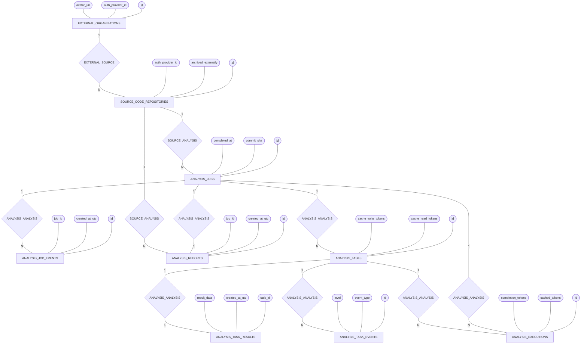

### 8. Community Forum ERD

```mermaid
flowchart TD

    %% Entities (Rectangles)
    E_forum_categories["FORUM_CATEGORIES"]
    E_forum_category_moderators["FORUM_CATEGORY_MODERATORS"]
    E_forum_topics["FORUM_TOPICS"]
    E_forum_replies["FORUM_REPLIES"]
    E_forum_tags["FORUM_TAGS"]
    E_forum_topic_tags["FORUM_TOPIC_TAGS"]
    E_forum_votes["FORUM_VOTES"]
    E_forum_reactions["FORUM_REACTIONS"]
    E_forum_bookmarks["FORUM_BOOKMARKS"]
    E_forum_follows["FORUM_FOLLOWS"]
    E_forum_reports["FORUM_REPORTS"]
    E_forum_reputations["FORUM_REPUTATIONS"]
    E_forum_badges["FORUM_BADGES"]
    E_forum_user_badges["FORUM_USER_BADGES"]
    E_forum_moderation_logs["FORUM_MODERATION_LOGS"]
    E_forum_topic_histories["FORUM_TOPIC_HISTORIES"]
    E_forum_reply_histories["FORUM_REPLY_HISTORIES"]

    %% Attributes (Ovals)
    A_forum_categories_id(["<u>id</u>"]) --- E_forum_categories
    A_forum_categories_created_at(["created_at"]) --- E_forum_categories
    A_forum_categories_deleted_at(["deleted_at"]) --- E_forum_categories
    A_forum_category_moderators_category_id(["<u>category_id</u>"]) --- E_forum_category_moderators
    A_forum_category_moderators_user_id(["<u>user_id</u>"]) --- E_forum_category_moderators
    A_forum_category_moderators_assigned_at(["assigned_at"]) --- E_forum_category_moderators
    A_forum_topics_id(["<u>id</u>"]) --- E_forum_topics
    A_forum_topics_ai_excerpt(["ai_excerpt"]) --- E_forum_topics
    A_forum_topics_author_id(["author_id"]) --- E_forum_topics
    A_forum_replies_id(["<u>id</u>"]) --- E_forum_replies
    A_forum_replies_author_id(["author_id"]) --- E_forum_replies
    A_forum_replies_content(["content"]) --- E_forum_replies
    A_forum_tags_id(["<u>id</u>"]) --- E_forum_tags
    A_forum_tags_created_at(["created_at"]) --- E_forum_tags
    A_forum_tags_is_archived(["is_archived"]) --- E_forum_tags
    A_forum_topic_tags_topic_id(["<u>topic_id</u>"]) --- E_forum_topic_tags
    A_forum_topic_tags_tag_id(["<u>tag_id</u>"]) --- E_forum_topic_tags
    A_forum_votes_id(["<u>id</u>"]) --- E_forum_votes
    A_forum_votes_created_at(["created_at"]) --- E_forum_votes
    A_forum_votes_reply_id(["reply_id"]) --- E_forum_votes
    A_forum_reactions_id(["<u>id</u>"]) --- E_forum_reactions
    A_forum_reactions_created_at(["created_at"]) --- E_forum_reactions
    A_forum_reactions_reaction_type(["reaction_type"]) --- E_forum_reactions
    A_forum_bookmarks_topic_id(["<u>topic_id</u>"]) --- E_forum_bookmarks
    A_forum_bookmarks_user_id(["<u>user_id</u>"]) --- E_forum_bookmarks
    A_forum_bookmarks_created_at(["created_at"]) --- E_forum_bookmarks
    A_forum_follows_topic_id(["<u>topic_id</u>"]) --- E_forum_follows
    A_forum_follows_user_id(["<u>user_id</u>"]) --- E_forum_follows
    A_forum_follows_created_at(["created_at"]) --- E_forum_follows
    A_forum_reports_id(["<u>id</u>"]) --- E_forum_reports
    A_forum_reports_created_at(["created_at"]) --- E_forum_reports
    A_forum_reports_reason(["reason"]) --- E_forum_reports
    A_forum_reputations_user_id(["<u>user_id</u>"]) --- E_forum_reputations
    A_forum_reputations_points(["points"]) --- E_forum_reputations
    A_forum_reputations_updated_at(["updated_at"]) --- E_forum_reputations
    A_forum_badges_id(["<u>id</u>"]) --- E_forum_badges
    A_forum_badges_created_at(["created_at"]) --- E_forum_badges
    A_forum_badges_criteria_code(["criteria_code"]) --- E_forum_badges
    A_forum_user_badges_user_id(["<u>user_id</u>"]) --- E_forum_user_badges
    A_forum_user_badges_badge_id(["<u>badge_id</u>"]) --- E_forum_user_badges
    A_forum_user_badges_awarded_at(["awarded_at"]) --- E_forum_user_badges
    A_forum_moderation_logs_id(["<u>id</u>"]) --- E_forum_moderation_logs
    A_forum_moderation_logs_action(["action"]) --- E_forum_moderation_logs
    A_forum_moderation_logs_created_at(["created_at"]) --- E_forum_moderation_logs
    A_forum_topic_histories_id(["<u>id</u>"]) --- E_forum_topic_histories
    A_forum_topic_histories_content(["content"]) --- E_forum_topic_histories
    A_forum_topic_histories_edited_at(["edited_at"]) --- E_forum_topic_histories
    A_forum_reply_histories_id(["<u>id</u>"]) --- E_forum_reply_histories
    A_forum_reply_histories_content(["content"]) --- E_forum_reply_histories
    A_forum_reply_histories_edited_at(["edited_at"]) --- E_forum_reply_histories

    %% Relationships (Diamonds & Cardinalities)
    R_community_forum_1{"FORUM_FORUM"}
    E_forum_topics ---|"1"| R_community_forum_1
    R_community_forum_1 ---|"N"| E_forum_bookmarks
    R_community_forum_2{"FORUM_FORUM"}
    E_forum_categories ---|"1"| R_community_forum_2
    R_community_forum_2 ---|"N"| E_forum_category_moderators
    R_community_forum_3{"FORUM_FORUM"}
    E_forum_topics ---|"1"| R_community_forum_3
    R_community_forum_3 ---|"N"| E_forum_follows
    R_community_forum_4{"FORUM_FORUM"}
    E_forum_replies ---|"1"| R_community_forum_4
    R_community_forum_4 ---|"N"| E_forum_reactions
    R_community_forum_5{"FORUM_FORUM"}
    E_forum_topics ---|"1"| R_community_forum_5
    R_community_forum_5 ---|"N"| E_forum_reactions
    R_community_forum_6{"FORUM_FORUM"}
    E_forum_replies ---|"1"| R_community_forum_6
    R_community_forum_6 ---|"N"| E_forum_replies
    R_community_forum_7{"FORUM_FORUM"}
    E_forum_topics ---|"1"| R_community_forum_7
    R_community_forum_7 ---|"N"| E_forum_replies
    R_community_forum_8{"FORUM_FORUM"}
    E_forum_replies ---|"1"| R_community_forum_8
    R_community_forum_8 ---|"N"| E_forum_reply_histories
    R_community_forum_9{"FORUM_FORUM"}
    E_forum_replies ---|"1"| R_community_forum_9
    R_community_forum_9 ---|"N"| E_forum_reports
    R_community_forum_10{"FORUM_FORUM"}
    E_forum_topics ---|"1"| R_community_forum_10
    R_community_forum_10 ---|"N"| E_forum_reports
    R_community_forum_11{"FORUM_FORUM"}
    E_forum_categories ---|"1"| R_community_forum_11
    R_community_forum_11 ---|"N"| E_forum_topics
    R_community_forum_12{"FORUM_FORUM"}
    E_forum_topics ---|"1"| R_community_forum_12
    R_community_forum_12 ---|"N"| E_forum_topic_histories
    R_community_forum_13{"FORUM_FORUM"}
    E_forum_tags ---|"1"| R_community_forum_13
    R_community_forum_13 ---|"N"| E_forum_topic_tags
    R_community_forum_14{"FORUM_FORUM"}
    E_forum_topics ---|"1"| R_community_forum_14
    R_community_forum_14 ---|"N"| E_forum_topic_tags
    R_community_forum_15{"FORUM_FORUM"}
    E_forum_badges ---|"1"| R_community_forum_15
    R_community_forum_15 ---|"N"| E_forum_user_badges
    R_community_forum_16{"FORUM_FORUM"}
    E_forum_replies ---|"1"| R_community_forum_16
    R_community_forum_16 ---|"N"| E_forum_votes
    R_community_forum_17{"FORUM_FORUM"}
    E_forum_topics ---|"1"| R_community_forum_17
    R_community_forum_17 ---|"N"| E_forum_votes
```

### 9. Audit, Security Telemetry & Messaging ERD

```mermaid
flowchart TD

    %% Entities (Rectangles)
    E_outbox_messages["OUTBOX_MESSAGES"]
    E_audit_logs["AUDIT_LOGS"]
    E_conversations["CONVERSATIONS"]
    E_messages["MESSAGES"]
    E_activity_events["ACTIVITY_EVENTS"]
    E_in_app_notifications["IN_APP_NOTIFICATIONS"]
    E_notification_preferences["NOTIFICATION_PREFERENCES"]
    E_security_events["SECURITY_EVENTS"]
    E_security_incidents["SECURITY_INCIDENTS"]
    E_security_event_comments["SECURITY_EVENT_COMMENTS"]
    E_security_rules["SECURITY_RULES"]
    E_seeding_history["SEEDING_HISTORY"]

    %% Attributes (Ovals)
    A_outbox_messages_id(["<u>id</u>"]) --- E_outbox_messages
    A_outbox_messages_created_at(["created_at"]) --- E_outbox_messages
    A_outbox_messages_error(["error"]) --- E_outbox_messages
    A_audit_logs_id(["<u>id</u>"]) --- E_audit_logs
    A_audit_logs_actor_user_id(["actor_user_id"]) --- E_audit_logs
    A_audit_logs_anonymized_actor_hash(["anonymized_actor_hash"]) --- E_audit_logs
    A_conversations_id(["<u>id</u>"]) --- E_conversations
    A_conversations_created_at(["created_at"]) --- E_conversations
    A_conversations_title(["title"]) --- E_conversations
    A_messages_id(["<u>id</u>"]) --- E_messages
    A_messages_content(["content"]) --- E_messages
    A_messages_conversation_id(["conversation_id"]) --- E_messages
    A_activity_events_id(["<u>id</u>"]) --- E_activity_events
    A_activity_events_actor_user_id(["actor_user_id"]) --- E_activity_events
    A_activity_events_causation_id(["causation_id"]) --- E_activity_events
    A_in_app_notifications_id(["<u>id</u>"]) --- E_in_app_notifications
    A_in_app_notifications_activity_event_id(["activity_event_id"]) --- E_in_app_notifications
    A_in_app_notifications_aggregate_key(["aggregate_key"]) --- E_in_app_notifications
    A_notification_preferences_id(["<u>id</u>"]) --- E_notification_preferences
    A_notification_preferences_channel(["channel"]) --- E_notification_preferences
    A_notification_preferences_is_enabled(["is_enabled"]) --- E_notification_preferences
    A_security_events_id(["<u>id</u>"]) --- E_security_events
    A_security_events_actor_user_id(["actor_user_id"]) --- E_security_events
    A_security_events_assigned_to_user_id(["assigned_to_user_id"]) --- E_security_events
    A_security_incidents_id(["<u>id</u>"]) --- E_security_incidents
    A_security_incidents_assigned_to_user_id(["assigned_to_user_id"]) --- E_security_incidents
    A_security_incidents_created_at(["created_at"]) --- E_security_incidents
    A_security_event_comments_id(["<u>id</u>"]) --- E_security_event_comments
    A_security_event_comments_author_user_id(["author_user_id"]) --- E_security_event_comments
    A_security_event_comments_comment_text(["comment_text"]) --- E_security_event_comments
    A_security_rules_id(["<u>id</u>"]) --- E_security_rules
    A_security_rules_code(["code"]) --- E_security_rules
    A_security_rules_configuration_json(["configuration_json"]) --- E_security_rules
    A_seeding_history_module_id(["<u>module_id</u>"]) --- E_seeding_history
    A_seeding_history_applied_at_utc(["applied_at_utc"]) --- E_seeding_history
    A_seeding_history_duration_ms(["duration_ms"]) --- E_seeding_history

    %% Relationships (Diamonds & Cardinalities)
    R_audit_security_messaging_1{"CONVERSATIONS_MESSAGES"}
    E_conversations ---|"1"| R_audit_security_messaging_1
    R_audit_security_messaging_1 ---|"N"| E_messages
    R_audit_security_messaging_2{"ACTIVITY_IN"}
    E_activity_events ---|"1"| R_audit_security_messaging_2
    R_audit_security_messaging_2 ---|"N"| E_in_app_notifications
    R_audit_security_messaging_3{"SECURITY_SECURITY"}
    E_security_incidents ---|"1"| R_audit_security_messaging_3
    R_audit_security_messaging_3 ---|"N"| E_security_events
    R_audit_security_messaging_4{"SECURITY_SECURITY"}
    E_security_events ---|"1"| R_audit_security_messaging_4
    R_audit_security_messaging_4 ---|"N"| E_security_event_comments
    R_audit_security_messaging_5{"SECURITY_SECURITY"}
    E_security_incidents ---|"1"| R_audit_security_messaging_5
    R_audit_security_messaging_5 ---|"N"| E_security_event_comments
```

### 10. System Administration & Staff ERD

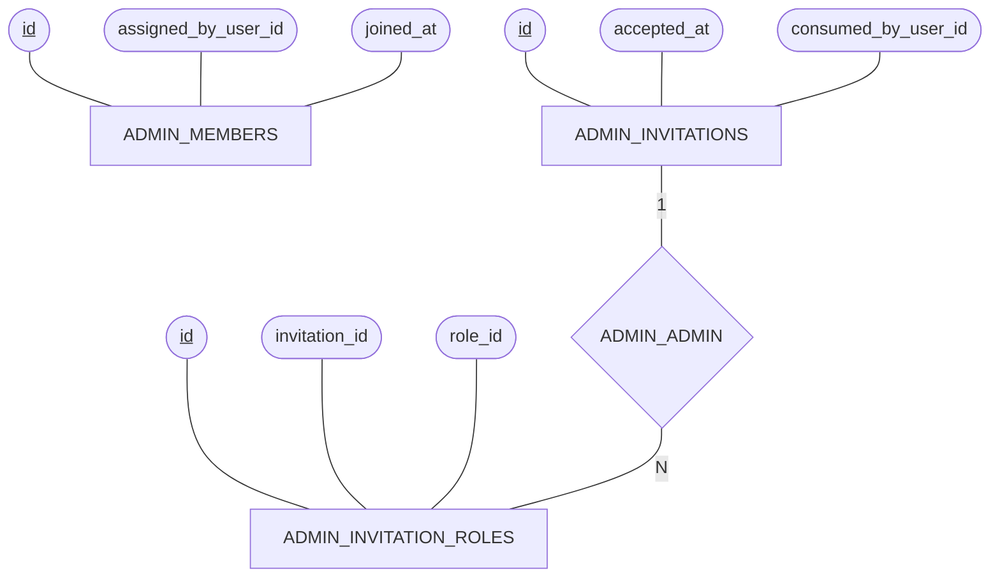

### 11. Platform Orchestration & AI Engine ERD

```mermaid
flowchart TD

    %% Entities (Rectangles)
    E_pipeline_jobs["PIPELINE_JOBS"]
    E_pipeline_tasks["PIPELINE_TASKS"]
    E_pipeline_executions["PIPELINE_EXECUTIONS"]
    E_pipeline_stages["PIPELINE_STAGES"]
    E_pipeline_tasks_durable["PIPELINE_TASKS_DURABLE"]
    E_pipeline_events_durable["PIPELINE_EVENTS_DURABLE"]
    E_prompt_deployments["PROMPT_DEPLOYMENTS"]
    E_artifact_registry_entries["ARTIFACT_REGISTRY_ENTRIES"]
    E_ai_streaming_sessions["AI_STREAMING_SESSIONS"]
    E_ai_streaming_stages["AI_STREAMING_STAGES"]
    E_ai_streaming_logs["AI_STREAMING_LOGS"]
    E_ai_streaming_metrics["AI_STREAMING_METRICS"]

    %% Attributes (Ovals)
    A_pipeline_jobs_id(["<u>id</u>"]) --- E_pipeline_jobs
    A_pipeline_jobs_completed_at(["completed_at"]) --- E_pipeline_jobs
    A_pipeline_jobs_created_at_utc(["created_at_utc"]) --- E_pipeline_jobs
    A_pipeline_tasks_id(["<u>id</u>"]) --- E_pipeline_tasks
    A_pipeline_tasks_completed_at(["completed_at"]) --- E_pipeline_tasks
    A_pipeline_tasks_cost_usd(["cost_usd"]) --- E_pipeline_tasks
    A_pipeline_executions_id(["<u>id</u>"]) --- E_pipeline_executions
    A_pipeline_executions_completed_at(["completed_at"]) --- E_pipeline_executions
    A_pipeline_executions_created_at_utc(["created_at_utc"]) --- E_pipeline_executions
    A_pipeline_stages_id(["<u>id</u>"]) --- E_pipeline_stages
    A_pipeline_stages_completed_at(["completed_at"]) --- E_pipeline_stages
    A_pipeline_stages_description(["description"]) --- E_pipeline_stages
    A_pipeline_tasks_durable_id(["<u>id</u>"]) --- E_pipeline_tasks_durable
    A_pipeline_tasks_durable_cache_read_tokens(["cache_read_tokens"]) --- E_pipeline_tasks_durable
    A_pipeline_tasks_durable_cache_write_tokens(["cache_write_tokens"]) --- E_pipeline_tasks_durable
    A_pipeline_events_durable_id(["<u>id</u>"]) --- E_pipeline_events_durable
    A_pipeline_events_durable_component(["component"]) --- E_pipeline_events_durable
    A_pipeline_events_durable_correlation_id(["correlation_id"]) --- E_pipeline_events_durable
    A_prompt_deployments_prompt_id(["<u>prompt_id</u>"]) --- E_prompt_deployments
    A_prompt_deployments_active_version(["active_version"]) --- E_prompt_deployments
    A_prompt_deployments_sha256hash(["sha256hash"]) --- E_prompt_deployments
    A_artifact_registry_entries_id(["<u>id</u>"]) --- E_artifact_registry_entries
    A_artifact_registry_entries_artifact_id(["artifact_id"]) --- E_artifact_registry_entries
    A_artifact_registry_entries_checksum(["checksum"]) --- E_artifact_registry_entries
    A_ai_streaming_sessions_id(["<u>id</u>"]) --- E_ai_streaming_sessions
    A_ai_streaming_sessions_completed_at(["completed_at"]) --- E_ai_streaming_sessions
    A_ai_streaming_sessions_created_at_utc(["created_at_utc"]) --- E_ai_streaming_sessions
    A_ai_streaming_stages_id(["<u>id</u>"]) --- E_ai_streaming_stages
    A_ai_streaming_stages_completed_at(["completed_at"]) --- E_ai_streaming_stages
    A_ai_streaming_stages_description(["description"]) --- E_ai_streaming_stages
    A_ai_streaming_logs_id(["<u>id</u>"]) --- E_ai_streaming_logs
    A_ai_streaming_logs_component(["component"]) --- E_ai_streaming_logs
    A_ai_streaming_logs_log_level(["log_level"]) --- E_ai_streaming_logs
    A_ai_streaming_metrics_id(["<u>id</u>"]) --- E_ai_streaming_metrics
    A_ai_streaming_metrics_metric_name(["metric_name"]) --- E_ai_streaming_metrics
    A_ai_streaming_metrics_metric_value(["metric_value"]) --- E_ai_streaming_metrics

    %% Relationships (Diamonds & Cardinalities)
    R_platform_orchestration_ai_1{"AI_AI"}
    E_ai_streaming_sessions ---|"1"| R_platform_orchestration_ai_1
    R_platform_orchestration_ai_1 ---|"N"| E_ai_streaming_logs
    R_platform_orchestration_ai_2{"AI_AI"}
    E_ai_streaming_sessions ---|"1"| R_platform_orchestration_ai_2
    R_platform_orchestration_ai_2 ---|"N"| E_ai_streaming_metrics
    R_platform_orchestration_ai_3{"AI_AI"}
    E_ai_streaming_sessions ---|"1"| R_platform_orchestration_ai_3
    R_platform_orchestration_ai_3 ---|"N"| E_ai_streaming_stages
    R_platform_orchestration_ai_4{"PIPELINE_PIPELINE"}
    E_pipeline_executions ---|"1"| R_platform_orchestration_ai_4
    R_platform_orchestration_ai_4 ---|"N"| E_pipeline_events_durable
    R_platform_orchestration_ai_5{"PIPELINE_PIPELINE"}
    E_pipeline_executions ---|"1"| R_platform_orchestration_ai_5
    R_platform_orchestration_ai_5 ---|"N"| E_pipeline_stages
    R_platform_orchestration_ai_6{"PIPELINE_PIPELINE"}
    E_pipeline_executions ---|"1"| R_platform_orchestration_ai_6
    R_platform_orchestration_ai_6 ---|"N"| E_pipeline_tasks_durable
    R_platform_orchestration_ai_7{"PIPELINE_PIPELINE"}
    E_pipeline_jobs ---|"1"| R_platform_orchestration_ai_7
    R_platform_orchestration_ai_7 ---|"N"| E_pipeline_tasks
```

---

## 6. Cross-Module Relationship Diagram

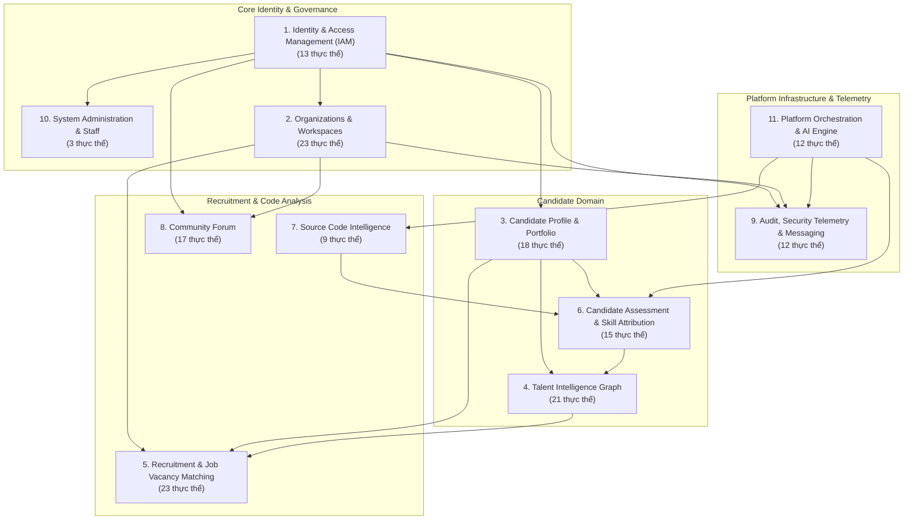
