# UML Activity & State Diagrams (Tài liệu Quy trình Đầy đủ & Chi tiết)

Tài liệu này chứa toàn bộ các **Sơ đồ UML Activity / State Diagram (`stateDiagram-v2`)** mô hình hóa đầy đủ tất cả các quy trình nghiệp vụ (Business Workflows), xử lý chuyển trạng thái, kiểm tra điều kiện rẽ nhánh (`<<choice>>`), luồng thực thi song song (Fork/Join), kiểm duyệt AI, và đường dẫn xử lý ngoại lệ cho **tất cả 37 Controllers và 11 Module nghiệp vụ** của nền tảng CVerify.

## 1. Tổng quan các Module & Controllers trong Hệ thống

Hệ thống CVerify được kiến trúc theo mô hình Modular Monolith kết hợp Python AI Pipeline Service, bao gồm 11 nhóm module nghiệp vụ chính:

1. **Authentication & Identity Management (IAM)**: `AuthController`, `InvitationController`, `MemberController`, `OrganizationRoleController`
2. **Account Recovery & Governance**: `PasswordRecoveryController`, `RecoveryController`, `Level2RecoveryController`
3. **Organizations & Workspaces**: `OrganizationController`, `WorkspaceController`
4. **Candidate Profile & Portfolio**: `ProfileController`, `CareerController`, `WorkExperienceController`, `EducationController`, `AchievementController`, `ProjectController`, `EvidenceController`, `CandidateAssessmentController`
5. **Source Code Intelligence & Repository Analysis**: `SourceCodeProvidersController`, `RepositoryAnalysisController`, `AiJobsController`
6. **Talent Intelligence & Job Vacancy Matching**: `TalentDiscoveryController`, `JobVacancyController`, `HiringRequirementController`, `PublicJobController`
7. **AI Assistant & Token Streaming Engine**: `AiChatController`, `StreamingController`
8. **Community Forum**: `ForumController`
9. **Notifications & System Utilities**: `NotificationController`, `SystemController`, `EmailTestController`
10. **System Administration & Enterprise Governance**: `UsersAdminController`, `RolesAdminController`, `PermissionsController`, `EnterpriseOperationsController`, `AuditLogsController`
11. **Security Telemetry & AI Operations**: `SecurityEventsController`, `AiOperationsController`

---

## 2. Chi tiết Sơ đồ Trạng thái Workflow theo Module (`stateDiagram-v2`)

### Module 1: Authentication & Identity Management (IAM)

#### Workflow 1.1: Đăng ký Tài khoản & Gửi Email Xác minh (`Register`)

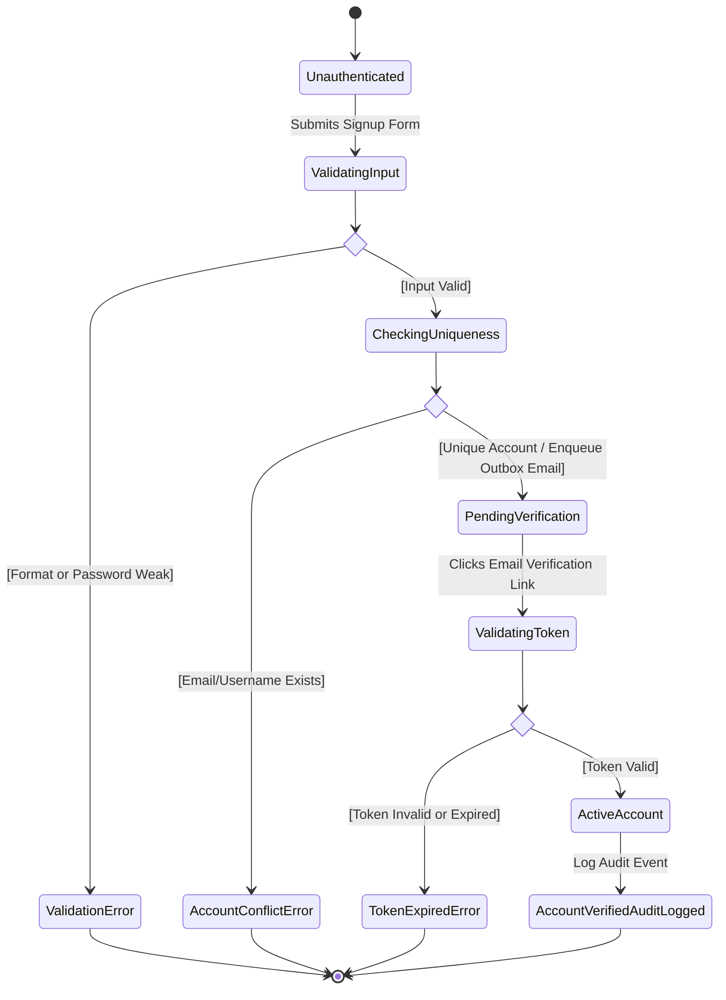

#### Workflow 1.2: Đăng nhập & Thử thách MFA (`Login & MFA`)

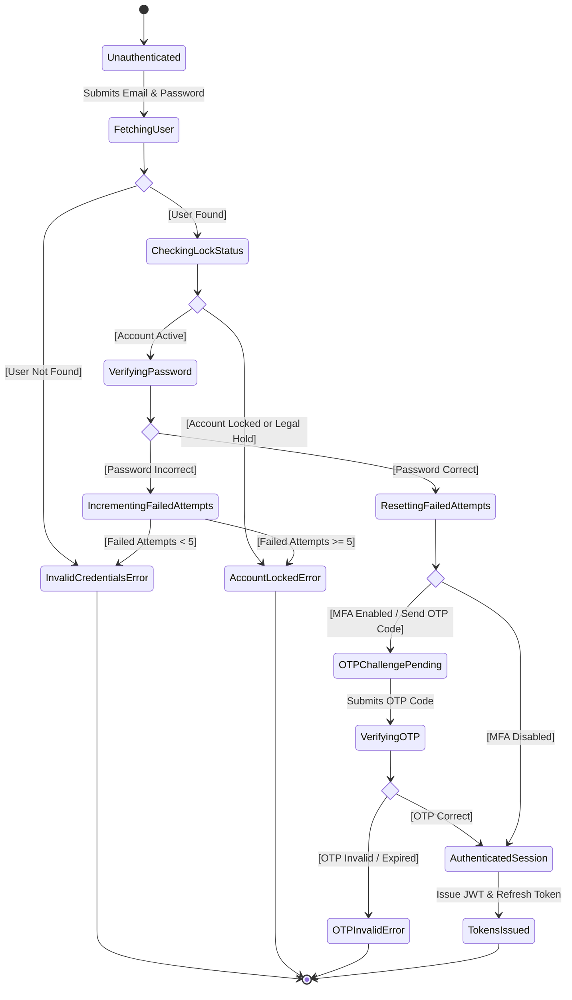

#### Workflow 1.3: Đăng nhập & Liên kết OAuth2 Provider (`OAuth Login`)

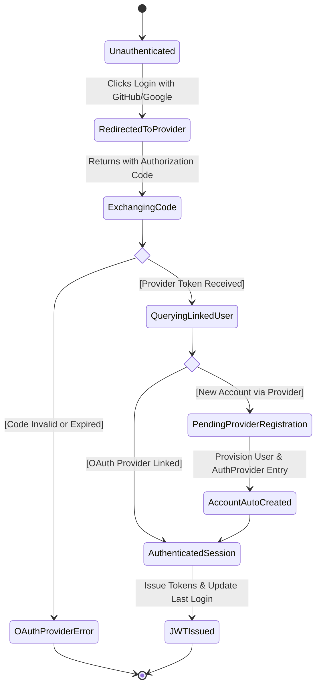

#### Workflow 1.4: Làm mới Phiên & Đăng xuất (`Refresh Token & Logout`)

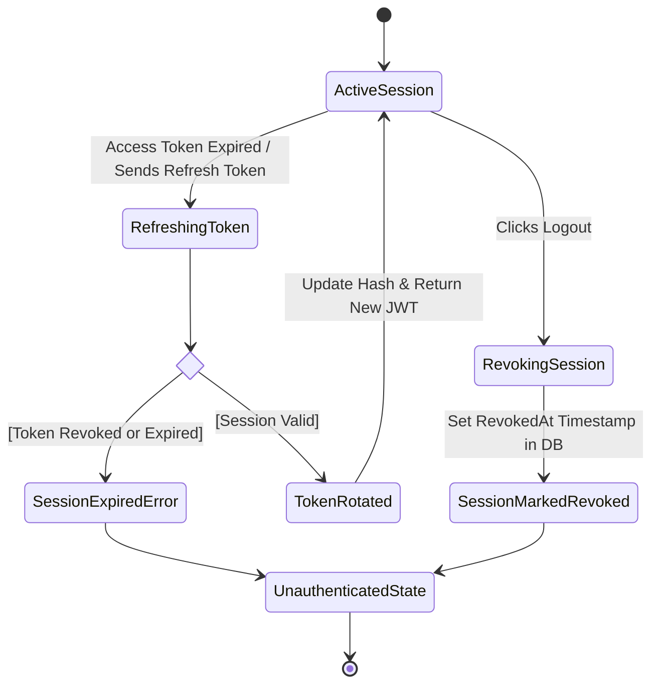

#### Workflow 1.5: Mời Thành viên Tổ chức & Nhận Vai trò (`Invite Member`)

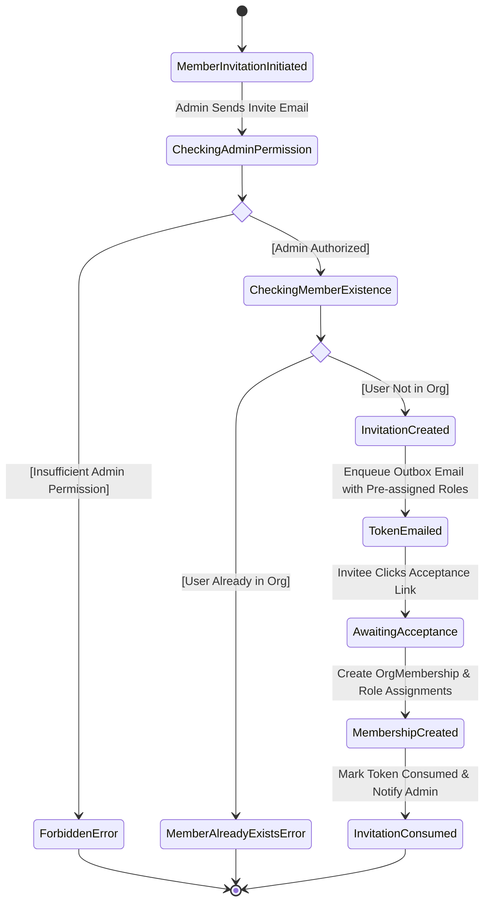

---

### Module 2: Account Recovery & Governance

#### Workflow 2.1: Quên Mật khẩu (`Forgot Password`)

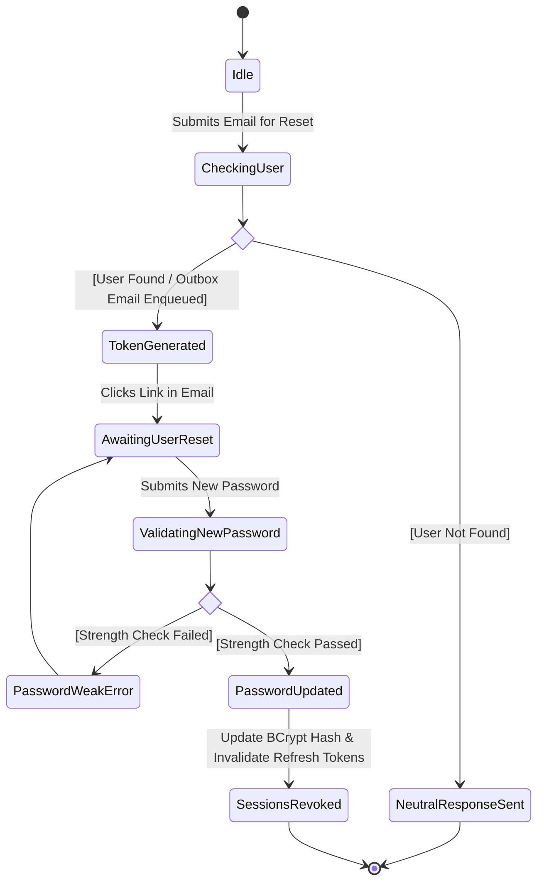

#### Workflow 2.2: Khiếu nại Khôi phục Tổ chức Khẩn cấp (`Emergency Claim`)

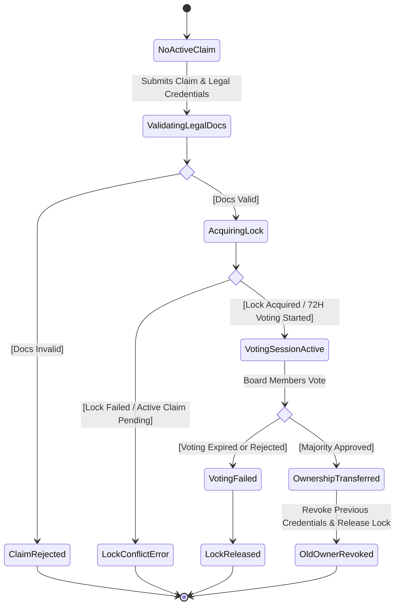

#### Workflow 2.3: Xoay vòng Người Đại diện Pháp luật (`Representative Rotation`)

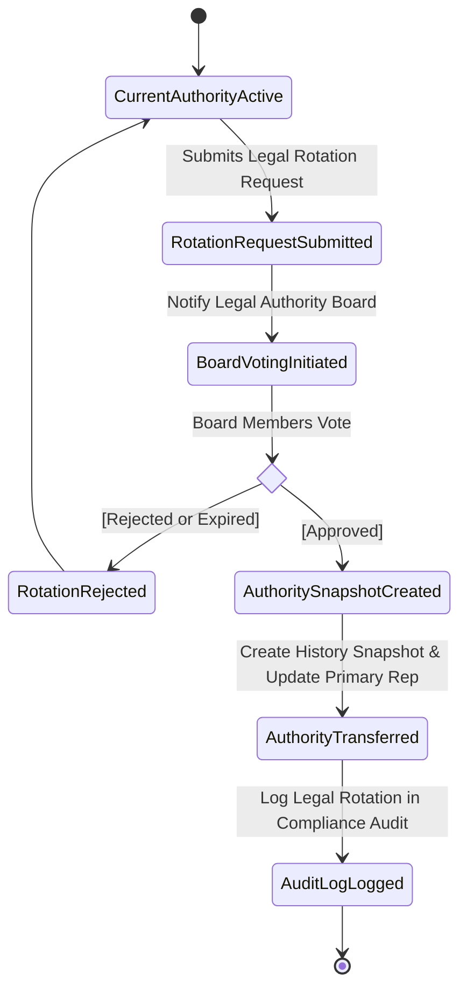

---

### Module 3: Organizations & Workspaces

#### Workflow 3.1: Khởi tạo Tổ chức & Xác thực Tên miền DNS (`Create Organization`)

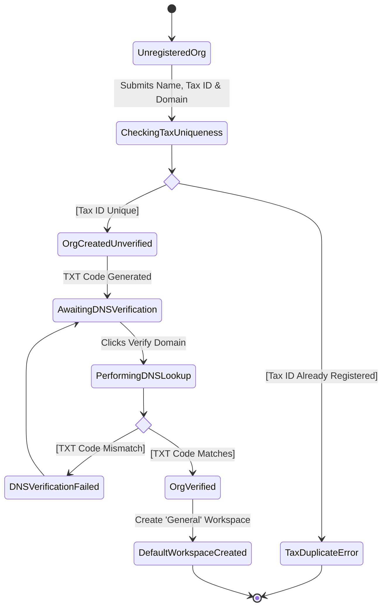

#### Workflow 3.2: Quản lý Không gian Làm việc Workspace (`Manage Workspace`)

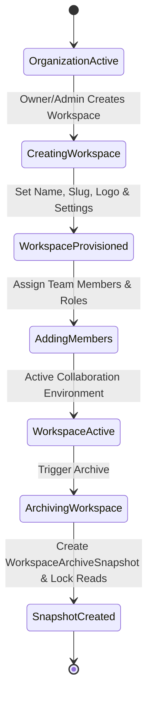

---

### Module 4: Candidate Profile & Portfolio

#### Workflow 4.1: Cập nhật Bio & Kinh nghiệm Làm việc (`Update Profile & Work Exp`)

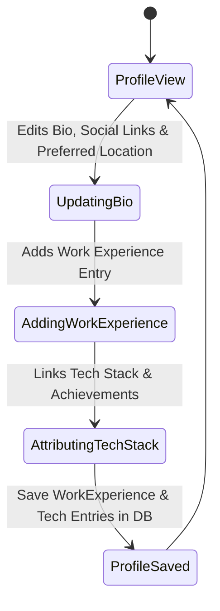

#### Workflow 4.2: Tải lên CV & Quét Virus (`Upload CV`)

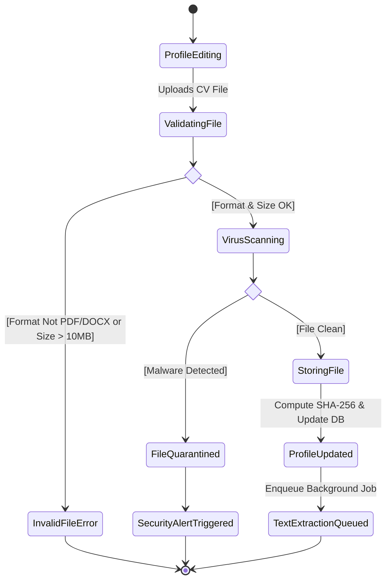

#### Workflow 4.3: Dự án Portfolio & Bằng chứng Kỹ năng (`Project & Evidence`)

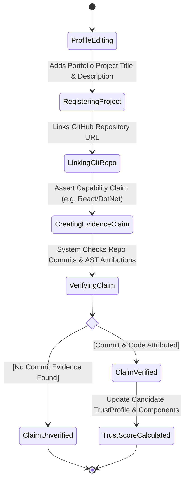

#### Workflow 4.4: Đánh giá Kỹ năng & Cây Kỹ năng (`Trigger Skill Assessment`)

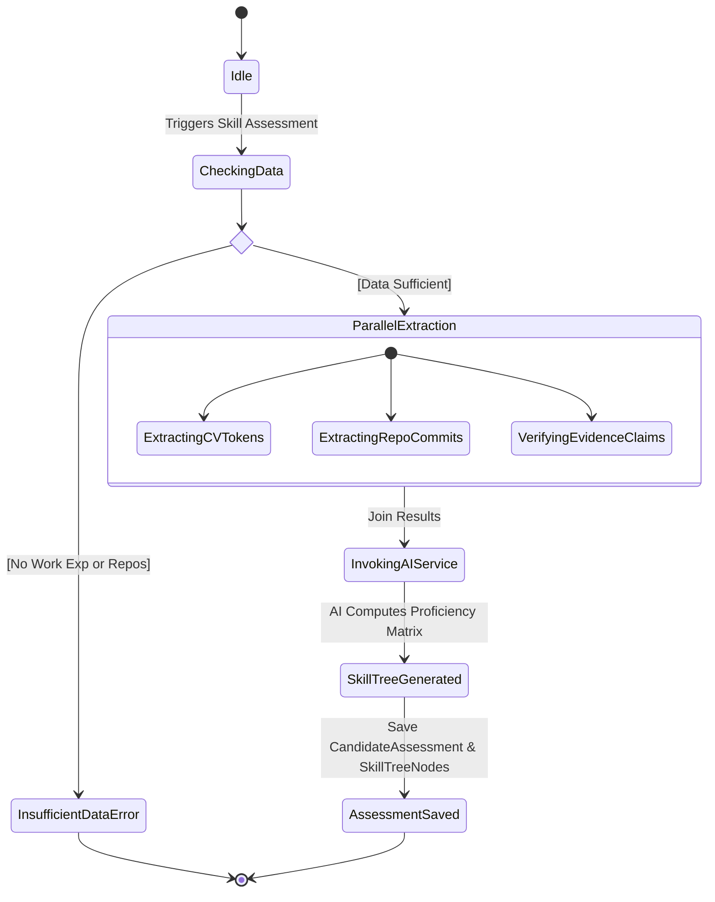

---

### Module 5: Source Code Intelligence & Repository Analysis

#### Workflow 5.1: Kết nối Provider & Nhập Kho mã nguồn (`Import Repository`)

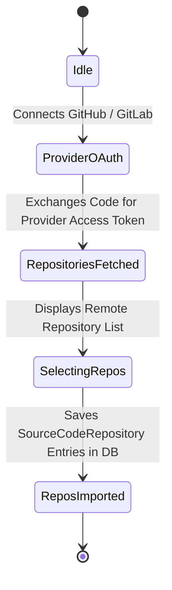

#### Workflow 5.2: Phân tích Mã nguồn AST Tĩnh (`Trigger Code Analysis`)

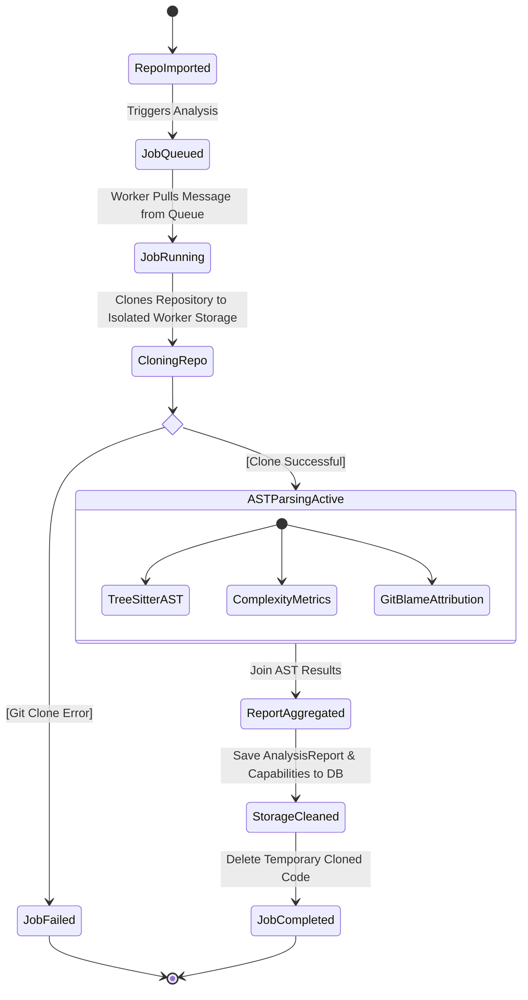

---

### Module 6: Talent Intelligence & Job Matching

#### Workflow 6.1: Khởi tạo & Đăng tin Tuyển dụng (`Publish Job Vacancy`)

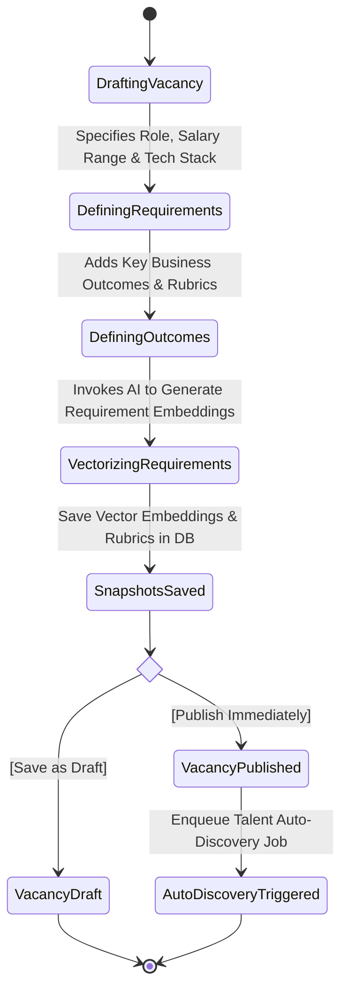

#### Workflow 6.2: Ứng tuyển & Tính điểm Khớp AI (`Apply Job & AI Match`)

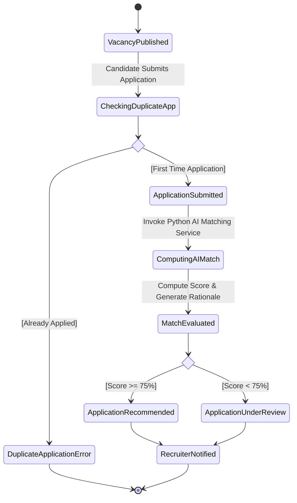

#### Workflow 6.3: Tự động Săn Tìm Nhân tài AI (`AI Talent Discovery`)

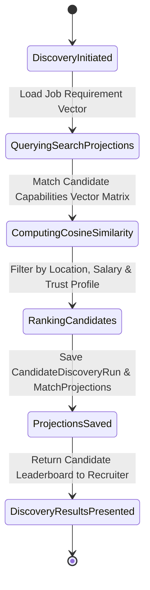

---

### Module 7: AI Assistant & Token Streaming Engine

#### Workflow 7.1: Trợ lý AI Chat & Stream SSE Token Real-time (`AI Chat Streaming`)

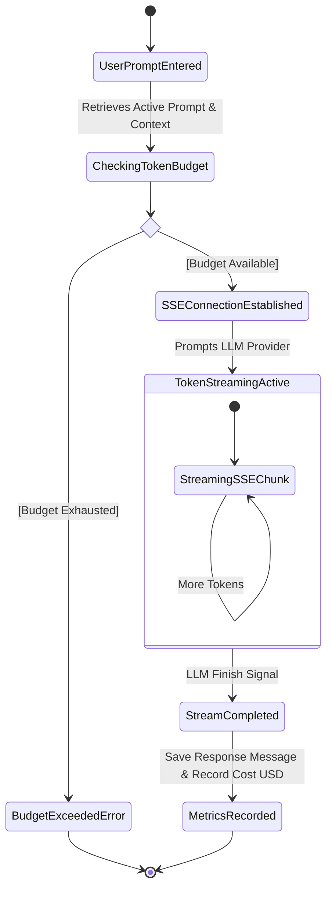

---

### Module 8: Community Forum

#### Workflow 8.1: Đăng bài Diễn đàn & Kiểm duyệt Tự động (`Create Forum Topic`)

```mermaid
stateDiagram-v2
    [*] --> TopicSubmitted
    TopicSubmitted --> RunningContentFilter : Validates Category
    
    state check_moderation <<choice>>
    RunningContentFilter --> check_moderation
    check_moderation --> TopicPendingReview : [Profanity / Spam Detected]
    TopicPendingReview --> ModeratorNotified
    ModeratorNotified --> [*]
    
    check_moderation --> TopicPublished : [Content Clean]
    TopicPublished --> ReputationAwarded : Add +5 Reputation Points to Author
    ReputationAwarded --> [*]
```

#### Workflow 8.2: Bình luận & Bình chọn Bài viết (`Reply & Vote`)

```mermaid
stateDiagram-v2
    [*] --> TopicViewed
    TopicViewed --> SubmittingReply : User Submits Reply
    SubmittingReply --> ReplySaved : Save ForumReply in DB
    ReplySaved --> SubmittingVote : User Upvotes/Downvotes Reply
    
    state check_vote_type <<choice>>
    SubmittingVote --> check_vote_type
    check_vote_type --> Upvoted : [Upvote]
    Upvoted --> AuthorReputationIncremented : +10 Reputation Points to Reply Author
    
    check_vote_type --> Downvoted : [Downvote]
    Downvoted --> AuthorReputationDecremented : -2 Reputation Points to Reply Author
    
    AuthorReputationIncremented --> ScoreUpdated : Recalculate ForumReply Score
    AuthorReputationDecremented --> ScoreUpdated
    ScoreUpdated --> [*]
```

---

### Module 9: System Administration & Telemetry

#### Workflow 9.1: Khóa Tài khoản Admin & Phong tỏa Pháp lý (`Legal Hold Lock`)

```mermaid
stateDiagram-v2
    [*] --> ActiveUserAccount
    ActiveUserAccount --> AdminReviewingUser : Super Admin Inspects User
    
    state check_admin_action <<choice>>
    AdminReviewingUser --> check_admin_action
    check_admin_action --> UserTemporarilyLocked : [Select Lock Account]
    UserTemporarilyLocked --> SessionRevoked
    
    check_admin_action --> LegalHoldEnforced : [Select Enforce Legal Hold]
    LegalHoldEnforced --> AllAccessFrozen : Set 'IsLegalHold' = True & Freeze All API Actions
    AllAccessFrozen --> LegalHoldAuditLogged : Log Compliance Record in Audit Logs
    LegalHoldAuditLogged --> [*]
```

#### Workflow 9.2: Cảnh báo Telemetry An ninh SOC (`Security Telemetry Alert`)

```mermaid
stateDiagram-v2
    [*] --> EventIngested
    EventIngested --> EvaluatingRules : Passes Event to Threat Engine
    
    state check_threat <<choice>>
    EvaluatingRules --> check_threat
    check_threat --> TelemetryLogged : [Normal Traffic]
    TelemetryLogged --> [*]
    
    check_threat --> IncidentCreated : [Threat Pattern Detected]
    
    state check_critical <<choice>>
    IncidentCreated --> check_critical
    check_critical --> LegalHoldEnforced : [Severity Critical]
    LegalHoldEnforced --> SOCNotified : Lock Account & Alert SOC
    
    check_critical --> SOCNotified : [Severity High/Medium]
    SOCNotified --> AnalystResolved : Analyst Adds Investigation Note & Resolves
    AnalystResolved --> AuditLogged : Log Compliance Audit
    AuditLogged --> [*]
```
