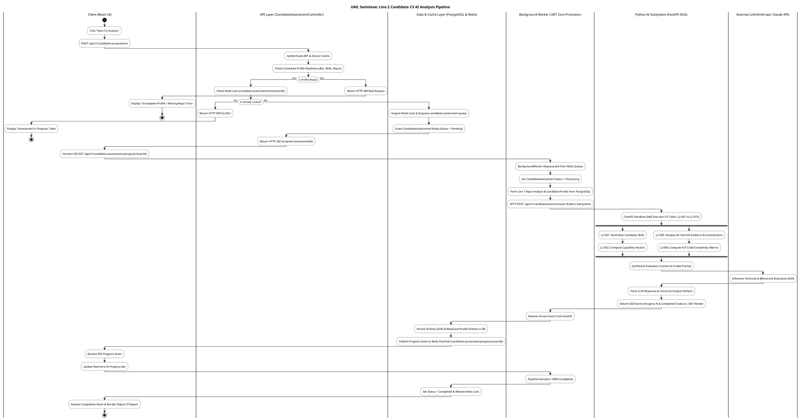
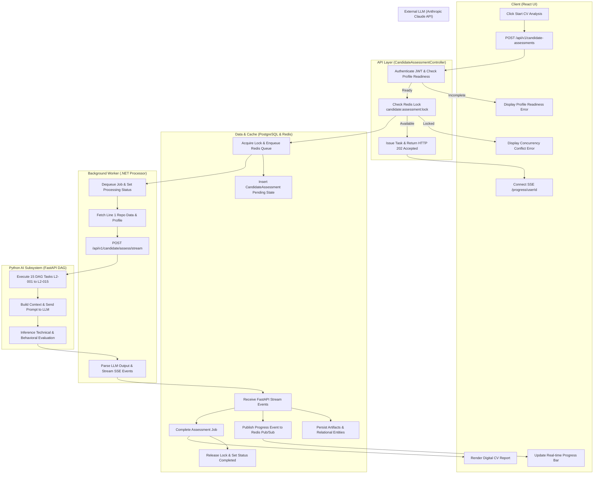
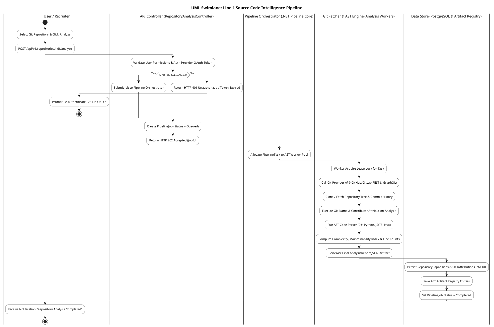
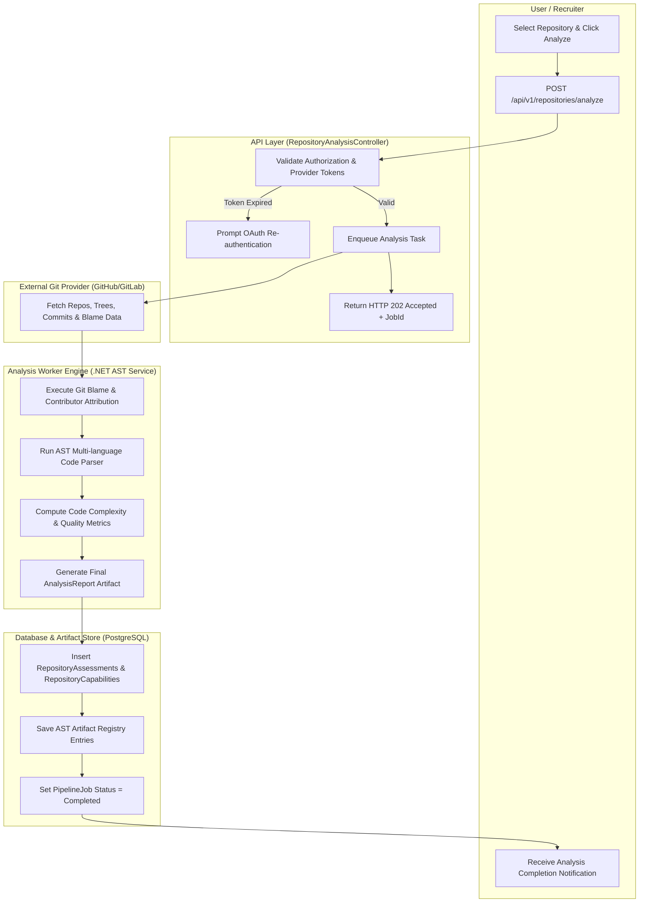
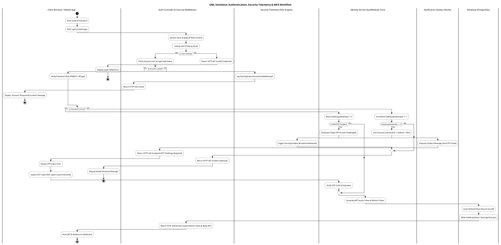
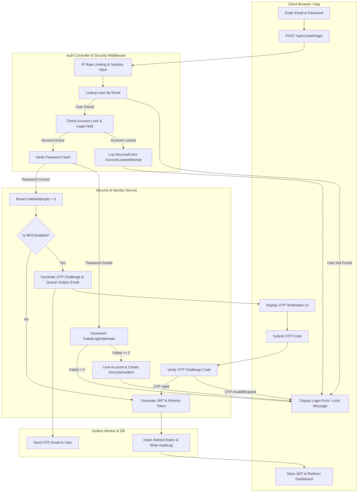
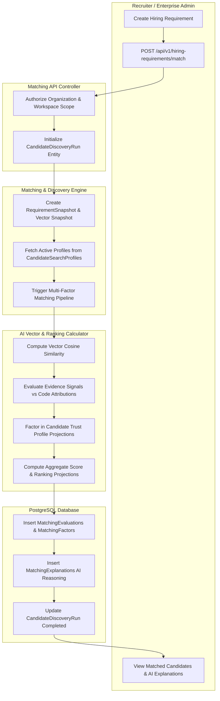

# UML Swimlane Diagrams (Bản Chi Tiết Đầy Đủ Trắng Đen)

Tài liệu chứa các sơ đồ **Swimlane Activity Diagrams chi tiết đầy đủ (Fully Detailed)** ở định dạng mã PlantUML và Mermaid phong cách **Trắng Đen (Monochrome / Black & White)** cho toàn bộ quy trình kiến trúc nền tảng **CVerify**.

---

## Danh mục các Quy trình Swimlane

1. [Quy trình 1: Line 2 - Candidate CV AI Analysis Pipeline (Phân tích CV & Đánh giá Năng lực)](#workflow-1)
2. [Quy trình 2: Line 1 - Source Code Intelligence Pipeline (Phân tích Mã nguồn & Git Repository)](#workflow-2)
3. [Quy trình 3: Authentication, Security Telemetry & MFA Workflow (Đăng nhập, MFA & An ninh)](#workflow-3)
4. [Quy trình 4: Job Vacancy Matching & Candidate Discovery (Ghép nối Ứng viên & Nhu cầu Tuyển dụng)](#workflow-4)

---

<a id="workflow-1"></a>
## Quy trình 1: Line 2 - Candidate CV AI Analysis Pipeline (Phân tích CV & Đánh giá Năng lực)

### 1.1. PlantUML Activity Swimlane Code (Chi Tiết Trắng Đen)



### 1.2. Mermaid Flowchart Swimlane Code (Chi Tiết Trắng Đen)



---

<a id="workflow-2"></a>
## Quy trình 2: Line 1 - Source Code Intelligence Pipeline (Phân tích Mã nguồn & Git Repository)

### 2.1. PlantUML Activity Swimlane Code (Chi Tiết Trắng Đen)



### 2.2. Mermaid Flowchart Swimlane Code (Chi Tiết Trắng Đen)



---

<a id="workflow-3"></a>
## Quy trình 3: Authentication, Security Telemetry & MFA Workflow (Đăng nhập, MFA & An ninh)

### 3.1. PlantUML Activity Swimlane Code (Chi Tiết Trắng Đen)



### 3.2. Mermaid Flowchart Swimlane Code (Chi Tiết Trắng Đen)



---

<a id="workflow-4"></a>
## Quy trình 4: Job Vacancy Matching & Candidate Discovery (Ghép nối Ứng viên & Nhu cầu Tuyển dụng)

### 4.1. PlantUML Activity Swimlane Code (Chi Tiết Trắng Đen)

```plantuml
@startuml
skinparam TitleFontSize 16
skinparam TitleFontColor #000000
skinparam ActivityBorderColor #000000
skinparam ActivityBackgroundColor #FFFFFF
skinparam ActivityFontColor #000000
skinparam SwimlaneBorderColor #000000
skinparam SwimlaneTitleFontColor #000000
skinparam SwimlaneTitleFontSize 14
skinparam ArrowColor #000000

title UML Swimlane: Job Vacancy Matching & Candidate Discovery

|Recruiter / Enterprise Admin|
start
:Create Job Vacancy & Enter Hiring Requirement;
:POST /api/v1/hiring-requirements/{id}/match;

|Matching API (HiringRequirementController)|
:Authorize Organization & Workspace Scope;
:Initialize CandidateDiscoveryRun Entity;

|Matching & Discovery Engine (.NET System Service)|
:Create RequirementSnapshot & Vector Snapshot;
:Fetch Active Candidate Profiles from CandidateSearchProfiles;

|AI Vector & Ranking Engine|
loop For Each Candidate in CandidatePool
  :Compute Vector Cosine Similarity (Requirement vs Capability);
  :Evaluate Evidence Signals vs Code Attributions;
  :Factor in Candidate Trust Profile Projections;
  :Compute Aggregate Score (Capability 50%, Evidence 30%, Trust 20%);
end loop

|Data Persistence (PostgreSQL)|
|Matching & Discovery Engine (.NET System Service)|
:Rank Candidate List by Aggregate Match Score;
|Data Persistence (PostgreSQL)|
:Insert MatchingEvaluations, Factors & Explanations into DB;
:Set CandidateDiscoveryRun Status = Completed;

|Matching API (HiringRequirementController)|
:Return HTTP 200 OK (Candidate Cards & AI Match Explanations);

|Recruiter / Enterprise Admin|
:View Matched Candidate List & AI Reasoning;
stop
@enduml
```

### 4.2. Mermaid Flowchart Swimlane Code (Chi Tiết Trắng Đen)



---
*Tài liệu sơ đồ Swimlane UML bản chi tiết đầy đủ chuẩn trắng đen monochrome.*
